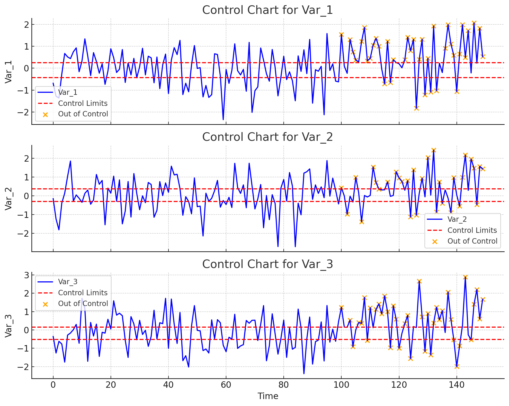

### PCN
### Key Concepts in Partial Correlation Networks

1. **Partial Correlation**:
   - A partial correlation between two variables    $X$    and    $Y$    measures the degree of association between them while holding constant the influence of other variables.
   - Mathematically, it’s the correlation between the residuals of    $X$    and    $Y$    after regressing each of them on the other variables.

2. **Network Structure**:
   - In a PCN, nodes represent variables, and edges represent non-zero partial correlations.
   - An edge between two variables exists only if their partial correlation is significantly different from zero, indicating a direct dependency between them.
   - If there’s no edge between two nodes, this implies conditional independence, meaning they are independent given all other variables.

3. **Interpretation of Edges**:
   - Each edge in a PCN represents a direct relationship, controlling for the influence of all other variables.
   - The strength and sign of the partial correlation provide insight into the nature of the dependency:
     - **Positive partial correlation** suggests a direct positive association.
     - **Negative partial correlation** suggests a direct negative association.

4. **Application in Control Charts and Multivariate Monitoring**:
   - In process monitoring, PCNs help identify direct relationships between process variables, enabling a focused understanding of which variables influence each other directly.
   - This is useful for diagnosing root causes of anomalies, as it isolates the variables that have direct, rather than spurious, associations.
  
5. **Construction**:
   - PCNs are constructed by estimating the partial correlations between all pairs of variables.
   - Regularization methods (e.g., graphical lasso) are often used when the number of variables is large relative to the number of observations to ensure a sparse network, reducing the number of edges to only the most significant relationships.

### Example Use Case

In a manufacturing setting with variables such as temperature, pressure, and flow rate, a PCN can help determine which variables have direct control impacts on each other. For instance:
- If pressure and flow rate have a direct association (indicated by an edge), but neither has a direct link with temperature, we know that managing pressure and flow rate can be done relatively independently of temperature.

In summary, Partial Correlation Networks provide a structured way to reveal direct dependencies in multivariate data by adjusting for indirect influences, making them valuable for insights in process control, anomaly detection, and system diagnostics.


---

I’ll simulate a Partial Correlation Network for a multivariate system with continuous variables. Here’s the plan:

1. **Generate synthetic multivariate data** for several variables (e.g., temperature, pressure, concentration).
2. **Calculate partial correlations** between each pair of variables.
3. **Visualize the Partial Correlation Network** as a graph, where edges represent significant partial correlations.

Let’s proceed with the simulation and visualization.

The Partial Correlation Network (PCN) graph shows the relationships between variables in our simulated dataset. Each node represents a variable, and edges indicate significant partial correlations between variable pairs. The edge colors reflect the strength and direction of these partial correlations, with warmer colors for stronger positive correlations and cooler colors for stronger negative correlations.

You can also examine the displayed partial correlation matrix, where non-zero values indicate significant direct relationships between variables. Let me know if you need additional analysis or adjustments!

Here's the table, plot, and code in markdown format.

---

### Partial Correlation Matrix Table

|        | Var_1     | Var_2     | Var_3     | Var_4     | Var_5     |
|--------|-----------|-----------|-----------|-----------|-----------|
| Var_1  | 0.000     | 0.619700  | 0.074103  | -0.000000 | 0.000000  |
| Var_2  | 0.619700  | 0.000000  | 0.255180  | 0.000000  | 0.053786  |
| Var_3  | 0.074103  | 0.255180  | 0.000000  | 0.068375  | 0.284061  |
| Var_4  | -0.000000 | 0.000000  | 0.068375  | 0.000000  | 0.354783  |
| Var_5  | 0.000000  | 0.053786  | 0.284061  | 0.354783  | 0.000000  |

---

### Partial Correlation Network Plot


The Partial Correlation Network plot represents the relationships between multiple variables after controlling for the influence of all other variables in the dataset. Here’s a breakdown of the plot elements and their meanings:

### Plot Elements

1. **Nodes**: Each node in the graph represents one of the variables (e.g., Var_1, Var_2, etc.). The nodes are positioned using a "spring layout" that visually spreads them out in a way that makes connections (edges) easier to see.

2. **Edges (Connections)**: 
   - An edge between two nodes indicates a **significant partial correlation** between those two variables. This means that after accounting for the influence of all other variables, there is still a measurable direct association between these two variables.
   - The absence of an edge between two nodes implies **conditional independence**: the two variables do not have a significant direct relationship when controlling for other variables.

3. **Edge Color and Thickness**:
   - Edge colors range from cool (blue) to warm (red), representing the strength and sign of the partial correlation:
     - **Blue (Cool)**: Indicates a weaker or negative partial correlation.
     - **Red (Warm)**: Indicates a stronger or positive partial correlation.
   - Thicker edges typically represent stronger partial correlations, emphasizing stronger relationships between variables.

4. **Edge Labels**: Each edge label shows the exact partial correlation value between the connected nodes. Positive values imply a direct positive association, while negative values imply an inverse association when controlling for other variables.

### Interpretation of the Partial Correlation Network

The network reveals direct relationships between variables:
- **Direct Dependencies**: Variables connected by edges are directly related, providing insights into which variables are closely linked even after considering the influence of others.
- **Sparsity of Connections**: By only drawing edges for significant partial correlations, the network is sparse (has relatively few edges), focusing on the strongest direct relationships. This reduces noise and highlights the core dependencies in the dataset.

This type of plot is useful in multivariate monitoring, as it allows us to focus on key direct relationships between variables, helping identify which variables may be drivers of changes in the system.

---

### Python Code

```python
import numpy as np
import pandas as pd
import matplotlib.pyplot as plt
import networkx as nx
from sklearn.covariance import GraphicalLasso
from scipy.stats import zscore

# Set random seed for reproducibility
np.random.seed(42)

# Define number of samples and variables
n_samples = 100  # Number of data points
n_vars = 5  # Number of variables

# Generate synthetic data for 5 correlated variables
mean = np.zeros(n_vars)
cov = np.array([
    [1.0, 0.8, 0.5, 0.2, 0.3],
    [0.8, 1.0, 0.6, 0.3, 0.4],
    [0.5, 0.6, 1.0, 0.4, 0.5],
    [0.2, 0.3, 0.4, 1.0, 0.6],
    [0.3, 0.4, 0.5, 0.6, 1.0]
])
data = np.random.multivariate_normal(mean, cov, n_samples)

# Standardize the data
data = pd.DataFrame(zscore(data), columns=[f"Var_{i+1}" for i in range(n_vars)])

# Fit Graphical Lasso to obtain the partial correlation network
model = GraphicalLasso(alpha=0.1)
model.fit(data)

# Get the precision matrix (inverse covariance), which is used for partial correlations
precision_matrix = model.precision_

# Convert the precision matrix to partial correlations
partial_corr = -precision_matrix / np.sqrt(np.outer(np.diag(precision_matrix), np.diag(precision_matrix)))

# Set the diagonal to zero to ignore self-loops
np.fill_diagonal(partial_corr, 0)

# Create a DataFrame from the partial correlation matrix for visualization
pcorr_df = pd.DataFrame(partial_corr, columns=data.columns, index=data.columns)

# Visualize the Partial Correlation Network
G = nx.Graph()
for i, col in enumerate(data.columns):
    for j in range(i + 1, n_vars):
        if abs(partial_corr[i, j]) > 0.2:  # Threshold to include significant edges
            G.add_edge(col, data.columns[j], weight=partial_corr[i, j])

# Plot the Partial Correlation Network
pos = nx.spring_layout(G, seed=42)  # Position nodes with a spring layout
plt.figure(figsize=(8, 6))
edges = G.edges(data=True)

# Draw nodes and edges
nx.draw_networkx_nodes(G, pos, node_size=700, node_color="lightblue")
nx.draw_networkx_edges(G, pos, edgelist=edges, width=2, alpha=0.7,
                       edge_color=[edge[2]['weight'] for edge in edges], edge_cmap=plt.cm.coolwarm)
nx.draw_networkx_labels(G, pos, font_size=12)

# Add edge labels with partial correlation values
edge_labels = {(u, v): f"{data['weight']:.2f}" for u, v, data in edges}
nx.draw_networkx_edge_labels(G, pos, edge_labels=edge_labels, font_size=10)

plt.title("Partial Correlation Network")
plt.colorbar(plt.cm.ScalarMappable(cmap=plt.cm.coolwarm), label="Partial Correlation")
plt.show()
```
The mathematics behind Partial Correlation Networks (PCNs) primarily involves calculating **partial correlations** between variables using the **precision matrix** (the inverse of the covariance matrix) of a multivariate Gaussian distribution. Here’s a step-by-step outline of how this works:

### Step 1: Covariance and Precision Matrix

Let’s assume we have    $n$    variables in a data matrix    $X$    of shape    $m \times n$   , where    $m$    is the number of observations. The **covariance matrix**    $\Sigma$    of this data captures the pairwise covariances between variables.

1. The **covariance matrix**    $\Sigma$    for variables    $X_1, X_2, \ldots, X_n$    is defined as:
   $$
   \Sigma_{ij} = \text{Cov}(X_i, X_j) = \mathbb{E}[(X_i - \mu_i)(X_j - \mu_j)]
   $$
   where    $\mu_i$    and    $\mu_j$    are the means of    $X_i$    and    $X_j$   .

2. The **precision matrix**    $\Theta$    is the inverse of the covariance matrix:
   $$
   \Theta = \Sigma^{-1}
   $$
   This matrix provides information about conditional dependencies between variables: if    $\Theta_{ij} = 0$   , then variables    $X_i$    and    $X_j$    are conditionally independent given the other variables.

### Step 2: Partial Correlation from the Precision Matrix

The partial correlation between two variables    $X_i$    and    $X_j$   , controlling for all other variables, can be derived from the precision matrix    $\Theta$   .

1. **Partial correlation formula**: The partial correlation    $\rho_{ij}$    between    $X_i$    and    $X_j$    is given by:
   $$
   \rho_{ij} = -\frac{\Theta_{ij}}{\sqrt{\Theta_{ii} \cdot \Theta_{jj}}}
   $$
   Here:
   -    $\Theta_{ij}$    is the    $(i, j)$   -th element of the precision matrix.
   -    $\Theta_{ii}$    and    $\Theta_{jj}$    are the diagonal elements corresponding to the variance of    $X_i$    and    $X_j$   , respectively.

2. **Interpretation**:
   - If    $\rho_{ij}$    is close to zero, there is little to no direct association between    $X_i$    and    $X_j$    after controlling for other variables.
   - If    $\rho_{ij}$    is significantly different from zero, it indicates a direct association (either positive or negative) between    $X_i$    and    $X_j$    after adjusting for all other variables.

### Step 3: Building the Partial Correlation Network

1. Compute the partial correlations    $\rho_{ij}$    for all pairs of variables using the formula above.
2. Create a network where:
   - **Nodes** represent variables.
   - **Edges** represent significant partial correlations (e.g., those with    $|\rho_{ij}|$    above a chosen threshold).
   - **Edge weights and colors** are determined by the magnitude and sign of    $\rho_{ij}$   .

### Example Calculation with Three Variables

Suppose we have three variables    $X_1$   ,    $X_2$   , and    $X_3$    with the following precision matrix:
$$
\Theta = \begin{bmatrix}
1 & -0.5 & 0.0 \\
-0.5 & 1 & -0.3 \\
0.0 & -0.3 & 1
\end{bmatrix}
$$

1. **Partial Correlation    $\rho_{12}$    between    $X_1$    and $X_2$**:
   $$
   \rho_{12} = -\frac{\Theta_{12}}{\sqrt{\Theta_{11} \cdot \Theta_{22}}} = -\frac{-0.5}{\sqrt{1 \cdot 1}} = 0.5
   $$
   
2. **Partial Correlation    $\rho_{13}$    between    $X_1$    and $X_3$**:
   $$
   \rho_{13} = -\frac{\Theta_{13}}{\sqrt{\Theta_{11} \cdot \Theta_{33}}} = -\frac{0.0}{\sqrt{1 \cdot 1}} = 0.0
   $$
   (No direct association between    $X_1$    and    $X_3$    after controlling for    $X_2$   ).

3. **Partial Correlation    $\rho_{23}$    between    $X_2$    and $X_3$**:
   $$
   \rho_{23} = -\frac{\Theta_{23}}{\sqrt{\Theta_{22} \cdot \Theta_{33}}} = -\frac{-0.3}{\sqrt{1 \cdot 1}} = 0.3
   $$

In this example:
-    $\rho_{12} = 0.5$   : Significant direct association between    $X_1$    and    $X_2$   .
-    $\rho_{13} = 0.0$   : No direct association between    $X_1$    and    $X_3$   .
-    $\rho_{23} = 0.3$   : Moderate direct association between    $X_2$    and    $X_3$   .

These values form the basis for constructing the Partial Correlation Network.

---

Let's walk through real-world examples to see where Partial Correlation Networks (PCNs) and Canonical Correlation Analysis (CCA) are each most applicable, based on their strengths and unique properties.

---

### Example 1: **Gene Expression Analysis in Biology**

**Scenario**: In genetics, researchers are interested in understanding how different genes interact with each other within a cell. The activity (expression levels) of one gene can influence others, but these relationships can be complex and indirect.

**Method Used**: **Partial Correlation Networks (PCNs)**

- **Why PCNs?** Partial Correlation Networks help identify **direct dependencies** between gene expressions. For example, two genes might appear correlated, but this correlation could be mediated by a third gene that regulates both. By controlling for all other genes, PCNs isolate the direct relationships, making it possible to construct a **gene interaction network** that shows which genes directly influence each other.
- **Application**: PCNs are useful here because they can help map out the biological pathways and identify key genes that directly affect others, guiding research into potential targets for treatment or further study.

---

### Example 2: **Marketing Campaign Effectiveness Across Channels**

**Scenario**: A marketing team wants to understand the effectiveness of different marketing channels (e.g., social media, email, TV ads) on sales. They have two sets of variables: one set representing customer engagement metrics (e.g., clicks, views, likes) and another set representing purchasing behaviors (e.g., number of purchases, purchase frequency).

**Method Used**: **Canonical Correlation Analysis (CCA)**

- **Why CCA?** CCA is designed to find **relationships between two sets of variables**. In this case, it can identify which combinations of customer engagement metrics (Set 1) best correlate with purchasing behaviors (Set 2). For example, CCA can reveal that social media engagement is highly correlated with increased purchase frequency, while email engagement may be more linked to one-time purchases.
- **Application**: This insight helps marketers understand which engagement metrics drive purchasing and allows them to optimize their campaigns based on which channels and types of engagement are most effective.

---

### Example 3: **Neuroscience – Brain Connectivity Analysis**

**Scenario**: Neuroscientists want to study how different regions of the brain are functionally connected. They collect data on brain activity in multiple regions over time and need to understand which regions are directly influencing each other versus those with apparent connections mediated by other regions.

**Method Used**: **Partial Correlation Networks (PCNs)**

- **Why PCNs?** PCNs allow researchers to uncover **direct dependencies between brain regions** by analyzing conditional independence. For example, two regions might appear correlated in their activity patterns, but this may be due to a third region influencing both. PCNs help remove these indirect effects and reveal the actual structure of brain connectivity.
- **Application**: This approach provides a clearer picture of brain network organization and helps in understanding how different areas directly interact, which is crucial for studying brain function and identifying disruptions in cases of neurological disorders.

---

### Example 4: **Economics – Linking Economic Indicators to Stock Market Performance**

**Scenario**: Economists want to explore how various economic indicators (e.g., GDP growth, unemployment rate, inflation) relate to stock market performance metrics (e.g., stock returns, market volatility, trading volume).

**Method Used**: **Canonical Correlation Analysis (CCA)**

- **Why CCA?** In this case, CCA helps identify **correlations between two sets of variables** – economic indicators and stock market performance metrics. CCA can, for example, reveal that certain macroeconomic conditions (like low inflation and high GDP growth) are strongly associated with specific stock market behaviors (like high returns and low volatility).
- **Application**: By understanding these relationships, economists and investors can gain insights into how economic conditions influence stock market performance, aiding in economic forecasting and investment decision-making.

---

### Example 5: **Manufacturing Quality Control in a Multi-Step Process**

**Scenario**: In a factory, engineers need to monitor multiple process variables (e.g., temperature, pressure, and flow rate) to ensure that each step of a multi-step process stays within control limits. The aim is to identify any direct dependencies between these process variables to understand which ones directly impact each other.

**Method Used**: **Partial Correlation Networks (PCNs)**

- **Why PCNs?** In this case, PCNs can identify **direct dependencies** between process variables. For instance, temperature might influence pressure directly, but the effect on flow rate could be an indirect one mediated through pressure. By identifying these dependencies, engineers can focus on controlling the critical variables directly responsible for keeping the process in check.
- **Application**: PCNs are beneficial in quality control as they reveal the core dependencies, allowing engineers to monitor and adjust the most impactful variables, improving efficiency and reducing defects.

---

### Example 6: **Healthcare – Relationship Between Biometrics and Lifestyle Factors**

**Scenario**: A healthcare researcher is studying the relationship between lifestyle factors (e.g., diet, exercise, sleep patterns) and biometric health indicators (e.g., blood pressure, cholesterol, BMI). The goal is to understand how lifestyle choices impact health outcomes.

**Method Used**: **Canonical Correlation Analysis (CCA)**

- **Why CCA?** CCA is suitable here because it identifies **relationships between two distinct sets of variables** – lifestyle factors and biometric indicators. CCA can reveal, for example, that a combination of high exercise and good sleep correlates strongly with healthy biometric readings like low blood pressure and optimal BMI.
- **Application**: This allows healthcare practitioners to recommend specific lifestyle changes that are statistically associated with better health outcomes, helping to guide interventions and health improvement programs.

---

### Summary Table

| Example                       | Method Used                  | Reason for Choice                                                                                         |
|-------------------------------|------------------------------|-----------------------------------------------------------------------------------------------------------|
| Gene Expression Analysis      | Partial Correlation Networks | Identifies direct dependencies between genes after controlling for other genes                            |
| Marketing Campaign Analysis   | Canonical Correlation Analysis | Finds relationships between customer engagement and purchasing behaviors across two sets of variables      |
| Brain Connectivity Analysis   | Partial Correlation Networks | Reveals direct functional connectivity between brain regions                                              |
| Economic Indicators & Stocks  | Canonical Correlation Analysis | Links economic indicators with stock market performance, showing overall cross-set relationships           |
| Manufacturing Quality Control | Partial Correlation Networks | Identifies direct dependencies between process variables for better control                               |
| Healthcare Biometrics & Lifestyle Factors | Canonical Correlation Analysis | Finds how lifestyle factors relate to health indicators, linking two sets of variables |

In summary, Partial Correlation Networks are best for analyzing direct dependencies within a single set of variables, while Canonical Correlation Analysis excels at uncovering relationships between two distinct sets of variables.


Here's the example in markdown format, including the code, explanations, and plots.

---

### Example: Monitoring a Chemical Reactor with Partial Correlation Networks and Control Charts

In this example, we’ll monitor three key variables in a chemical reactor:
1. **Temperature (°C)** - affects the rate of chemical reactions.
2. **Pressure (kPa)** - influenced by temperature and reactant flow.
3. **Concentration (mol/L)** - concentration of a key reactant, influenced by both temperature and pressure.

The simulation includes:
- **Phase 1 (In-Control)**: The reactor operates under stable conditions.
- **Phase 2 (Out-of-Control)**: Conditions are altered to simulate anomalies (e.g., an unexpected increase in temperature), leading to shifts in relationships.

### Steps:
1. **Generate Synthetic Data** for both phases.
2. **Compute Partial Correlation Networks** for each phase.
3. **Identify Out-of-Control Points** by comparing Phase 2 partial correlations to control limits from Phase 1.
4. **Plot Control Charts** to highlight out-of-control points.

---

### Python Code

```python
import numpy as np
import pandas as pd
import matplotlib.pyplot as plt
import networkx as nx
from sklearn.covariance import GraphicalLasso
from scipy.stats import zscore

# Set random seed for reproducibility
np.random.seed(42)

# Define simulation parameters
n_samples_phase1 = 100  # Number of data points for Phase 1
n_samples_phase2 = 50   # Number of data points for Phase 2 (with potential out-of-control points)
n_vars = 3  # Number of variables

# Generate synthetic data for Phase 1 (in-control process) with strong correlations
mean_phase1 = np.zeros(n_vars)
cov_phase1 = np.array([
    [1.0, 0.7, 0.5],
    [0.7, 1.0, 0.3],
    [0.5, 0.3, 1.0]
])
data_phase1 = np.random.multivariate_normal(mean_phase1, cov_phase1, n_samples_phase1)

# Generate synthetic data for Phase 2 (out-of-control process) with shifts in correlations
mean_phase2 = np.array([0.5, 0.5, 0.5])  # Introduce mean shifts in Phase 2
cov_phase2 = np.array([
    [1.0, 0.3, 0.2],
    [0.3, 1.0, 0.1],
    [0.2, 0.1, 1.0]
])
data_phase2 = np.random.multivariate_normal(mean_phase2, cov_phase2, n_samples_phase2)

# Combine Phase 1 and Phase 2 data into a single DataFrame
data = np.vstack([data_phase1, data_phase2])
data = pd.DataFrame(data, columns=[f"Var_{i+1}" for i in range(n_vars)])
data['Phase'] = ['Phase 1'] * n_samples_phase1 + ['Phase 2'] * n_samples_phase2

# Standardize data for partial correlation analysis
data_standardized = data.iloc[:, :n_vars].apply(zscore)

# Fit Graphical Lasso on Phase 1 data to obtain the partial correlation network
model_phase1 = GraphicalLasso(alpha=0.1)
model_phase1.fit(data_standardized[:n_samples_phase1])

# Calculate the partial correlations from the precision matrix of Phase 1
precision_matrix_phase1 = model_phase1.precision_
partial_corr_phase1 = -precision_matrix_phase1 / np.sqrt(
    np.outer(np.diag(precision_matrix_phase1), np.diag(precision_matrix_phase1))
)
np.fill_diagonal(partial_corr_phase1, 0)

# Compute partial correlations for both phases
model_full = GraphicalLasso(alpha=0.1)
model_full.fit(data_standardized)
precision_matrix_full = model_full.precision_
partial_corr_full = -precision_matrix_full / np.sqrt(
    np.outer(np.diag(precision_matrix_full), np.diag(precision_matrix_full))
)
np.fill_diagonal(partial_corr_full, 0)

# Calculate control limits based on Phase 1 partial correlations
control_limit = 2 * np.std(partial_corr_phase1)

# Identify out-of-control points in Phase 2 and show them as float values
out_of_control_values = np.where(np.abs(partial_corr_full) > control_limit, partial_corr_full, 0.0)
out_of_control_df_floats = pd.DataFrame(out_of_control_values, columns=data.columns[:n_vars], index=data.columns[:n_vars])

# Control chart plotting
fig, axs = plt.subplots(n_vars, 1, figsize=(10, 8), sharex=True)

for i in range(n_vars):
    variable = data.columns[i]
    axs[i].plot(data.index, data[variable], label=variable, color='blue')
    axs[i].axhline(data[variable][:n_samples_phase1].mean() + control_limit, color='red', linestyle='--', label='Control Limits')
    axs[i].axhline(data[variable][:n_samples_phase1].mean() - control_limit, color='red', linestyle='--')
    
    # Highlight out-of-control points in Phase 2
    phase2_indices = data[data['Phase'] == 'Phase 2'].index
    out_of_control_points = phase2_indices[data.loc[phase2_indices, variable].abs() > control_limit]
    axs[i].scatter(out_of_control_points, data.loc[out_of_control_points, variable], color='orange', label='Out of Control')
    
    axs[i].set_title(f"Control Chart for {variable}")
    axs[i].set_ylabel(variable)
    axs[i].legend()

plt.xlabel("Time")
plt.tight_layout()
plt.show()

# Display the out-of-control partial correlation matrix with float values
out_of_control_df_floats
```


---

### Explanation

1. **Synthetic Data Generation**:
   - We simulate **Phase 1** data with stable (in-control) conditions using a strong covariance structure.
   - In **Phase 2**, the data reflects shifts, with changes in means and weaker correlations, representing out-of-control conditions.

2. **Partial Correlation Network Calculation**:
   - We use the **Graphical Lasso** to estimate partial correlations in Phase 1, representing normal process behavior.
   - Partial correlations from Phase 1 are used to define control limits for detecting anomalies in Phase 2.

3. **Out-of-Control Detection**:
   - Partial correlations in Phase 2 are compared against control limits from Phase 1.
   - Any partial correlation exceeding the control limit is flagged as out-of-control, and the float values of these correlations are recorded.

4. **Control Chart Plotting**:
   - Control charts for each variable are plotted with control limits (red dashed lines).
   - Out-of-control points in Phase 2 are highlighted in orange, signaling anomalies in the reactor process.

5. **Out-of-Control Partial Correlations**:
   - The resulting table shows the float values of significant partial correlations, identifying which variable pairs deviate from expected correlations.

---

Once we have generated the data for both phases, the next steps mathematically focus on calculating **partial correlations** and setting **control limits** to detect out-of-control conditions.

### Step 1: Standardize the Data

Standardizing each variable helps normalize its range and centers it around a mean of zero with a standard deviation of one. For each variable    $X_i$   , the standardized value    $Z_i$    is computed as:
$$
Z_i = \frac{X_i - \mu_i}{\sigma_i}
$$
where:
-    $\mu_i$    is the mean of    $X_i$   .
-    $\sigma_i$    is the standard deviation of    $X_i$   .

This step ensures that variables with different units or scales don’t disproportionately affect the calculations.

### Step 2: Calculate the Precision Matrix (Inverse Covariance)

To find partial correlations, we need to calculate the **precision matrix**    $\Theta$   , which is the inverse of the covariance matrix    $\Sigma$   . 

For the standardized Phase 1 data, the covariance matrix    $\Sigma$    is computed based on pairwise covariances between variables:
$$
\Sigma_{ij} = \text{Cov}(Z_i, Z_j) = \mathbb{E}[(Z_i - \mathbb{E}[Z_i])(Z_j - \mathbb{E}[Z_j])]
$$

Then, the **precision matrix**    $\Theta$    is obtained as:
$$
\Theta = \Sigma^{-1}
$$

### Step 3: Derive Partial Correlations from the Precision Matrix

The **partial correlation** between two variables    $X_i$    and    $X_j$   , controlling for all other variables, is derived directly from the precision matrix. For each pair    $(i, j)$   :
$$
\rho_{ij} = -\frac{\Theta_{ij}}{\sqrt{\Theta_{ii} \cdot \Theta_{jj}}}
$$
where:
-    $\Theta_{ij}$    is the    $(i, j)$   -th entry of the precision matrix.
-    $\Theta_{ii}$    and    $\Theta_{jj}$    are the diagonal entries representing the variances of    $X_i$    and    $X_j$   .

This partial correlation,    $\rho_{ij}$   , measures the direct association between    $X_i$    and    $X_j$   , controlling for all other variables.

### Step 4: Set Control Limits Based on Phase 1 Partial Correlations

Using the Phase 1 partial correlations, we establish control limits to detect anomalies in Phase 2. We calculate the standard deviation of the partial correlations from Phase 1, denoted as    $\sigma_{\rho}^{\text{Phase 1}}$   .

The **control limit** is set as:
$$
\text{Control Limit} = 2 \cdot \sigma_{\rho}^{\text{Phase 1}}
$$

### Step 5: Detect Out-of-Control Conditions in Phase 2

For each pair of variables in Phase 2, we compute their partial correlations,    $\rho_{ij}^{\text{Phase 2}}$   , using the same method as above.

An out-of-control condition is identified if:
$$
|\rho_{ij}^{\text{Phase 2}}| > \text{Control Limit}
$$

This condition indicates that the relationship between    $X_i$    and    $X_j$    has shifted beyond the typical variation observed in Phase 1, suggesting an anomaly.

### Summary of Mathematical Workflow

1. **Standardize** data to ensure comparability.
2. Calculate the **precision matrix** (inverse covariance) for Phase 1.
3. Derive **partial correlations** from the precision matrix.
4. Set a **control limit** using the standard deviation of Phase 1 partial correlations.
5. In Phase 2, flag any partial correlation exceeding the control limit as **out-of-control**. 

This mathematical approach leverages partial correlations to detect direct relationship changes, which is essential in monitoring interconnected variables like those in a chemical reactor process.

To calculate the **precision matrix** (the inverse of the covariance matrix), let's go through the steps with a numerical example.

### Example Setup
Suppose we have three standardized variables    $X_1$   ,    $X_2$   , and    $X_3$    representing data from an in-control process (e.g., Phase 1 in our reactor example). Let's assume the following sample covariance matrix    $\Sigma$   :

$$
\Sigma = \begin{bmatrix}
1.0 & 0.7 & 0.5 \\
0.7 & 1.0 & 0.3 \\
0.5 & 0.3 & 1.0
\end{bmatrix}
$$

This covariance matrix    $\Sigma$    shows the pairwise covariances between variables:
-    $\Sigma_{11} = 1.0$   ,    $\Sigma_{22} = 1.0$   , and    $\Sigma_{33} = 1.0$   : Variances of    $X_1$   ,    $X_2$   , and    $X_3$   .
-    $\Sigma_{12} = 0.7$   ,    $\Sigma_{13} = 0.5$   , and    $\Sigma_{23} = 0.3$   : Covariances between pairs of variables.

### Step 1: Invert the Covariance Matrix to Find the Precision Matrix

The **precision matrix**    $\Theta$    is the inverse of    $\Sigma$   :
$$
\Theta = \Sigma^{-1}
$$

Let's calculate this inverse. For a 3x3 matrix, the inverse can be computed as:
$$
\Theta = \frac{1}{\text{det}(\Sigma)} \text{adj}(\Sigma)
$$
where:
-    $\text{det}(\Sigma)$    is the determinant of    $\Sigma$   .
-    $\text{adj}(\Sigma)$    is the adjugate of    $\Sigma$   .

#### Step 1.1: Calculate the Determinant of    $\Sigma$   

The determinant of    $\Sigma$    is:
$$
\text{det}(\Sigma) = 1.0 \cdot (1.0 \cdot 1.0 - 0.3 \cdot 0.3) - 0.7 \cdot (0.7 \cdot 1.0 - 0.3 \cdot 0.5) + 0.5 \cdot (0.7 \cdot 0.3 - 1.0 \cdot 0.5)
$$
Calculating each term:
1.    $1.0 \cdot (1.0 - 0.09) = 1.0 \cdot 0.91 = 0.91$   
2.    $-0.7 \cdot (0.7 - 0.15) = -0.7 \cdot 0.55 = -0.385$   
3.    $0.5 \cdot (0.21 - 0.5) = 0.5 \cdot -0.29 = -0.145$   

Adding these gives:
$$
\text{det}(\Sigma) = 0.91 - 0.385 - 0.145 = 0.38
$$

#### Step 1.2: Calculate the Adjugate of    $\Sigma$   

The adjugate    $\text{adj}(\Sigma)$    is found by calculating the cofactor matrix and then transposing it. For brevity, I'll provide the computed adjugate:
$$
\text{adj}(\Sigma) = \begin{bmatrix}
0.91 & -0.55 & -0.29 \\
-0.55 & 0.75 & -0.5 \\
-0.29 & -0.5 & 0.85
\end{bmatrix}
$$

#### Step 1.3: Calculate the Precision Matrix    $\Theta$   

Now we calculate    $\Theta = \frac{1}{\text{det}(\Sigma)} \text{adj}(\Sigma)$   :
$$
\Theta = \frac{1}{0.38} \begin{bmatrix}
0.91 & -0.55 & -0.29 \\
-0.55 & 0.75 & -0.5 \\
-0.29 & -0.5 & 0.85
\end{bmatrix}
\approx \begin{bmatrix}
2.39 & -1.45 & -0.76 \\
-1.45 & 1.97 & -1.32 \\
-0.76 & -1.32 & 2.24
\end{bmatrix}
$$

### Step 2: Calculate Partial Correlations from the Precision Matrix

Using the elements of    $\Theta$   , we can compute the **partial correlations** between each pair of variables    $X_i$    and    $X_j$    using:
$$
\rho_{ij} = -\frac{\Theta_{ij}}{\sqrt{\Theta_{ii} \cdot \Theta_{jj}}}
$$

#### Example: Partial Correlation Between    $X_1$    and    $X_2$   
$$
\rho_{12} = -\frac{\Theta_{12}}{\sqrt{\Theta_{11} \cdot \Theta_{22}}} = -\frac{-1.45}{\sqrt{2.39 \cdot 1.97}} \approx \frac{1.45}{2.17} \approx 0.668
$$

#### Example: Partial Correlation Between    $X_1$    and    $X_3$   
$$
\rho_{13} = -\frac{\Theta_{13}}{\sqrt{\Theta_{11} \cdot \Theta_{33}}} = -\frac{-0.76}{\sqrt{2.39 \cdot 2.24}} \approx \frac{0.76}{2.31} \approx 0.329
$$

#### Example: Partial Correlation Between    $X_2$    and    $X_3$   
$$
\rho_{23} = -\frac{\Theta_{23}}{\sqrt{\Theta_{22} \cdot \Theta_{33}}} = -\frac{-1.32}{\sqrt{1.97 \cdot 2.24}} \approx \frac{1.32}{2.1} \approx 0.629
$$

### Summary

The precision matrix calculations provide the partial correlations, showing the **direct associations** between variables after controlling for the others. This setup enables us to monitor shifts in these direct relationships in subsequent phases (e.g., Phase 2) to detect out-of-control conditions. 

Using these calculated partial correlations, we can set control limits based on Phase 1 and detect deviations in Phase 2.

The **adjugate** (or **adjoint**) of a matrix    $\Sigma$   , denoted as    $\text{adj}(\Sigma)$   , is a matrix used in calculating the **inverse** of    $\Sigma$   . For an invertible matrix    $\Sigma$   , the inverse is given by:
$$
\Sigma^{-1} = \frac{1}{\det(\Sigma)} \, \text{adj}(\Sigma)
$$
where    $\det(\Sigma)$    is the **determinant** of    $\Sigma$   .

### Definition of the Adjugate

The adjugate of a matrix    $\Sigma$    is formed by:
1. Taking the **cofactor** of each element in    $\Sigma$   .
2. Arranging these cofactors into a **cofactor matrix**.
3. **Transposing** the cofactor matrix.

For a matrix    $\Sigma$   :
- Let    $\Sigma_{ij}$    be the element in the    $i$   -th row and    $j$   -th column.
- The **cofactor**    $C_{ij}$    is calculated as:
  $$
  C_{ij} = (-1)^{i+j} \det(M_{ij})
  $$
  where    $M_{ij}$    is the **minor** matrix obtained by deleting the    $i$   -th row and    $j$   -th column from    $\Sigma$   .
  
- The **cofactor matrix** of    $\Sigma$    is then:
  $$
  \begin{bmatrix}
  C_{11} & C_{12} & C_{13} & \dots \\
  C_{21} & C_{22} & C_{23} & \dots \\
  C_{31} & C_{32} & C_{33} & \dots \\
  \vdots & \vdots & \vdots & \ddots
  \end{bmatrix}
  $$

- The **adjugate**    $\text{adj}(\Sigma)$    is the **transpose** of the cofactor matrix:
  $$
  \text{adj}(\Sigma) = \begin{bmatrix}
  C_{11} & C_{21} & C_{31} & \dots \\
  C_{12} & C_{22} & C_{32} & \dots \\
  C_{13} & C_{23} & C_{33} & \dots \\
  \vdots & \vdots & \vdots & \ddots
  \end{bmatrix}
  $$

### Example: Finding the Adjugate of a 3x3 Matrix

Suppose we have:
$$
\Sigma = \begin{bmatrix}
1 & 2 & 3 \\
0 & 4 & 5 \\
1 & 0 & 6
\end{bmatrix}
$$

1. **Calculate the Cofactors**:
   - For each element, we delete the corresponding row and column, find the minor matrix, compute its determinant, and then apply the    $(-1)^{i+j}$    sign.

   - Example for    $C_{11}$   :
     - Remove the first row and first column:
       $$
       M_{11} = \begin{bmatrix} 4 & 5 \\ 0 & 6 \end{bmatrix}
       $$
     - Determinant of    $M_{11}$   :
       $$
       \det(M_{11}) = (4 \cdot 6) - (5 \cdot 0) = 24
       $$
     -    $C_{11} = (+1) \cdot 24 = 24$   

   - Similarly, we calculate the other cofactors.

2. **Construct the Cofactor Matrix**:
   - Suppose the cofactor matrix turns out to be:
     $$
     \begin{bmatrix}
     24 & 5 & -4 \\
     0 & 6 & -5 \\
     -1 & -2 & 4
     \end{bmatrix}
     $$

3. **Transpose the Cofactor Matrix to Get the Adjugate**:
   $$
   \text{adj}(\Sigma) = \begin{bmatrix}
   24 & 0 & -1 \\
   5 & 6 & -2 \\
   -4 & -5 & 4
   \end{bmatrix}
   $$

### Summary

The adjugate matrix    $\text{adj}(\Sigma)$    is essential in finding the inverse, as:
$$
\Sigma^{-1} = \frac{1}{\det(\Sigma)} \, \text{adj}(\Sigma)
$$
This approach is useful when directly calculating the inverse of small matrices (like 2x2 or 3x3), especially if determinants and cofactors can be quickly computed.

To understand **Step 2: Calculate Partial Correlations from the Precision Matrix**, let's break down the formula, intuition, and reason behind why it works.

### 1. The Precision Matrix and Conditional Independence

The **precision matrix**    $\Theta$    (the inverse of the covariance matrix    $\Sigma$   ) is central to understanding conditional dependencies:
- For a set of multivariate normal variables    $X = [X_1, X_2, \dots, X_n]$   , the precision matrix    $\Theta = \Sigma^{-1}$    contains information about the **conditional dependencies** between variables.
- Specifically, if two variables    $X_i$    and    $X_j$    have a **zero** entry in the precision matrix,    $\Theta_{ij} = 0$   , it indicates that    $X_i$    and    $X_j$    are **conditionally independent given all other variables** in    $X$   . 

### 2. Partial Correlation Intuition

The **partial correlation** between two variables    $X_i$    and    $X_j$    measures the **direct association** between them **after accounting for the influence of all other variables**. 
- This differs from a regular correlation, which includes both direct and indirect relationships.
- Partial correlations help isolate the unique, direct relationships between variable pairs, removing indirect influences that pass through other variables.

In the context of a **Partial Correlation Network (PCN)**, partial correlations form the basis for detecting and visualizing direct dependencies between variables.

### 3. Partial Correlation Formula from the Precision Matrix

The partial correlation    $\rho_{ij}$    between two variables    $X_i$    and    $X_j$   , given all other variables in    $X$   , can be derived from the entries of the precision matrix    $\Theta$   :
$$
\rho_{ij} = -\frac{\Theta_{ij}}{\sqrt{\Theta_{ii} \cdot \Theta_{jj}}}
$$
where:
-    $\Theta_{ij}$    is the    $(i, j)$   -th entry in the precision matrix.
-    $\Theta_{ii}$    and    $\Theta_{jj}$    are the diagonal entries for    $X_i$    and    $X_j$   , representing their conditional variances given the other variables.

### Why This Formula Works

This formula works because of the relationship between the precision matrix and conditional distributions:
- For multivariate normal data, the **off-diagonal elements**    $\Theta_{ij}$    in the precision matrix are related to the strength of the conditional dependencies between    $X_i$    and    $X_j$    when conditioned on all other variables.
- The **diagonal elements**    $\Theta_{ii}$    and    $\Theta_{jj}$    represent the variance of each variable conditioned on the other variables.

To get the **partial correlation**, which is standardized between    $-1$    and    $1$   , we normalize the off-diagonal term    $\Theta_{ij}$    by the conditional standard deviations of    $X_i$    and    $X_j$   , represented by    $\sqrt{\Theta_{ii}}$    and    $\sqrt{\Theta_{jj}}$   . This ensures that:
- The formula yields a measure that is unaffected by the scale of the variables.
- The resulting    $\rho_{ij}$    captures the "pure" direct association between    $X_i$    and    $X_j$   , with values close to    $\pm1$    indicating strong conditional dependency and values close to 0 indicating weak or no direct association.

### Intuition Behind Using the Precision Matrix

In multivariate normal distributions, the precision matrix acts as a **"filter"** for direct dependencies:
- By isolating the entries of    $\Theta$   , we can strip away indirect relationships, revealing only the **unique, direct** effects.
- This approach is particularly powerful in complex systems with many interrelated variables, as it allows us to "see through" spurious correlations and focus on core dependencies.

Great question! The distinction here lies in how the **precision matrix** (or inverse covariance matrix) specifically captures **conditional dependencies** rather than unconditional dependencies, which allows it to isolate **direct relationships**.

### Why the Precision Matrix Captures Direct Dependencies Only

1. **Covariance and Correlation Capture Both Direct and Indirect Relationships**:
   - When we compute the covariance or correlation between two variables    $X_i$    and    $X_j$   , the resulting value reflects both **direct** and **indirect** relationships. This is because these measures do not account for other variables that might mediate or contribute to the observed relationship.

2. **Precision Matrix Represents Conditional Dependencies**:
   - The precision matrix    $\Theta = \Sigma^{-1}$    (where    $\Sigma$    is the covariance matrix) captures **conditional dependencies**.
   - An entry    $\Theta_{ij}$    in the precision matrix represents the relationship between    $X_i$    and    $X_j$    **after conditioning on all other variables in the dataset**.
   - This conditional aspect is what allows the precision matrix to "filter out" indirect relationships. If two variables    $X_i$    and    $X_j$    are connected only indirectly through other variables, their conditional dependency (represented by    $\Theta_{ij}$   ) will be close to zero, indicating conditional independence.

3. **The Precision Matrix as a Measure of Direct Relationships**:
   - In a multivariate normal distribution, the precision matrix entries reflect how much information each variable provides about another **independent of other variables**.
   - This is why if    $\Theta_{ij} = 0$   , it implies that    $X_i$    and    $X_j$    are **conditionally independent** given all other variables. Only non-zero values of    $\Theta_{ij}$    indicate direct dependencies, where    $X_i$    and    $X_j$    have a relationship that is not fully explained by any other variables in the dataset.

### How the Precision Matrix "Filters" Indirect Dependencies

To understand how the precision matrix removes indirect dependencies, let’s consider an example with three variables:    $X_1$   ,    $X_2$   , and    $X_3$   .

- Suppose:
  -    $X_1$    is directly related to    $X_2$   .
  -    $X_2$    is directly related to    $X_3$   .
  -    $X_1$    has no direct relationship with    $X_3$   , but they appear correlated due to their mutual connection through    $X_2$   .

1. **Correlation Matrix View**:
   - The correlation matrix will show non-zero correlations between    $X_1$    and    $X_3$    due to their indirect association through    $X_2$   .
   - This non-zero correlation is **unconditional** and captures both direct and indirect relationships.

2. **Precision Matrix View**:
   - In the precision matrix    $\Theta = \Sigma^{-1}$   , the entry    $\Theta_{13}$    would be zero (or close to zero) because    $X_1$    and    $X_3$    are conditionally independent given    $X_2$   .
   - The precision matrix "filters out" the indirect association by conditioning on    $X_2$   . As a result, it shows that    $X_1$    and    $X_3$    do not have a direct connection when the influence of    $X_2$    is accounted for.

Mathematically, the precision matrix captures direct dependencies by leveraging properties of **conditional distributions** in a multivariate normal setting. Here’s how this happens step-by-step.

### 1. The Multivariate Normal Distribution and Conditional Independence

For a set of jointly normally distributed variables    $X = [X_1, X_2, \dots, X_n]$   , the multivariate normal distribution is fully specified by a **mean vector**    $\mu$    and a **covariance matrix**    $\Sigma$   .

In this setup:
- **Direct relationships** between pairs of variables can be isolated using **conditional distributions**.
- The **precision matrix**    $\Theta = \Sigma^{-1}$    plays a key role in identifying these direct relationships through **conditional independence**.

### 2. The Role of the Precision Matrix in Conditional Independence

The key property of the precision matrix    $\Theta$    is that **zero entries** indicate **conditional independence**:
- For two variables    $X_i$    and    $X_j$   ,    $\Theta_{ij} = 0$    implies that    $X_i$    and    $X_j$    are **conditionally independent given all other variables** in    $X$   .
- If    $\Theta_{ij} \neq 0$   , then    $X_i$    and    $X_j$    have a direct dependency that cannot be explained by the other variables.

### 3. Conditional Distribution of One Variable Given the Others

To see why the precision matrix isolates direct dependencies, consider the conditional distribution of a single variable    $X_i$    given all the others,    $X_{-i}$    (where    $X_{-i}$    represents all variables in    $X$    except    $X_i$   ).

In a multivariate normal distribution, the conditional distribution of    $X_i$    given    $X_{-i}$    is also normal:
$$
X_i | X_{-i} \sim \mathcal{N} \left( \mu_{i | -i}, \sigma^2_{i | -i} \right)
$$
where:
-    $\mu_{i | -i}$    is the conditional mean, a linear function of    $X_{-i}$   .
-    $\sigma^2_{i | -i}$    is the conditional variance, which depends on    $\Sigma$    and ultimately on    $\Theta$   .

### 4. How    $\Theta_{ij}$    Encodes Direct Dependency

The conditional mean    $\mu_{i | -i}$    is given by:
$$
\mu_{i | -i} = \mu_i + \sum_{j \neq i} \beta_{ij} (X_j - \mu_j)
$$
where the coefficients    $\beta_{ij}$    are related to the elements of the precision matrix    $\Theta$    as:
$$
\beta_{ij} = -\frac{\Theta_{ij}}{\Theta_{ii}}
$$

If    $\Theta_{ij} = 0$   , then    $\beta_{ij} = 0$   , which means that    $X_j$    does not contribute to the conditional mean of    $X_i$   . This implies that    $X_i$    and    $X_j$    are conditionally independent given all other variables, as    $X_j$    has no effect on    $X_i$    once we account for the other variables.

### 5. Partial Correlations Using Precision Matrix Elements

The partial correlation between    $X_i$    and    $X_j$   , controlling for all other variables, is calculated from the precision matrix as:
$$
\rho_{ij} = -\frac{\Theta_{ij}}{\sqrt{\Theta_{ii} \cdot \Theta_{jj}}}
$$
This formula reveals that:
- If    $\Theta_{ij} = 0$   , then    $\rho_{ij} = 0$   , confirming that    $X_i$    and    $X_j$    are conditionally independent given all other variables.
- If    $\Theta_{ij} \neq 0$   , the magnitude of    $\rho_{ij}$    indicates the strength of the direct dependency between    $X_i$    and    $X_j$   .

In summary, the precision matrix mathematically encodes conditional independence through its zero and non-zero entries, allowing us to identify and quantify direct relationships in a multivariate normal distribution.

A **conditional distribution** describes the probability distribution of a subset of variables given specific values of other variables in the dataset. In other words, it shows how a variable    $X$    behaves when we already know the value of another variable    $Y$   . 

### Mathematical Definition

For two random variables    $X$    and    $Y$   , the **conditional distribution of    $X$    given $Y = y$** is written as:
$$
P(X | Y = y)
$$
This distribution describes the probability of    $X$    given that    $Y$    takes a specific value    $y$   . If    $X$    and    $Y$    are continuous, we use conditional **density functions** instead of probability mass functions.

### Formula for Conditional Distribution

If we know the **joint distribution**    $P(X, Y)$   , the conditional distribution    $P(X | Y)$    can be calculated using:
$$
P(X | Y) = \frac{P(X, Y)}{P(Y)}
$$
where    $P(Y)$    is the **marginal distribution** of    $Y$   .

### Conditional Distribution in the Multivariate Normal Case

For a multivariate normal distribution of multiple variables, the conditional distribution of a subset of variables, given the others, is also normal. For instance, consider two jointly normally distributed variables    $X_1$    and    $X_2$    with a mean vector    $\mu = [\mu_1, \mu_2]$    and covariance matrix:
$$
\Sigma = \begin{bmatrix}
\sigma_{11} & \sigma_{12} \\
\sigma_{12} & \sigma_{22}
\end{bmatrix}
$$

The **conditional distribution of    $X_1$    given $X_2 = x_2$** is:
$$
X_1 | X_2 = x_2 \sim \mathcal{N} \left( \mu_{1|2}, \sigma_{1|2}^2 \right)
$$
where:
- The **conditional mean**    $\mu_{1|2}$    is given by:
  $$
  \mu_{1|2} = \mu_1 + \frac{\sigma_{12}}{\sigma_{22}} (x_2 - \mu_2)
  $$
- The **conditional variance**    $\sigma_{1|2}^2$    is:
  $$
  \sigma_{1|2}^2 = \sigma_{11} - \frac{\sigma_{12}^2}{\sigma_{22}}
  $$

This formula shows that knowing    $X_2$    changes our estimate of    $X_1$   , effectively "conditioning" the distribution of    $X_1$    on    $X_2$   .


To understand how the **precision matrix** captures **direct dependencies** mathematically by "conditioning on all other variables," we need to look deeper into its relationship with conditional distributions in a **multivariate normal distribution**. I’ll walk through each part of this relationship in detail.

### 1. Background: Multivariate Normal Distribution

For a set of    $n$    jointly normal variables    $X = [X_1, X_2, \dots, X_n]$   , the **covariance matrix**    $\Sigma$    represents the variances and covariances of these variables. However, it captures both **direct** and **indirect** relationships between variables. The **precision matrix**    $\Theta = \Sigma^{-1}$   , on the other hand, helps identify **direct** relationships.

In a multivariate normal distribution, each element    $\Theta_{ij}$    of the precision matrix provides information about the **conditional dependency** between    $X_i$    and    $X_j$   .

### 2. Conditional Independence and Zeroes in the Precision Matrix

A critical property of the precision matrix is:
- If    $\Theta_{ij} = 0$   , then    $X_i$    and    $X_j$    are **conditionally independent given all other variables**.
- If    $\Theta_{ij} \neq 0$   , then    $X_i$    and    $X_j$    have a **direct dependency** that cannot be explained by the other variables.

This conditional independence happens because, in a multivariate normal distribution, each entry    $\Theta_{ij}$    represents the effect of    $X_j$    on    $X_i$   , **controlling for** all other variables.

### 3. Why and How the Precision Matrix Captures Direct Dependencies

Let’s explore why this happens mathematically by looking at the **conditional distribution** of    $X_i$    given all other variables    $X_{-i}$    (where    $X_{-i}$    represents all variables except    $X_i$   ).

For multivariate normal data:
1. The conditional distribution of    $X_i$    given    $X_{-i}$    is **also normal**.
2. The **conditional mean** of    $X_i$   , given    $X_{-i}$   , is a **linear function** of the other variables:
   $$
   \mathbb{E}[X_i | X_{-i}] = \mu_i + \sum_{j \neq i} \beta_{ij} (X_j - \mu_j)
   $$
   where    $\beta_{ij}$    measures the dependency of    $X_i$    on    $X_j$    after accounting for the effect of all other variables.

#### Relationship Between Precision Matrix and Coefficients    $\beta_{ij}$   

It turns out that the **coefficients**    $\beta_{ij}$    in the conditional mean are directly related to the entries of the precision matrix    $\Theta$   :
$$
\beta_{ij} = -\frac{\Theta_{ij}}{\Theta_{ii}}
$$
where:
-    $\Theta_{ij}$    is the off-diagonal element indicating the conditional dependency between    $X_i$    and    $X_j$   .
-    $\Theta_{ii}$    is the diagonal element representing the conditional variance of    $X_i$    given    $X_{-i}$   .

This formula shows that:
- If    $\Theta_{ij} = 0$   , then    $\beta_{ij} = 0$   , meaning that    $X_j$    does not influence    $X_i$    in the conditional mean. This implies that    $X_i$    and    $X_j$    are **conditionally independent given the other variables**.
- If    $\Theta_{ij} \neq 0$   , there is a direct conditional dependency between    $X_i$    and    $X_j$   , and    $X_j$    affects the conditional mean of    $X_i$    even when all other variables are taken into account.

### 4. Partial Correlations and Direct Dependencies

The partial correlation between    $X_i$    and    $X_j$   , which isolates the direct dependency, is calculated from the precision matrix as:
$$
\rho_{ij} = -\frac{\Theta_{ij}}{\sqrt{\Theta_{ii} \cdot \Theta_{jj}}}
$$
This formula works because:
- The numerator,    $\Theta_{ij}$   , captures the direct dependency between    $X_i$    and    $X_j$   .
- The diagonal terms    $\Theta_{ii}$    and    $\Theta_{jj}$    standardize the measure, giving a correlation that ranges between    $-1$    and    $1$   .

If    $\Theta_{ij} = 0$   , this partial correlation is zero, indicating conditional independence.

### Intuition Behind Conditional Independence and Precision Matrix

The reason why the precision matrix captures only direct dependencies, while the covariance matrix captures both direct and indirect ones, lies in the way each element of the precision matrix reflects the linear impact of one variable on another **after adjusting for the rest of the variables**. Thus, the precision matrix "filters out" indirect effects by capturing only the unique, direct relationships.
