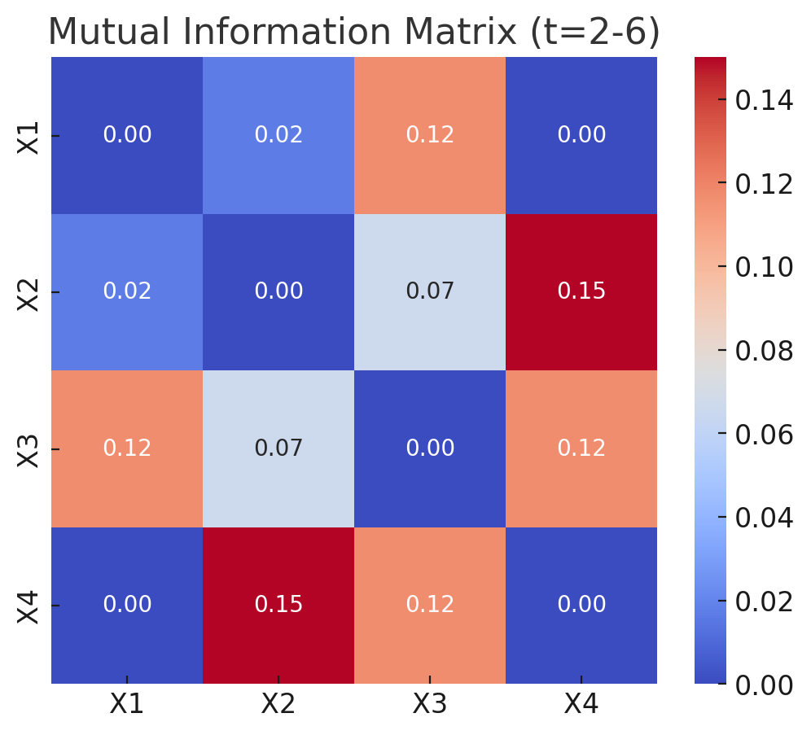

### Mutual Information in Control Charts and Multivariate Process Monitoring

#### Step 1: **Concept Overview**
Mutual Information (MI) quantifies the amount of shared information between two variables, measuring their dependency. Unlike correlation or covariance, which are limited to linear relationships, MI captures both linear and non-linear dependencies.

#### Step 2: **Application in Multivariate Control Charts**
1. **Phase 1: Feature Selection**  
   - MI can identify features that are highly dependent, even in non-linear ways.  
   - This ensures critical relationships between process variables are captured, improving anomaly detection.

2. **Phase 1: Data Reduction**  
   - MI helps identify redundant features. Features with high MI relative to others can be removed to reduce dimensionality without losing critical information.

#### Step 3: **Advantages Over Covariance/Correlation**
- **Non-linear Relationships**: MI detects hidden dependencies that covariance or correlation may miss.  
- **High-dimensional Data**: Useful in multivariate process monitoring, where relationships between features are complex.

#### Step 4: **Example Use Case**
In a manufacturing process with multiple temperature sensors:
- Correlation might show weak relationships between sensor readings.  
- MI could reveal a strong, non-linear dependency, indicating a shared underlying cause of variation (e.g., a faulty cooling system).  
- Using MI, these relationships can be incorporated into multivariate control charts to improve detection of out-of-control processes.

Let's walk through stepwise calculations of **Mutual Information (MI)** and visualize its application in multivariate process monitoring using a simplified example.

---

### Example Scenario:  
We have two features, $X$ (e.g., machine temperature) and $Y$ (e.g., output quality metric). We aim to calculate the MI to determine if there’s a dependency and apply this to improve monitoring in control charts.

---

### Step 1: **Calculate Probability Distributions**  
Assume $X$ and $Y$ are discretized into bins for simplicity. Suppose the data is:

| $X$ (bins) | $Y$ (bins) | Joint Frequency |
|--------------|--------------|-----------------|
| 1            | 1            | 20              |
| 1            | 2            | 10              |
| 2            | 1            | 5               |
| 2            | 2            | 15              |

#### Step 1.1: Compute Joint Probability $P(X, Y)$  
$$ P(X, Y) = \frac{\text{Joint Frequency}}{\text{Total Data Points}} $$  
Total Data Points $N = 20 + 10 + 5 + 15 = 50$.

$$
P(X, Y) =
\begin{array}{|c|c|c|}
\hline
X & Y & P(X, Y) \\
\hline
1 & 1 & \frac{20}{50} = 0.4 \\
1 & 2 & \frac{10}{50} = 0.2 \\
2 & 1 & \frac{5}{50} = 0.1 \\
2 & 2 & \frac{15}{50} = 0.3 \\
\hline
\end{array}
$$

#### Step 1.2: Compute Marginal Probabilities  
$$
P(X=1) = P(1, 1) + P(1, 2) = 0.4 + 0.2 = 0.6, \quad P(X=2) = 0.1 + 0.3 = 0.4
$$  
$$
P(Y=1) = P(1, 1) + P(2, 1) = 0.4 + 0.1 = 0.5, \quad P(Y=2) = 0.2 + 0.3 = 0.5
$$

---

### Step 2: **Compute Mutual Information**  
$$
MI(X, Y) = \sum_{x \in X} \sum_{y \in Y} P(X, Y) \cdot \log \left(\frac{P(X, Y)}{P(X) \cdot P(Y)} \right)
$$

#### Step 2.1: Term-by-Term Calculation  
- For $X=1, Y=1$ :  
$$
MI_{1,1} = 0.4 \cdot \log \left(\frac{0.4}{0.6 \cdot 0.5}\right) = 0.4 \cdot \log(1.333) \approx 0.4 \cdot 0.125 = 0.05
$$
- For $X=1, Y=2$ :  
$$
MI_{1,2} = 0.2 \cdot \log \left(\frac{0.2}{0.6 \cdot 0.5}\right) = 0.2 \cdot \log(0.667) \approx 0.2 \cdot (-0.176) = -0.035
$$
- For $X=2, Y=1$ :  
$$
MI_{2,1} = 0.1 \cdot \log \left(\frac{0.1}{0.4 \cdot 0.5}\right) = 0.1 \cdot \log(0.5) \approx 0.1 \cdot (-0.301) = -0.03
$$
- For $X=2, Y=2$ :  
$$
MI_{2,2} = 0.3 \cdot \log \left(\frac{0.3}{0.4 \cdot 0.5}\right) = 0.3 \cdot \log(1.5) \approx 0.3 \cdot 0.176 = 0.053
$$

#### Step 2.2: Sum All Terms  
$$
MI(X, Y) = 0.05 - 0.035 - 0.03 + 0.053 = 0.038
$$

---

### Step 3: **Visualize Results**
#### Plotting Mutual Information for Feature Pairs
We can create a heatmap showing MI for all variable pairs in a multivariate dataset. For simplicity, consider MI between $X_1, X_2, \ldots, X_n$.

The heatmap above shows the Mutual Information (MI) values between features. Higher MI values indicate stronger dependencies (linear or non-linear). This insight can guide feature selection or data transformation for constructing more effective multivariate control charts.

Here is an example of a dataset with 4 variables ($X_1, X_2, X_3, X_4$ ) and timestamps ($t$ ) for 10 time points:

| Timestamp ($t$ ) | $X_1$   | $X_2$   | $X_3$   | $X_4$   |
|--------------------|-----------|-----------|-----------|-----------|
| 1                  | 10.0      | 20.1      | 15.2      | 30.4      |
| 2                  | 10.5      | 19.8      | 14.9      | 30.2      |
| 3                  | 11.0      | 20.0      | 15.0      | 30.0      |
| 4                  | 10.8      | 19.7      | 15.1      | 29.8      |
| 5                  | 10.9      | 20.2      | 15.0      | 30.1      |
| 6                  | 11.2      | 20.3      | 15.4      | 30.5      |
| 7                  | 10.7      | 20.0      | 14.8      | 30.0      |
| 8                  | 10.6      | 19.9      | 15.0      | 29.7      |
| 9                  | 10.9      | 20.1      | 15.2      | 30.2      |
| 10                 | 11.1      | 20.4      | 15.3      | 30.3      |

### Applying Mutual Information Dynamically
1. **Sliding Window**: Choose a window size (e.g., 5 timestamps).
2. **Compute MI for Each Window**: For $t=1$ to $t=5$ , calculate MI for $X_1, X_2, X_3, X_4$. Slide the window forward by 1 timestamp and repeat.
3. **Result**: A sequence of MI matrices, one for each window.

Using **Mutual Information (MI)** in control charts for process monitoring involves leveraging its ability to detect dependencies (linear and non-linear) between variables. Here's a step-by-step explanation:

---

### **Step 1: Establish Baseline Process Behavior (Phase I)**
1. **Calculate MI for Normal (In-Control) Data**:
   - Use historical in-control data to compute the baseline MI matrix.
   - This serves as the reference for process monitoring.
   
2. **Create a Reference Statistic**:
   - Combine the MI values into a single statistic or a set of key statistics (e.g., average MI, significant deviations) that represent the process behavior.

---

### **Step 2: Monitor Real-Time Data (Phase II)**
1. **Dynamic MI Calculation**:
   - Compute MI in real-time or within a sliding window for the current process data.
   - Compare this MI matrix to the baseline (or reference) MI matrix.

2. **Define Control Limits**:
   - Set control limits based on acceptable deviations from the baseline MI matrix or statistics.
   - These could be determined using standard thresholds (e.g., 3-sigma) or machine learning techniques.

3. **Out-of-Control Signals**:
   - If deviations in MI exceed control limits, flag the process as out-of-control.
   - Example metrics: 
     - Maximum pairwise MI deviation.
     - Total MI variation (e.g., sum of absolute differences).

---

### **Step 3: Diagnose and Act**
1. **Identify Variables Contributing to MI Changes**:
   - Analyze which variable pairs show significant MI changes to identify the root cause of process disruptions.
   
2. **Visualize Changes**:
   - Use heatmaps or trend lines to show MI variations over time.

---

### **Example Application**
#### Scenario:
A manufacturing process with $X_1$ (temperature), $X_2$ (pressure), $X_3$ (humidity), and $X_4$ (speed) is being monitored.

1. **Baseline MI Matrix**:
   - Compute MI using historical data to find baseline dependencies (e.g., $X_1$ and $X_2$ have high MI due to thermal coupling).

2. **Real-Time Monitoring**:
   - Track changes in MI during the process. If $X_1$ -$X_2$ MI drops unexpectedly, it might indicate a system decoupling (e.g., malfunction in the heating system).

3. **Control Chart Integration**:
   - Plot MI deviations or summary statistics on a control chart for continuous monitoring.

To understand how **Mutual Information (MI)** captures both **linear** and **non-linear relationships**, let’s break it down step by step:

---

### Step 1: **Linear Relationships**
Linear relationships are those where one variable is a linear function of another, such as $Y = aX + b$.  
- **Correlation** is sufficient for linear relationships because it measures how well a straight line fits the data.

#### MI Perspective:
- MI measures how much knowing $X$ reduces uncertainty in $Y$ , irrespective of the linearity. 
- For a perfect linear relationship ($Y = X$ ), MI is high, as $X$ completely determines $Y$.

---

### Step 2: **Non-Linear Relationships**
Non-linear relationships cannot be expressed as a straight-line equation (e.g., $Y = X^2$ , $Y = \sin(X)$ ).

#### MI Perspective:
- MI captures dependencies by comparing joint and marginal distributions.
- It does not assume any functional form, unlike correlation, which assumes linearity.

For example:
1. $Y = X^2$ : Correlation may be near zero because $Y$ increases quadratically, not linearly, with $X$.
   - MI is high because $Y$ still depends on $X$ , even though the relationship is non-linear.

2. $Y = \sin(X)$ : Correlation may fail because the relationship is periodic (oscillating between positive and negative).
   - MI captures the dependency because it measures shared information between $X$ and $Y$.

---

### Step 3: **How MI Works**
MI compares:
1. **Joint Distribution** $P(X, Y)$ : Probability of $X$ and $Y$ occurring together.
2. **Marginal Distributions** $P(X)$ and $P(Y)$ : Probabilities of $X$ and $Y$ individually.

$$
MI(X, Y) = \sum_{x \in X} \sum_{y \in Y} P(X, Y) \cdot \log \left(\frac{P(X, Y)}{P(X) \cdot P(Y)}\right)
$$

- If $X$ and $Y$ are independent, $P(X, Y) = P(X) \cdot P(Y)$ , and $MI = 0$.
- If $X$ determines $Y$ completely (linear or non-linear), $P(X, Y) \neq P(X) \cdot P(Y)$ , and $MI > 0$.

---

### Step 4: **Examples with Linear and Non-Linear Relationships**

#### Dataset:
- $X$ is a uniformly distributed variable.
- $Y$ depends on $X$ in the following ways:
  1. $Y_1 = 2X + 1$ (Linear)
  2. $Y_2 = X^2$ (Non-Linear)
  3. $Y_3 = \sin(X)$ (Periodic, Non-Linear)

I’ll compute MI and visualize the relationships.

The scatter plots above show the relationships between $X$ and $Y$ :

1. **Linear ($Y = 2X + 1$ )**:
   - The relationship is clearly linear.
   - MI is high because $X$ fully determines $Y$.

2. **Non-Linear Quadratic ($Y = X^2$ )**:
   - Correlation might fail here, but MI captures the dependency between $X$ and $Y$.

3. **Non-Linear Periodic ($Y = \sin(X)$ )**:
   - Correlation might misinterpret the periodicity, but MI still identifies strong shared information.

This demonstrates that MI effectively captures both linear and non-linear relationships. Let me know if you'd like further details!

