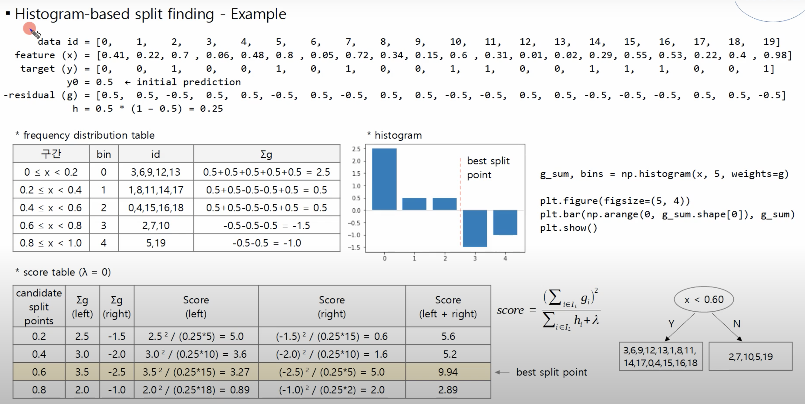

# Histogram-based Splitting

Histogram-based Splitting**

### **Problem it solves:**

Traditional GBMs evaluate **all possible split points** for every feature, which is slow and memory-intensive, especially for continuous features.

### **Core idea:**

Convert continuous feature values into **discrete bins** (a histogram). Then perform split finding using **bin thresholds** instead of raw feature values.

This reduces:

* the number of candidate splits,
* the size of gradient statistics,
* and memory usage.

### **How it works (step-by-step):**

1. **Discretization**:

   * For each feature, divide its range into `k` bins (commonly 255).
   * Replace raw values with their **bin indices**.

     * Example: If bins are `[0-5), [5–10), [10–15), ...`, a value of `7.2` goes into bin `1`.

2. **Histogram construction**:

   * For each feature’s bins, accumulate:

     * Sum of gradients (`∑g_i`)
     * Sum of Hessians (`∑h_i`)
     * Count of samples

3. **Split finding**:

   * Iterate over bins (not raw values).
   * For each bin `j`, compute the **gain** if we split at that bin:

     $$
     \text{Gain}(j) = \text{similarity(left)} + \text{similarity(right)} - \text{similarity(total)}
     $$
   * Choose the bin with the **highest gain**.

4. **Split execution**:

   * Once the best bin is selected, split the data based on **which side of the bin** a value falls into.

### **Numerical Example:**

Assume feature values: `[2.1, 7.3, 9.8, 10.5, 15.0]`

Define 5 bins:

* `[0–5)`, `[5–10)`, `[10–15)`, `[15–20)`, `[20–25)`

→ Values mapped to bins: `[0, 1, 1, 2, 3]`

Now compute the sum of gradients and Hessians for each bin and search for best split among 4 boundaries.

### **Why it works:**

* Reduces precision slightly (controlled via number of bins), but keeps structure.
* Much faster due to working with integers and fewer split points.
* Binning allows **histogram reuse** and memory sharing.

### **Benefits:**

* **Significantly faster** split finding (up to 10x faster).
* **Lower memory usage**, since bins need less space than raw floats.
* Enables **hardware-friendly** optimizations (e.g., SIMD, cache locality).

---
