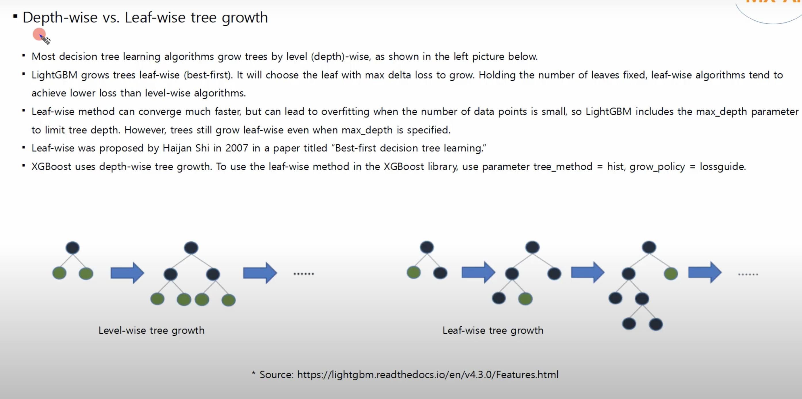

## **4. Leaf-wise Tree Growth with Depth Limit**

### **Problem it solves:**

Traditional GBMs (like scikit-learn's) grow trees **level-wise**:

* Split **all nodes at depth `d`**, then go to depth `d+1`.
* Easy to control depth but can be inefficient: not all splits reduce loss equally.

### **Core idea:**

Grow the tree by **always splitting the leaf that reduces loss the most** — not in a fixed level order.
This is called **leaf-wise** (best-first) growth.

### **What’s different:**

| Approach   | Strategy                       | Strength                         | Weakness                                  |
| ---------- | ------------------------------ | -------------------------------- | ----------------------------------------- |
| Level-wise | Split all leaves at same depth | Balanced trees, controlled depth | Wasteful splits, slower loss reduction    |
| Leaf-wise  | Split most promising leaf only | Fastest reduction in loss        | Unbalanced trees, higher overfitting risk |

### **How it works (step-by-step):**

1. Start with root node (all samples).
2. For each node (leaf), compute the **gain** from splitting it.
3. **Select the leaf with highest gain**.
4. Split that leaf into two child nodes.
5. Repeat until:

   * Max number of leaves is reached,
   * Or max depth is hit (as a regularization to prevent overfitting).

### **Depth limit usage:**

To prevent the tree from growing too deep (and overfitting), LightGBM supports a **maximum depth constraint**:

* Helps control model complexity.
* Acts as a regularizer.

### **Numerical intuition:**

Assume we have a root node, and 3 potential leaves (`L1`, `L2`, `L3`) with split gains:

* `Gain(L1) = 12`, `Gain(L2) = 3`, `Gain(L3) = 8`

Leaf-wise growth will:

1. Split `L1` → now we have `L1a`, `L1b`, `L2`, `L3`
2. Recompute gains, and again choose the **best** leaf to split
3. Repeat

Level-wise would instead:

* Split all 3 leaves regardless of their gain, which is less efficient.

### **Why it works:**

* Focuses resources on splitting where the model gains most.
* **Faster convergence**: fewer trees to reach low training error.

### **Drawbacks:**

* Can create **deep unbalanced trees**, especially on noisy data.
* Higher risk of **overfitting** unless controlled by:

  * `max_depth`
  * `min_data_in_leaf`
  * `min_gain_to_split`

### **Benefits:**

* **Fewer trees** to reach high accuracy.
* **Faster training** and lower loss per tree.
* Highly flexible and works well with regularization.

---

