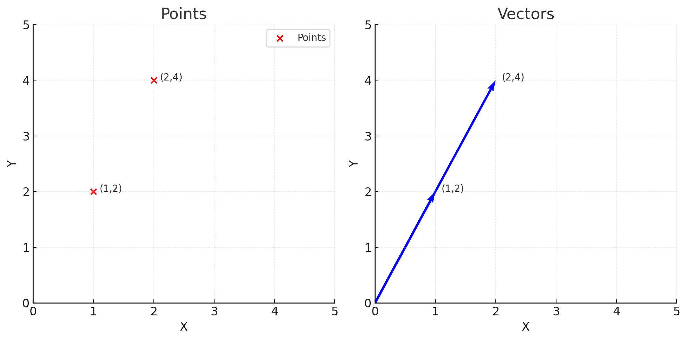
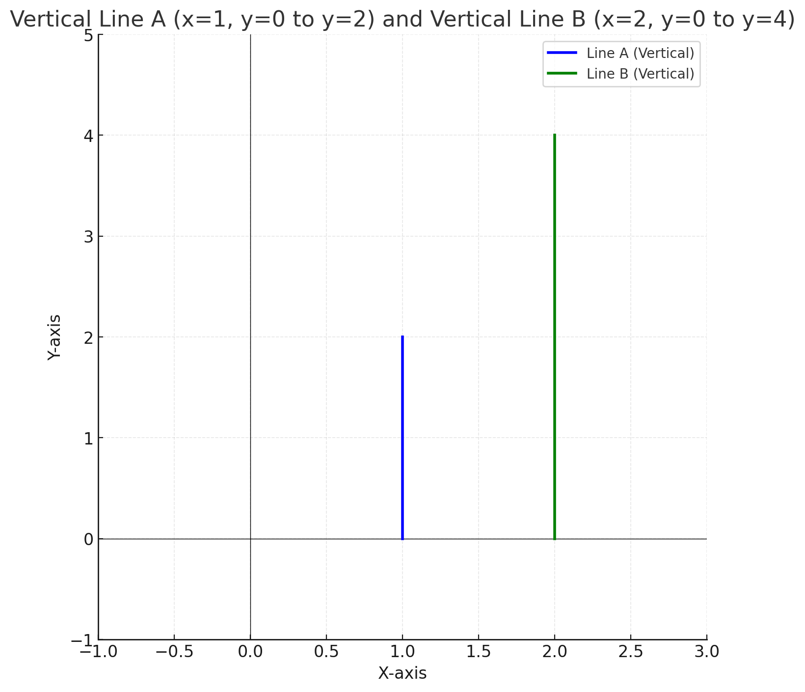
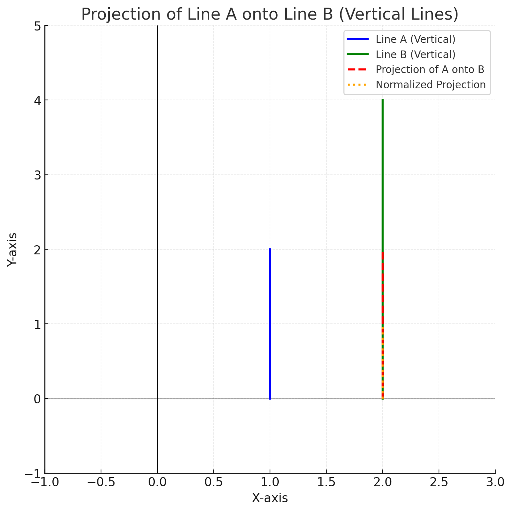
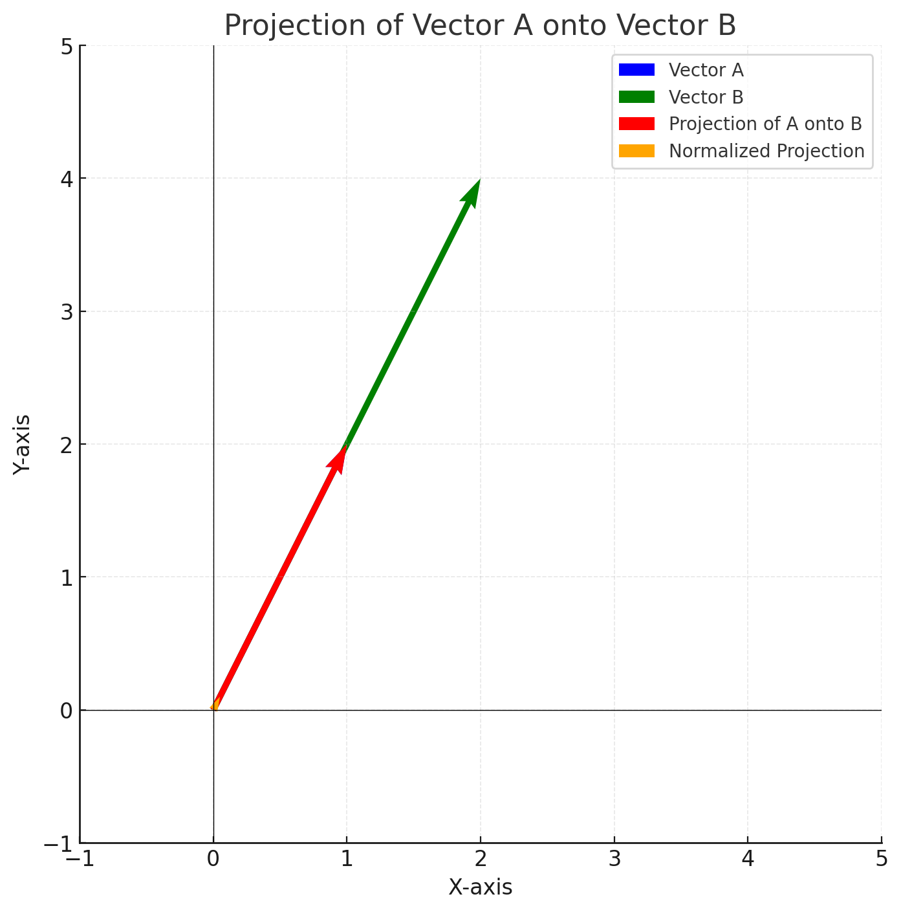
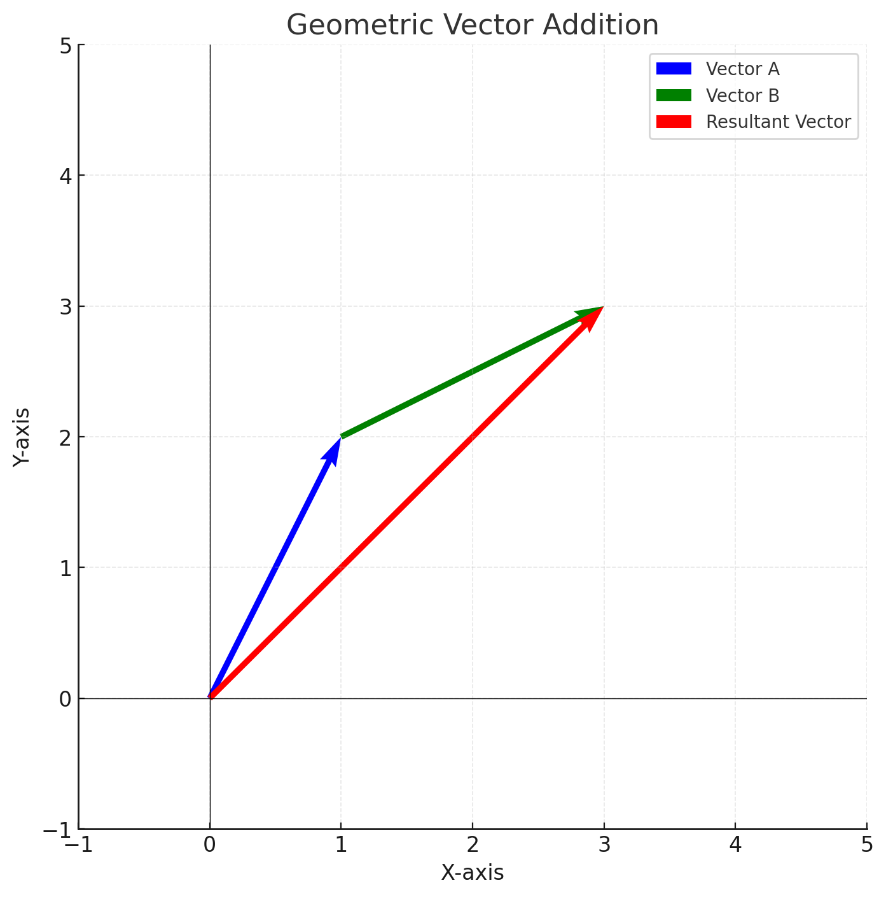
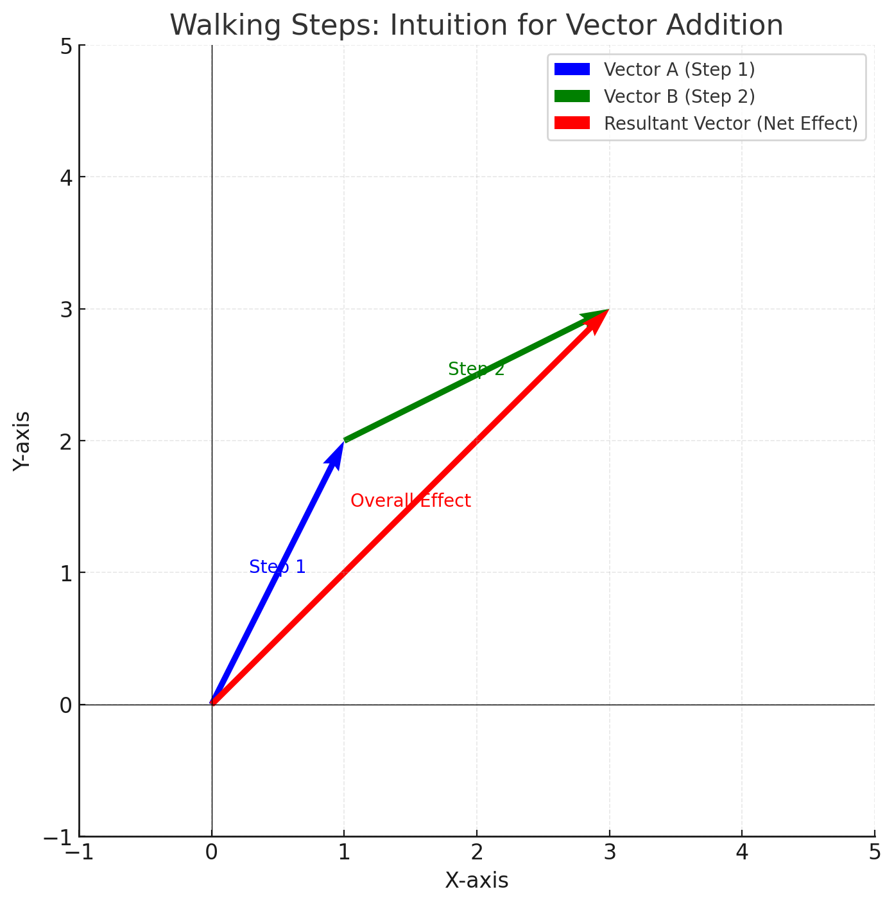
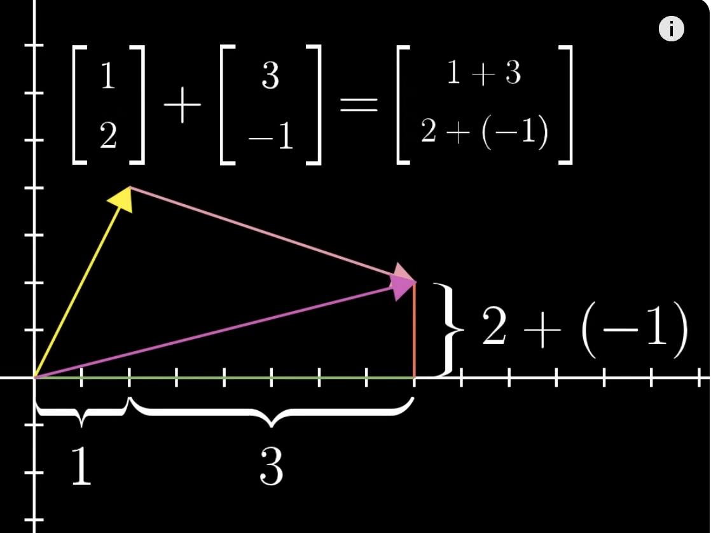
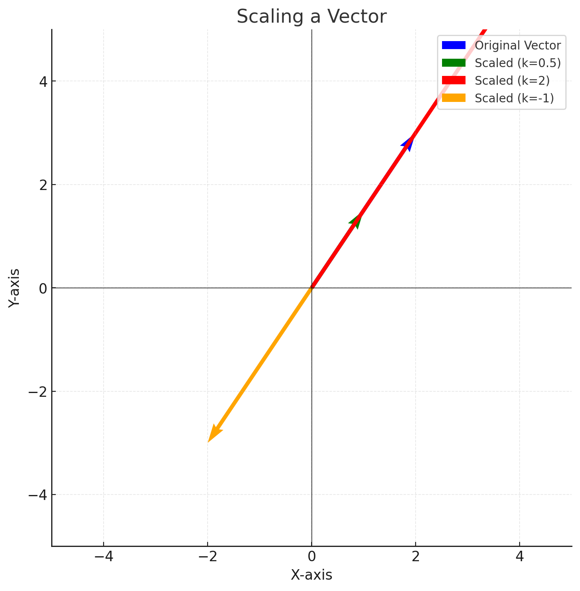

### **Difference Between Vectors and Points**

1. **Points**:
   - Represent **locations** in space.
   - Have no direction or magnitude.
   - Example: A point $(1, 2)$ is just a specific position in a 2D plane.

2. **Vectors**:
   - Represent **quantities with both direction and magnitude**.
   - Can start at the origin or any arbitrary point.
   - Example: A vector $\mathbf{v} = (1, 2)$ describes a movement or displacement, often drawn as an arrow starting at the origin.

---

### **Plotting Points and Vectors**

#### **Points: $(1, 2)$ and $(2, 4)$**
- Plot $A = (1, 2)$ and $B = (2, 4)$ as points:
  - They appear as specific dots on the plane at $x = 1, y = 2$ and $x = 2, y = 4$.

#### **Vectors: $(1, 2)$ and $(2, 4)$**
- Plot $\mathbf{a} = (1, 2)$ and $\mathbf{b} = (2, 4)$ as vectors:
  - $\mathbf{a}$ : Starts at the origin $(0, 0)$ and ends at $(1, 2)$.
  - $\mathbf{b}$ : Starts at the origin $(0, 0)$ and ends at $(2, 4)$.

---

### **Visualization**
I will now plot both the points and vectors for better understanding.

The plots above show:

1. **Points**: $(1, 2)$ and $(2, 4)$ are represented as red dots in the left graph, indicating fixed positions in the 2D plane.
2. **Vectors**: $(1, 2)$ and $(2, 4)$ are represented as arrows in the right graph, starting at the origin and pointing toward the respective coordinates.



---

### **Does Projection Work for Both Concepts?**

#### **1. For Vectors**:
Yes, projection works directly for vectors. The projection of $\mathbf{a}$ onto $\mathbf{b}$ is:
$$
\text{Proj}_{\mathbf{b}}(\mathbf{a}) = \frac{\mathbf{a} \cdot \mathbf{b}}{\|\mathbf{b}\|^2} \mathbf{b}
$$
This gives a new vector representing how much $\mathbf{a}$ aligns with $\mathbf{b}$.

#### **2. For Points**:
Projection is not directly meaningful for points because they lack direction or magnitude. However, if you interpret the points as vectors from the origin, you can apply projection as if they were vectors.

---

### **Does This Difference Matter for Different Fields?**

#### **Mathematics**:
- The distinction is important for clarity and interpretation.
- Points are used for geometry (locations), while vectors are used for algebraic operations (e.g., transformations, projections).

#### **Physics**:
- Vectors are essential for representing forces, velocities, and displacements (quantities with direction).
- Points rarely appear alone; they may represent positions, but their relationships (via displacement vectors) matter more.

#### **Computer Science**:
- Points are common in graphics and spatial data (e.g., rendering locations or storing geometric coordinates).
- Vectors are used for computations like transformations, projections, and machine learning (e.g., embeddings or gradients).

---

You described **vertical lines** by specifying their **fixed x-coordinates** and their range on the y-axis, and the misunderstanding arose because the terminology you used can be interpreted differently depending on context. Let's clarify:



---

### **1. Why the Misunderstanding?**
- **Your Description**: "A line starts at $x = 1$ and ends at $y = 2$."
  - This can be interpreted as:
    - A diagonal line connecting $(1, 0)$ and $(0, 2)$ , which forms a typical line segment.
    - Or, as you meant: a vertical line where $x = 1$ is constant, with $y$ ranging from $0$ to $2$.
  - The word **"starts at"** is often interpreted in the direction of a line or vector (e.g., from one point to another with an implied slope), leading to my incorrect assumption of a diagonal line.

---

### **2. What Are These Lines Called?**
- **They Are Not Vectors**:
  - Vectors represent quantities with magnitude and direction, not fixed x or y values.
  - A vertical line doesn't have a single direction or displacement; it's a **set of points**.

- **They Are Not Data Points**:
  - Data points are single locations, e.g., $(x, y)$ , while vertical lines are collections of points along the y-axis for a specific x.

- **They Are Geometric Lines**:
  - What you described are **vertical line segments**:
    - **Vertical line segment**: A line with a fixed $x$ -coordinate, extending over a specific range of $y$ -values.
    - Example: $x = 1$ , $y \in [0, 2]$.

---

### **3. Could This Be Improved?**
Yes! A clearer description would be:
- **Line A**: "A vertical line at $x = 1$ , extending from $y = 0$ to $y = 2$."
- **Line B**: "A vertical line at $x = 2$ , extending from $y = 0$ to $y = 4$."

This removes ambiguity about the direction or slope of the lines.

---

### **4. Are These Useful in Math, Physics, or Computer Science?**
Absolutely! Vertical line segments are commonly used:
- **Mathematics**:
  - For geometric analysis or visualizations.
  - Representing domain restrictions, boundaries, or intervals.
- **Physics**:
  - Rarely appear directly but may represent constraints (e.g., fixed x-values for motion).
- **Computer Science**:
  - Vertical lines can represent boundaries in algorithms (e.g., sweep-line algorithms in computational geometry).

---

To **convert vertical lines to vector representation**:

### **Vector Representation of Vertical Lines**
For a vertical line:
- The line is treated as a vector from its starting point (at the bottom) to its ending point (at the top).
- Example:
  - Line A starts at $(1, 0)$ and ends at $(1, 2)$ :
    $$
    \mathbf{a} = \text{End Point} - \text{Start Point} = \begin{bmatrix} 1 - 1 \\ 2 - 0 \end{bmatrix} = \begin{bmatrix} 0 \\ 2 \end{bmatrix}
    $$

---

### **Updated Answer with Plot**

1. **Projection of Line A onto Line B**:
   - Line A: Vertical at $x = 1$ , vector representation $\mathbf{a} = \begin{bmatrix} 0 \\ 2 \end{bmatrix}$.
   - Line B: Vertical at $x = 2$ , vector representation $\mathbf{b} = \begin{bmatrix} 0 \\ 4 \end{bmatrix}$.

   **Steps to Compute the Projection**:
   $$
   \text{Proj}_{\mathbf{b}}(\mathbf{a}) = \frac{\mathbf{a} \cdot \mathbf{b}}{\|\mathbf{b}\|^2} \mathbf{b}
   $$

   - **Dot Product**:
     $$
     \mathbf{a} \cdot \mathbf{b} = (0 \cdot 0) + (2 \cdot 4) = 8
     $$

   - **Magnitude Squared of $\mathbf{b}$**:
     $$
     \|\mathbf{b}\|^2 = 0^2 + 4^2 = 16
     $$

   - **Projection Vector**:
     $$
     \text{Proj}_{\mathbf{b}}(\mathbf{a}) = \frac{8}{16} \cdot \begin{bmatrix} 0 \\ 4 \end{bmatrix} = \begin{bmatrix} 0 \\ 2 \end{bmatrix}
     $$

   - **Normalize the Projection**:
     $$
     \text{Normalized Projection} = \frac{\text{Proj}_{\mathbf{b}}(\mathbf{a})}{\|\text{Proj}_{\mathbf{b}}(\mathbf{a})\|} = \frac{\begin{bmatrix} 0 \\ 2 \end{bmatrix}}{2} = \begin{bmatrix} 0 \\ 1 \end{bmatrix}
     $$

---

2. **Visualization**:
I will now plot Line A, Line B, the projection vector, and the normalized projection.

### **Explanation of the Plot**

1. **Line A (Blue)**:
   - A vertical line at $x = 1$ , extending from $y = 0$ to $y = 2$.

2. **Line B (Green)**:
   - A vertical line at $x = 2$ , extending from $y = 0$ to $y = 4$.

3. **Projection of Line A onto Line B (Red Dashed)**:
   - The projection vector overlaps with the segment of Line B, from $y = 0$ to $y = 2$ , as computed.

4. **Normalized Projection (Orange Dotted)**:
   - A unit-length vector along Line B, from $y = 0$ to $y = 1$.
   

   

---

### **Key Notes**
- The projection and normalized projection both align along Line B because both lines are vertical and parallel.
- The projection's magnitude is proportional to Line A's height, while the normalized projection is scaled to unit length.

---

### **Key Question**:
If we treat the **points $A$ and $B$** as vectors starting from the origin (rather than vertical lines), does the **projection value** remain the same?

---

### **Conceptual Difference**
1. **Lines as Vectors**:
   - The previous calculation treated **vertical line segments** as vectors.
   - For Line $A$ , $\mathbf{a} = [0, 2]$ (vertical movement only).
   - For Line $B$ , $\mathbf{b} = [0, 4]$ (vertical movement only).
   - Since both were purely vertical, the direction was the same, and the projection only depended on their magnitudes.

2. **Points as Vectors**:
   - Now, treat $A = (1, 2)$ and $B = (2, 4)$ as vectors from the origin:
     $$
     \mathbf{a} = [1, 2], \quad \mathbf{b} = [2, 4]
     $$
   - These vectors have both **x** and **y** components, meaning their direction is different (not purely vertical).

---

### **Step-by-Step Calculation**

#### 1. **Projection Formula**:
The projection of $\mathbf{a}$ onto $\mathbf{b}$ is:
$$
\text{Proj}_{\mathbf{b}}(\mathbf{a}) = \frac{\mathbf{a} \cdot \mathbf{b}}{\|\mathbf{b}\|^2} \mathbf{b}
$$

#### 2. **Dot Product**:
$$
\mathbf{a} \cdot \mathbf{b} = (1 \cdot 2) + (2 \cdot 4) = 2 + 8 = 10
$$

#### 3. **Magnitude Squared of $\mathbf{b}$**:
$$
\|\mathbf{b}\|^2 = (2^2 + 4^2) = 4 + 16 = 20
$$

#### 4. **Projection Scalar**:
$$
\frac{\mathbf{a} \cdot \mathbf{b}}{\|\mathbf{b}\|^2} = \frac{10}{20} = 0.5
$$

#### 5. **Projection Vector**:
$$
\text{Proj}_{\mathbf{b}}(\mathbf{a}) = 0.5 \cdot \begin{bmatrix} 2 \\ 4 \end{bmatrix} = \begin{bmatrix} 1 \\ 2 \end{bmatrix}
$$

---

### **Comparison of Results**

1. **When Treated as Lines (Vertical Only)**:
   - Projection vector: $\begin{bmatrix} 0 \\ 2 \end{bmatrix}$
   - Scalar: $0.5$.

2. **When Treated as Vectors (2D)**:
   - Projection vector: $\begin{bmatrix} 1 \\ 2 \end{bmatrix}$
   - Scalar: $0.5$.

---

### **Key Observations**

1. **Scalar Projection Remains the Same**:
   - The scalar projection ($0.5$ ) is unchanged because it depends only on the relative magnitudes and alignment of $\mathbf{a}$ and $\mathbf{b}$.
   - Both cases involve $\mathbf{a}$ pointing in the same direction relative to $\mathbf{b}$.

2. **Projection Vector Differs**:
   - When treated as vertical lines, the projection vector only had a $y$ -component.
   - When treated as 2D vectors, the projection vector $\begin{bmatrix} 1 \\ 2 \end{bmatrix}$ has both $x$ - and $y$ -components.

---

### **Conclusion**
The **scalar projection** remains the same because it measures alignment, but the **projection vector** differs based on whether you treat $A$ and $B$ as vertical lines or full 2D vectors.

```python
# Plot the points treated as vectors, their projection, and normalized vector (fixed linestyle issue)
plt.figure(figsize=(8, 8))
plt.axhline(0, color='black', linewidth=0.5)
plt.axvline(0, color='black', linewidth=0.5)
plt.grid(alpha=0.3)

# Plot Vector A
plt.quiver(0, 0, point_a[0], point_a[1], angles='xy', scale_units='xy', scale=1, color='blue', label="Vector A")

# Plot Vector B
plt.quiver(0, 0, point_b[0], point_b[1], angles='xy', scale_units='xy', scale=1, color='green', label="Vector B")

# Plot the projection of A onto B
plt.quiver(0, 0, projection_vector_points[0], projection_vector_points[1], 
           angles='xy', scale_units='xy', scale=1, color='red', label="Projection of A onto B")

# Normalized projection vector (unit length in B's direction)
normalized_proj_vector = [projection_vector_points[0] / magnitude_b_squared_points, 
                          projection_vector_points[1] / magnitude_b_squared_points]
plt.quiver(0, 0, normalized_proj_vector[0], normalized_proj_vector[1], 
           angles='xy', scale_units='xy', scale=1, color='orange', linestyle='-', label="Normalized Projection")

# Add labels and legend
plt.xlim(-1, 5)
plt.ylim(-1, 5)
plt.title("Projection of Vector A onto Vector B")
plt.xlabel("X-axis")
plt.ylabel("Y-axis")
plt.legend()
plt.show()


```




### **Explanation of the Updated Plot**

1. **Vector A (Blue)**:
   - Originates at $(0, 0)$ and points to $(1, 2)$.

2. **Vector B (Green)**:
   - Originates at $(0, 0)$ and points to $(2, 4)$.

3. **Projection of A onto B (Red)**:
   - The projection vector starts at $(0, 0)$ and points to $(1, 2)$ , aligning with $B$.

4. **Normalized Projection (Orange)**:
   - A unit vector in the same direction as $B$ , showing the direction of the projection scaled to length 1.

---

### **Key Notes**
- The projection of $A$ onto $B$ aligns with $B$ , as both vectors point in the same general direction.
- The projection's **magnitude and direction** match the computed values.

---

### **Adding Vectors Geometrically**
Adding vectors geometrically involves **placing one vector's tail at the head of another vector** and finding the resultant vector from the origin to the final point.

---

### **Steps to Add Vectors Geometrically**
1. **Positioning**:
   - Start with the first vector.
   - Place the tail of the second vector at the head of the first vector.

2. **Resultant Vector**:
   - The resultant vector is drawn from the origin (or the starting point) to the head of the last vector in the chain.

3. **Vector Addition Formula**:
   For two vectors $\mathbf{a} = [a_1, a_2]$ and $\mathbf{b} = [b_1, b_2]$ :
   $$
   \mathbf{r} = \mathbf{a} + \mathbf{b} = \begin{bmatrix} a_1 + b_1 \\ a_2 + b_2 \end{bmatrix}
   $$

---

### **Example**
Let:
- $\mathbf{a} = [1, 2]$
- $\mathbf{b} = [2, 1]$

1. **Adding**:
   $$
   \mathbf{r} = \mathbf{a} + \mathbf{b} = \begin{bmatrix} 1 + 2 \\ 2 + 1 \end{bmatrix} = \begin{bmatrix} 3 \\ 3 \end{bmatrix}
   $$

2. **Interpretation**:
   - $\mathbf{a}$ : Starts at the origin and points to $(1, 2)$.
   - $\mathbf{b}$ : Starts where $\mathbf{a}$ ends and points to $(2, 1)$.
   - $\mathbf{r}$ : The resultant vector points from the origin to $(3, 3)$.

---

### **Visualization**
I will now plot the vectors $\mathbf{a}$ , $\mathbf{b}$ , and the resultant vector $\mathbf{r}$.



```python
# Define the vectors
vector_a = [1, 2]  # Vector A
vector_b = [2, 1]  # Vector B
vector_r = [vector_a[0] + vector_b[0], vector_a[1] + vector_b[1]]  # Resultant Vector

# Plot the vectors geometrically
plt.figure(figsize=(8, 8))
plt.axhline(0, color='black', linewidth=0.5)
plt.axvline(0, color='black', linewidth=0.5)
plt.grid(alpha=0.3)

# Plot Vector A
plt.quiver(0, 0, vector_a[0], vector_a[1], angles='xy', scale_units='xy', scale=1, color='blue', label="Vector A")

# Plot Vector B (placed at the head of Vector A)
plt.quiver(vector_a[0], vector_a[1], vector_b[0], vector_b[1], angles='xy', scale_units='xy', scale=1, color='green', label="Vector B")

# Plot the resultant vector
plt.quiver(0, 0, vector_r[0], vector_r[1], angles='xy', scale_units='xy', scale=1, color='red', label="Resultant Vector")

# Add labels and legend
plt.xlim(-1, 5)
plt.ylim(-1, 5)
plt.title("Geometric Vector Addition")
plt.xlabel("X-axis")
plt.ylabel("Y-axis")
plt.legend()
plt.show()


```

### **Explanation of the Plot**

1. **Vector A (Blue)**:
   - Starts at the origin $(0, 0)$ and points to $(1, 2)$.

2. **Vector B (Green)**:
   - Placed with its tail at the head of $A$ , starting at $(1, 2)$ and pointing to $(3, 3)$.

3. **Resultant Vector (Red)**:
   - Drawn from the origin $(0, 0)$ to the head of $B$ , representing the sum of $A$ and $B$ : $(3, 3)$.

---

### **Key Takeaways**
- Geometric vector addition involves positioning one vector after another.
- The resultant vector represents the combined effect of both vectors.

### **Intuition Behind Vector Addition**
To understand vector addition, think of **walking steps**:
- Each vector represents a step you take: its **magnitude** is how far you walk, and its **direction** is where you walk.
- Adding vectors means combining these steps to see your **overall movement**.

---

### **Example on a Number Line (1D Case)**

1. **Vector A**: Suppose you start at 0 and walk **3 steps forward**. Now you're at position $3$.
   - $\mathbf{a} = 3$.

2. **Vector B**: From your new position, walk **5 more steps forward**. Now you're at position $8$.
   - $\mathbf{b} = 5$.

3. **Resultant Vector (Sum)**: Your total movement is from $0$ to $8$ , the combined effect of both steps:
   $$
   \mathbf{r} = \mathbf{a} + \mathbf{b} = 3 + 5 = 8
   $$

#### **Intuition**:
Adding vectors in 1D is like **stacking steps along the same path** to see where you end up.

---

### **Walking Steps in 2D (Geometric Example)**

1. **Vector A**:
   - Walk **1 step forward** and **2 steps up**. You’re now at position $(1, 2)$.

2. **Vector B**:
   - From $(1, 2)$ , walk **2 steps forward** and **1 step up**. You’re now at position $(3, 3)$.

3. **Resultant Vector (Sum)**:
   - Your total movement starts at $(0, 0)$ and ends at $(3, 3)$ :
     $$
     \mathbf{r} = \mathbf{a} + \mathbf{b} = \begin{bmatrix} 1 + 2 \\ 2 + 1 \end{bmatrix} = \begin{bmatrix} 3 \\ 3 \end{bmatrix}
     $$

---

### **Why the Result is the Overall Effect**
The resultant vector captures the **direct path** from your starting point to your final position:
- It **bypasses intermediate steps** (like where you were after Vector A).
- This is the **net displacement** of your movement.

---

### **Visualization**
Now, I’ll extend the earlier plot to show how each step represents walking, with annotations for intuition.



```python
# Extended plot to include walking intuition with annotations
plt.figure(figsize=(8, 8))
plt.axhline(0, color='black', linewidth=0.5)
plt.axvline(0, color='black', linewidth=0.5)
plt.grid(alpha=0.3)

# Plot Vector A
plt.quiver(0, 0, vector_a[0], vector_a[1], angles='xy', scale_units='xy', scale=1, color='blue', label="Vector A (Step 1)")
plt.text(vector_a[0] / 2, vector_a[1] / 2, "Step 1", fontsize=10, color='blue', ha='center')

# Plot Vector B
plt.quiver(vector_a[0], vector_a[1], vector_b[0], vector_b[1], angles='xy', scale_units='xy', scale=1, color='green', label="Vector B (Step 2)")
plt.text(vector_a[0] + vector_b[0] / 2, vector_a[1] + vector_b[1] / 2, "Step 2", fontsize=10, color='green', ha='center')

# Plot the resultant vector
plt.quiver(0, 0, vector_r[0], vector_r[1], angles='xy', scale_units='xy', scale=1, color='red', label="Resultant Vector (Net Effect)")
plt.text(vector_r[0] / 2, vector_r[1] / 2, "Overall Effect", fontsize=10, color='red', ha='center')

# Add labels and legend
plt.xlim(-1, 5)
plt.ylim(-1, 5)
plt.title("Walking Steps: Intuition for Vector Addition")
plt.xlabel("X-axis")
plt.ylabel("Y-axis")
plt.legend()
plt.show()


```

or



### **Explanation of the Plot**

1. **Step 1: Vector A (Blue)**:
   - You walk 1 step forward and 2 steps up, reaching $(1, 2)$.
   - Represented as the first arrow starting from $(0, 0)$.

2. **Step 2: Vector B (Green)**:
   - From $(1, 2)$ , you walk 2 steps forward and 1 step up, reaching $(3, 3)$.
   - Represented as the second arrow starting from the head of Vector A.

3. **Overall Effect: Resultant Vector (Red)**:
   - Instead of taking two separate steps, the resultant vector shows the **direct path** from $(0, 0)$ to $(3, 3)$.

---

### **Key Intuition**
- Adding vectors is like combining sequential steps to get the **net effect** of movement.
- The resultant vector bypasses intermediate points and directly shows where you end up.


---

### **Scaling a Vector**

**Scaling** a vector means multiplying it by a **scalar (a single number)**, which changes the **magnitude (length)** of the vector while maintaining or reversing its direction.

---

### **Mathematical Representation**
Given a vector $\mathbf{v} = \begin{bmatrix} x \\ y \end{bmatrix}$ and a scalar $k$ :
$$
k \cdot \mathbf{v} = \begin{bmatrix} k \cdot x \\ k \cdot y \end{bmatrix}
$$

- **Positive Scalar ($k > 0$ )**:
  - The vector stretches or shrinks, depending on the value of $k$.
  - The direction remains unchanged.

- **Negative Scalar ($k < 0$ )**:
  - The vector stretches or shrinks, and its direction is reversed.

- **Magnitude Scaling**:
  - The magnitude of the scaled vector becomes $|k| \cdot \|\mathbf{v}\|$ , where $\|\mathbf{v}\|$ is the original length.

---

### **Intuition**
Think of scaling a vector as:
- Stretching or compressing a **step** along the same direction.
- If $k > 1$ , you walk further in the same direction.
- If $0 < k < 1$ , you take a smaller step.
- If $k < 0$ , you walk in the **opposite direction**.

---

### **Example**
Let:
$$
\mathbf{v} = \begin{bmatrix} 2 \\ 3 \end{bmatrix}, \quad k = 2
$$

1. **Scaled Vector**:
   $$
   2 \cdot \mathbf{v} = \begin{bmatrix} 2 \cdot 2 \\ 2 \cdot 3 \end{bmatrix} = \begin{bmatrix} 4 \\ 6 \end{bmatrix}
   $$

2. **Reversing Direction** ($k = -1$ ):
   $$
   -1 \cdot \mathbf{v} = \begin{bmatrix} -1 \cdot 2 \\ -1 \cdot 3 \end{bmatrix} = \begin{bmatrix} -2 \\ -3 \end{bmatrix}
   $$

---

### **Visualization**
I will plot the original vector and its scaled versions for $k = 0.5, 2, -1$.



### **Explanation of the Plot**

1. **Original Vector (Blue)**:
   - The vector $\mathbf{v} = [2, 3]$ starts at the origin and points to $(2, 3)$.

2. **Scaled Vector for $k = 0.5$ (Green)**:
   - The vector shrinks to half its original length but points in the same direction, ending at $(1, 1.5)$.

3. **Scaled Vector for $k = 2$ (Red)**:
   - The vector stretches to twice its original length, ending at $(4, 6)$.

4. **Scaled Vector for $k = -1$ (Orange)**:
   - The vector flips direction (opposite) while maintaining its original length, ending at $(-2, -3)$.

---

### **Key Intuition**
- Scaling a vector by $k > 0$ changes its length while keeping its direction.
- Scaling by $0 < k < 1$ reduces the vector's magnitude.
- Scaling by $k < 0$ reverses its direction while adjusting the magnitude.

---

### **Understanding Linearity and Nonlinearity in Vector Representation**
You're **almost correct**, but let's break it down carefully.

### **1. Can We Draw a Line with Two Vectors?**
Yes! Given **two vectors** $\mathbf{a}$ and $\mathbf{b}$ , we can:
- Plot them **as arrows from the origin** in 2D or 3D.
- Find a **linear combination** $c_1 \mathbf{a} + c_2 \mathbf{b}$ to create a **line** if they are linearly dependent.

### **2. Can We Represent Nonlinearity with Only Two Vectors?**
No! A **single pair of vectors** cannot capture a **nonlinear shape** because:
- **Vectors are straight-line entities**.
- A single vector $\mathbf{a}$ is just an **arrow** pointing in one direction.
- A **nonlinear transformation** (e.g., $(x, x^2)$ or $(x, \sin x)$ ) requires **more than two fixed vectors**.

### **3. What Do We Need for Nonlinearity?**
To represent **nonlinear** relationships, we need a **sequence of vectors**, such as:
- A **time series** where **each time step** represents a new vector.
- A **dataset of many vectors** capturing different positions over time.

For example:
- **Linear case**: A **single** vector $(x, x)$ or a line formed by a **weighted sum** of two vectors.
- **Nonlinear case**: A **series** of vectors $(x, x^2)$ at different time steps, forming a curve.

### **Conclusion**
 **Two vectors can define a line, but they cannot create a nonlinear shape.**  
 **To represent nonlinearity, we need a series of vectors, such as a time series.**