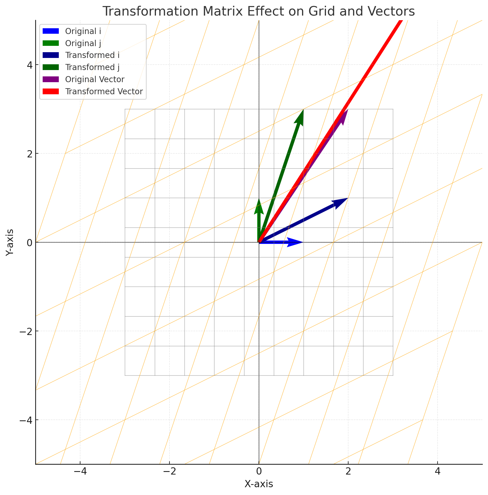
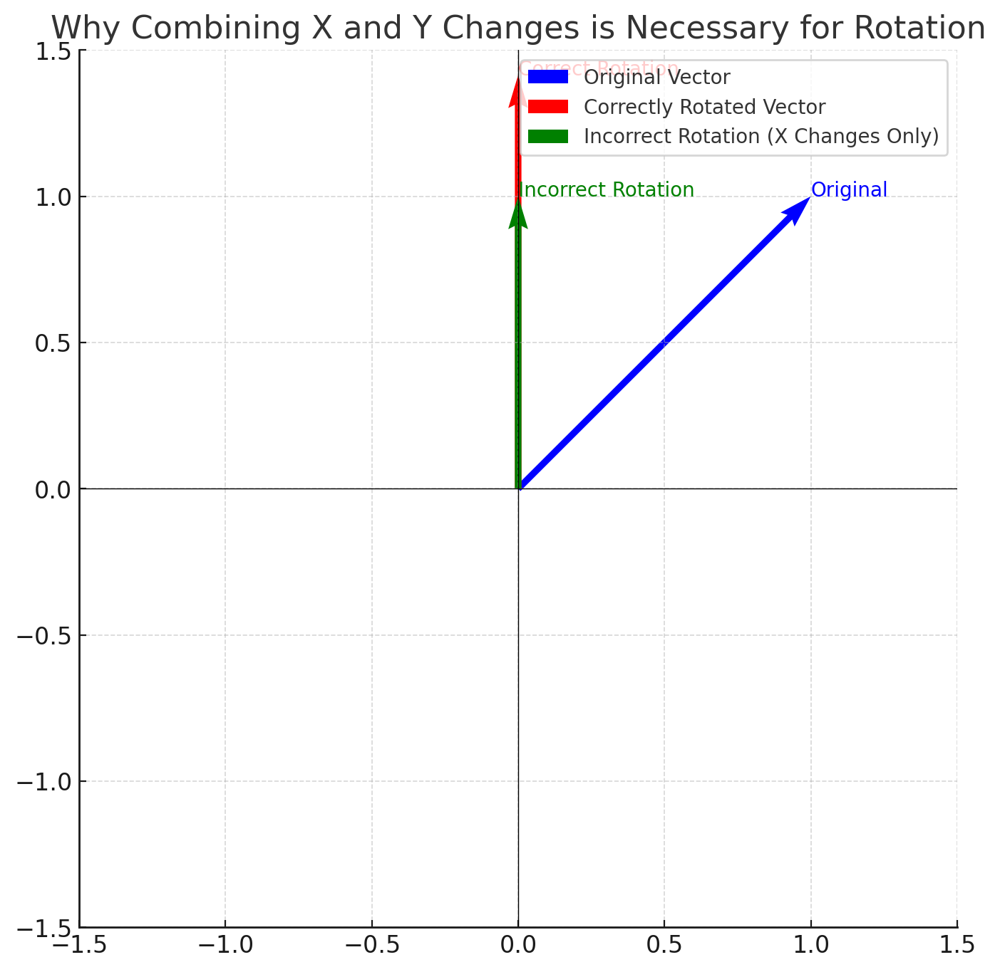

### **Linear Transformations**

I like to understand it how to transform the Grid System that show some vector.  so if the x coordinat are i (1,0) and the y (0,1) is u, are changed the grid is changed and shown vector is changed. So the transofrmation matrix says how do you want to change the i and u, then this will change the system and the way the vector is showed.

The transformation matrix dictates how the **grid system** (and therefore the **coordinate system**) changes, which impacts how vectors appear in that system. Let’s break it down with clear explanations and intuition.

---

### **1. The Grid System and Basis Vectors**
- The **grid system** is built using two special **basis vectors**:
  - $\mathbf{i} = \begin{bmatrix} 1 \\ 0 \end{bmatrix}$ : Represents 1 unit along the x-axis.
  - $\mathbf{j} = \begin{bmatrix} 0 \\ 1 \end{bmatrix}$ : Represents 1 unit along the y-axis.

- Every point or vector in this grid system is expressed as a **linear combination** of $\mathbf{i}$ and $\mathbf{j}$. For example:
  $$
  \mathbf{v} = \begin{bmatrix} 2 \\ 3 \end{bmatrix} = 2\mathbf{i} + 3\mathbf{j}.
  $$

#### **Key Insight**:
Changing the basis vectors $\mathbf{i}$ and $\mathbf{j}$ alters the grid, and the way we visualize $\mathbf{v}$ changes accordingly.

---

### **2. How the Transformation Matrix Works**
A **transformation matrix** specifies:
1. **Where the basis vectors go** after the transformation.
2. **How the grid changes** based on this new placement.

#### Matrix Columns Represent Basis Vectors
For a transformation matrix:
$$
A = \begin{bmatrix} a & b \\ c & d \end{bmatrix}
$$
- The first column $\begin{bmatrix} a \\ c \end{bmatrix}$ : Represents the **new position** of $\mathbf{i}$ after the transformation.
- The second column $\begin{bmatrix} b \\ d \end{bmatrix}$ : Represents the **new position** of $\mathbf{j}$ after the transformation.

#### Applying to the Grid
When the transformation matrix $A$ is applied:
1. The entire grid system adjusts so that:
   - $\mathbf{i}$ lands at $\begin{bmatrix} a \\ c \end{bmatrix}$.
   - $\mathbf{j}$ lands at $\begin{bmatrix} b \\ d \end{bmatrix}$.
2. Every vector in the grid $\mathbf{v}$ is transformed accordingly:
   $$
   \mathbf{v}' = A\mathbf{v}.
   $$

#### Example:
Let:
$$
A = \begin{bmatrix} 2 & 1 \\ 1 & 3 \end{bmatrix}.
$$
- New $\mathbf{i}$ : $\begin{bmatrix} 2 \\ 1 \end{bmatrix}$.
- New $\mathbf{j}$ : $\begin{bmatrix} 1 \\ 3 \end{bmatrix}$.

---

### **3. Visualizing the Grid Transformation**
The transformation matrix modifies:
1. The **grid lines**: They stretch, skew, rotate, or reflect based on how $\mathbf{i}$ and $\mathbf{j}$ are moved.
2. **Vectors within the grid**:
   - Each vector $\mathbf{v}$ is expressed in terms of the new $\mathbf{i}$ and $\mathbf{j}$.
   - This alters the apparent position and orientation of $\mathbf{v}$.

---

### **4. Intuition for Vectors After Transformation**
If a vector $\mathbf{v} = \begin{bmatrix} x \\ y \end{bmatrix}$ is expressed in terms of the original basis $\mathbf{i} = \begin{bmatrix} 1 \\ 0 \end{bmatrix}$ and $\mathbf{j} = \begin{bmatrix} 0 \\ 1 \end{bmatrix}$ , then after applying the transformation matrix $A$ :
$$
\mathbf{v}' = A \mathbf{v}.
$$
This means:
1. The vector $\mathbf{v}'$ is now described in terms of the **new** $\mathbf{i}$ and $\mathbf{j}$ defined by $A$.
2. The grid and vector both appear transformed, but the **relationship** between the vector and the grid remains the same.

---

### **5. Example with Visualization**
I will now create a plot to:
1. Show the original grid and basis vectors $\mathbf{i}$ and $\mathbf{j}$.
2. Show the transformed grid and basis vectors after applying a matrix $A$.
3. Demonstrate how a vector $\mathbf{v}$ appears in the original and transformed grids.

```python

# Re-import necessary libraries and re-define the setup for plotting
import numpy as np
import matplotlib.pyplot as plt

# Define the original basis vectors and the transformation matrix
original_basis = np.array([[1, 0], [0, 1]])  # Original i and j
transformation_matrix = np.array([[2, 1], [1, 3]])  # Transformation matrix

# Transform the basis vectors
transformed_basis = transformation_matrix @ original_basis

# Define a vector in the original grid and its transformation
vector_v = np.array([2, 3])
transformed_vector = transformation_matrix @ vector_v

# Create grid lines for visualization
grid_points = np.linspace(-3, 3, 10)
original_grid_x, original_grid_y = np.meshgrid(grid_points, grid_points)
transformed_grid_x = transformation_matrix[0, 0] * original_grid_x + transformation_matrix[0, 1] * original_grid_y
transformed_grid_y = transformation_matrix[1, 0] * original_grid_x + transformation_matrix[1, 1] * original_grid_y

# Plot the grids and vectors
plt.figure(figsize=(10, 10))
plt.axhline(0, color='black', linewidth=0.5)
plt.axvline(0, color='black', linewidth=0.5)
plt.grid(alpha=0.3)

# Plot the original grid
plt.plot(original_grid_x, original_grid_y, color='gray', linewidth=0.5, alpha=0.7)  # Horizontal lines
plt.plot(original_grid_x.T, original_grid_y.T, color='gray', linewidth=0.5, alpha=0.7)  # Vertical lines

# Plot the transformed grid
plt.plot(transformed_grid_x, transformed_grid_y, color='orange', linewidth=0.5, alpha=0.7)  # Horizontal lines
plt.plot(transformed_grid_x.T, transformed_grid_y.T, color='orange', linewidth=0.5, alpha=0.7)  # Vertical lines

# Plot the original basis vectors
plt.quiver(0, 0, original_basis[0, 0], original_basis[1, 0], angles='xy', scale_units='xy', scale=1, color='blue', label="Original i")
plt.quiver(0, 0, original_basis[0, 1], original_basis[1, 1], angles='xy', scale_units='xy', scale=1, color='green', label="Original j")

# Plot the transformed basis vectors
plt.quiver(0, 0, transformed_basis[0, 0], transformed_basis[1, 0], angles='xy', scale_units='xy', scale=1, color='darkblue', label="Transformed i")
plt.quiver(0, 0, transformed_basis[0, 1], transformed_basis[1, 1], angles='xy', scale_units='xy', scale=1, color='darkgreen', label="Transformed j")

# Plot the original vector and transformed vector
plt.quiver(0, 0, vector_v[0], vector_v[1], angles='xy', scale_units='xy', scale=1, color='purple', label="Original Vector")
plt.quiver(0, 0, transformed_vector[0], transformed_vector[1], angles='xy', scale_units='xy', scale=1, color='red', label="Transformed Vector")

# Add legend and labels
plt.xlim(-5, 5)
plt.ylim(-5, 5)
plt.title("Transformation Matrix Effect on Grid and Vectors")
plt.xlabel("X-axis")
plt.ylabel("Y-axis")
plt.legend()
plt.show()


```



### **Explanation of the Plot**

1. **Original Grid (Gray)**:
   - Represents the untransformed space with $\mathbf{i} = [1, 0]$ and $\mathbf{j} = [0, 1]$.
   - Each cell forms a square in the original coordinate system.

2. **Transformed Grid (Orange)**:
   - The transformation matrix $A = \begin{bmatrix} 2 & 1 \\ 1 & 3 \end{bmatrix}$ changes how $\mathbf{i}$ and $\mathbf{j}$ define the grid.
   - The grid is now skewed based on the transformed $\mathbf{i}$ and $\mathbf{j}$.

3. **Original Basis Vectors ($\mathbf{i}, \mathbf{j}$ )**:
   - $\mathbf{i} = [1, 0]$ (Blue) and $\mathbf{j} = [0, 1]$ (Green) show the original coordinate axes.

4. **Transformed Basis Vectors**:
   - $\mathbf{i}$ is transformed to $\begin{bmatrix} 2 \\ 1 \end{bmatrix}$ (Dark Blue).
   - $\mathbf{j}$ is transformed to $\begin{bmatrix} 1 \\ 3 \end{bmatrix}$ (Dark Green).
   - These determine the new coordinate axes.

5. **Original Vector (Purple)**:
   - $\mathbf{v} = \begin{bmatrix} 2 \\ 3 \end{bmatrix}$ is shown relative to the original grid.

6. **Transformed Vector (Red)**:
   - The vector $\mathbf{v}' = A \mathbf{v} = \begin{bmatrix} 7 \\ 11 \end{bmatrix}$ is shown in the transformed grid.

---

### **Key Takeaways**
- The transformation matrix $A$ alters the **grid** by redefining the basis vectors $\mathbf{i}$ and $\mathbf{j}$.
- Vectors (e.g., $\mathbf{v}$ ) transform accordingly to align with the new grid.
- The geometric meaning of $\mathbf{v}$ changes, but its relationship with the grid remains consistent.


#### **Definition**
A **linear transformation** is a function $T$ that maps vectors from one space to another while preserving:
1. **Additivity**:
   $$
   T(\mathbf{u} + \mathbf{v}) = T(\mathbf{u}) + T(\mathbf{v})
   $$
2. **Scalar Multiplication**:
   $$
   T(c \mathbf{v}) = c T(\mathbf{v}), \quad \text{for any scalar } c.
   $$

These properties ensure that the transformation respects the structure of a vector space.

---

#### **Matrix Representation**
Every linear transformation in finite dimensions can be represented as a matrix $A$ , such that:
$$
T(\mathbf{v}) = A \mathbf{v}
$$
where $A$ is a matrix and $\mathbf{v}$ is a vector.

---

### **Geometric Intuition**

1. **Effect on Basis Vectors**:
   - A linear transformation is fully determined by how it transforms the basis vectors of the space.
   - Example:
     - In 2D, the transformation of $\mathbf{i} = \begin{bmatrix} 1 \\ 0 \end{bmatrix}$ and $\mathbf{j} = \begin{bmatrix} 0 \\ 1 \end{bmatrix}$ defines the entire transformation.

2. **Key Geometric Transformations**:
   - **Scaling**:
     - Increases or decreases the length of vectors while keeping their direction unchanged.
   - **Rotation**:
     - Rotates vectors around the origin.
   - **Reflection**:
     - Flips vectors over a specified axis or line.
   - **Shear**:
     - Slants vectors such that they no longer remain perpendicular or aligned with their original direction.
   - **Projection**:
     - Maps vectors onto a lower-dimensional subspace, such as a line or a plane.

---

### **Examples**

#### **1. Identity Transformation**
$$
T(\mathbf{v}) = \mathbf{v}
$$
- The transformation leaves all vectors unchanged.
- Matrix representation:
  $$
  A = \begin{bmatrix} 1 & 0 \\ 0 & 1 \end{bmatrix}
  $$

#### **2. Scaling**
$$
T(\mathbf{v}) = 2 \mathbf{v}
$$
- Multiplies the magnitude of all vectors by 2.
- Matrix representation:
  $$
  A = \begin{bmatrix} 2 & 0 \\ 0 & 2 \end{bmatrix}
  $$

#### **3. Rotation**
$$
T(\mathbf{v}) = \text{Rotate } \mathbf{v} \text{ by } \theta
$$
- Matrix representation:
  $$
  A = \begin{bmatrix} \cos \theta & -\sin \theta \\ \sin \theta & \cos \theta \end{bmatrix}
  $$

#### **4. Shear**
$$
T(\mathbf{v}) = \text{Shear vectors along the x-axis}
$$
- Matrix representation:
  $$
  A = \begin{bmatrix} 1 & k \\ 0 & 1 \end{bmatrix}
  $$
  where $k$ is the shear factor.

#### **5. Projection onto the x-axis**
$$
T(\mathbf{v}) = \text{Project } \mathbf{v} \text{ onto the x-axis}
$$
- Matrix representation:
  $$
  A = \begin{bmatrix} 1 & 0 \\ 0 & 0 \end{bmatrix}
  $$

---

### **Properties of Linear Transformations**

1. **Preserve the Origin**:
   - The origin $\mathbf{0}$ is always mapped to $\mathbf{0}$ : $T(\mathbf{0}) = \mathbf{0}$.

2. **Combining Transformations**:
   - Applying multiple transformations is equivalent to multiplying their corresponding matrices:
     $$
     T_2(T_1(\mathbf{v})) = (A_2 A_1) \mathbf{v}
     $$

3. **Determinant**:
   - The determinant of the transformation matrix $\text{det}(A)$ provides insight into scaling and orientation:
     - $|\text{det}(A)| > 1$ : Area/volume is scaled up.
     - $|\text{det}(A)| < 1$ : Area/volume is scaled down.
     - $\text{det}(A) = 0$ : Transformation collapses to a lower-dimensional space.

4. **Eigenvectors and Eigenvalues**:
   - Some vectors remain unchanged in direction under $T$ :
     $$
     T(\mathbf{v}) = \lambda \mathbf{v}
     $$
     where $\lambda$ is the eigenvalue, and $\mathbf{v}$ is the eigenvector.

---

### **Applications**
1. **Computer Graphics**:
   - Transform objects (rotation, scaling, reflection).
2. **Physics**:
   - Analyze transformations of forces and fields.
3. **Machine Learning**:
   - PCA and dimensionality reduction use linear transformations.
4. **Engineering**:
   - Solve systems of equations or model mechanical systems.

---

### **Intuition Behind Transformation Matrices and Their Effects on Vectors**

A **transformation matrix** represents how a vector changes when a linear transformation is applied. Let’s dive into how the matrix influences a vector geometrically and intuitively.

---

### **1. Basis Vector Perspective**
A transformation matrix is easiest to understand by observing its effect on the **basis vectors** ($\mathbf{i} = [1, 0]$ and $\mathbf{j} = [0, 1]$ ):
- **Columns of the Matrix**:
  - Each column of the matrix represents where the corresponding basis vector lands after the transformation.
  - Example: For a matrix $A = \begin{bmatrix} a & b \\ c & d \end{bmatrix}$ :
    - The first column $\begin{bmatrix} a \\ c \end{bmatrix}$ : New position of $\mathbf{i}$ (x-direction).
    - The second column $\begin{bmatrix} b \\ d \end{bmatrix}$ : New position of $\mathbf{j}$ (y-direction).

#### **Key Insight**:
- **Matrix Columns as Anchors**: The transformation can be seen as stretching, rotating, or skewing the space around the new positions of $\mathbf{i}$ and $\mathbf{j}$.

---

### **2. Breaking Down the Effects of a Matrix**

For a matrix $A = \begin{bmatrix} a & b \\ c & d \end{bmatrix}$ , the effect on any vector $\mathbf{v} = [x, y]$ is:
$$
A \mathbf{v} = \begin{bmatrix} a & b \\ c & d \end{bmatrix} \begin{bmatrix} x \\ y \end{bmatrix} = x \begin{bmatrix} a \\ c \end{bmatrix} + y \begin{bmatrix} b \\ d \end{bmatrix}
$$

#### **Geometric Interpretation**:
1. **Scaling**:
   - The matrix stretches or shrinks the vector depending on the magnitudes of its entries.
2. **Rotation**:
   - If the columns of the matrix point in rotated directions, the resulting transformation includes a rotation.
3. **Shear**:
   - If the columns of the matrix are not perpendicular, the transformation includes skewing.
4. **Reflection**:
   - If one of the columns flips direction (e.g., negative values), it reflects vectors across a line or axis.

---

### **3. Decomposing Common Transformations**

#### **Scaling Matrix**:
$$
A = \begin{bmatrix} k & 0 \\ 0 & k \end{bmatrix}
$$
- Effect:
  - Uniformly stretches or shrinks vectors in all directions by a factor $k$.
- Geometric Intuition:
  - The space expands or contracts equally around the origin.

#### **Rotation Matrix**:
$$
A = \begin{bmatrix} \cos \theta & -\sin \theta \\ \sin \theta & \cos \theta \end{bmatrix}
$$
- Effect:
  - Rotates all vectors by an angle $\theta$ around the origin.
- Geometric Intuition:
  - Preserves the magnitude of vectors but changes their direction.

#### **Shear Matrix**:
$$
A = \begin{bmatrix} 1 & k \\ 0 & 1 \end{bmatrix}
$$
- Effect:
  - Slides vectors along the x-axis, creating a slanted space.
- Geometric Intuition:
  - Changes the shape of objects (e.g., a rectangle becomes a parallelogram).

#### **Reflection Matrix**:
$$
A = \begin{bmatrix} -1 & 0 \\ 0 & 1 \end{bmatrix}
$$
- Effect:
  - Flips vectors over the y-axis.
- Geometric Intuition:
  - Reverses the direction of x-components while leaving y-components unchanged.

---

### **4. Visualizing the Effect of Matrices**

1. **Grid Transformation**:
   - Think of the space as a grid of points.
   - Applying a matrix transformation $A$ moves each grid point based on the matrix’s instructions.
   - The resulting space is a distorted version of the original grid.

2. **Effect on Individual Vectors**:
   - Each vector in the space is stretched, rotated, or skewed depending on the matrix.
   - The transformation is consistent across all vectors, meaning parallel vectors remain parallel.

---

### **5. Determinant and Area Scaling**

The **determinant** of a matrix gives insight into how the transformation affects area (or volume in higher dimensions):
- $\text{det}(A) > 1$ : The transformation scales up the area by $\text{det}(A)$.
- $\text{det}(A) < 1$ : The transformation scales down the area.
- $\text{det}(A) = 0$ : The transformation collapses the space into a lower dimension (e.g., flattening to a line).
- **Negative Determinant**: Indicates a reflection is part of the transformation.

---

### **6. Step-by-Step Example**

#### Transformation Matrix:
$$
A = \begin{bmatrix} 2 & 1 \\ 1 & 3 \end{bmatrix}
$$

#### Basis Vector Transformations:
- Transform $\mathbf{i} = [1, 0]$ :
  $$
  A \mathbf{i} = \begin{bmatrix} 2 \\ 1 \end{bmatrix}
  $$
  (First column of $A$ ).

- Transform $\mathbf{j} = [0, 1]$ :
  $$
  A \mathbf{j} = \begin{bmatrix} 1 \\ 3 \end{bmatrix}
  $$
  (Second column of $A$ ).

#### Effect on Vector $\mathbf{v} = [2, 1]$ :
$$
A \mathbf{v} = \begin{bmatrix} 2 & 1 \\ 1 & 3 \end{bmatrix} \begin{bmatrix} 2 \\ 1 \end{bmatrix} = \begin{bmatrix} 5 \\ 5 \end{bmatrix}
$$

---

### **Key Intuition**
1. **Matrix Columns**: Think of them as the "new" $\mathbf{i}$ -hat and $\mathbf{j}$ -hat after the transformation.
2. **Resulting Vector**: The new vector is a weighted sum of these transformed basis vectors.

---

### Is this multiplication same as dot product?

### **Short Answer**
Yes and no—it depends on the context. **Matrix-vector multiplication** shares similarities with the **dot product**, but they are **not the same operation**. Here’s how they relate and differ:

---

### **Matrix-Vector Multiplication**
For a matrix $A = \begin{bmatrix} a_{11} & a_{12} \\ a_{21} & a_{22} \end{bmatrix}$ and a vector $\mathbf{v} = \begin{bmatrix} x \\ y \end{bmatrix}$ , the product $A \mathbf{v}$ is:
$$
A \mathbf{v} = \begin{bmatrix} a_{11} & a_{12} \\ a_{21} & a_{22} \end{bmatrix} \begin{bmatrix} x \\ y \end{bmatrix} = \begin{bmatrix} a_{11}x + a_{12}y \\ a_{21}x + a_{22}y \end{bmatrix}.
$$

#### **Geometric Interpretation**:
- This operation transforms $\mathbf{v}$ by scaling, rotating, or skewing it, based on the transformation described by $A$.

---

### **Dot Product**
For two vectors $\mathbf{u} = \begin{bmatrix} u_1 \\ u_2 \end{bmatrix}$ and $\mathbf{v} = \begin{bmatrix} v_1 \\ v_2 \end{bmatrix}$ , the dot product is:
$$
\mathbf{u} \cdot \mathbf{v} = u_1v_1 + u_2v_2.
$$

#### **Geometric Interpretation**:
- The dot product measures how much one vector projects onto the other, and it results in a scalar (not another vector).

---

### **How Are They Related?**
1. **Row-by-Column Interpretation**:
   - In matrix-vector multiplication, each entry in the result $A \mathbf{v}$ is a **dot product**:
     - First row of $A$ dotted with $\mathbf{v}$ : $a_{11}x + a_{12}y$.
     - Second row of $A$ dotted with $\mathbf{v}$ : $a_{21}x + a_{22}y$.

   - The final result is a vector composed of these dot products.

2. **Matrix-Vector Multiplication Extends the Dot Product**:
   - While the dot product is a scalar (1D), matrix-vector multiplication generalizes this idea to higher dimensions, applying it row-by-row.

---

### **Key Differences**
| **Aspect**             | **Dot Product**                               | **Matrix-Vector Multiplication**                      |
|-------------------------|-----------------------------------------------|------------------------------------------------------|
| **Input**               | Two vectors $\mathbf{u}$ , $\mathbf{v}$. | A matrix $A$ and a vector $\mathbf{v}$.       |
| **Result**              | A scalar value.                              | A new vector.                                        |
| **Geometric Meaning**   | Measures similarity or projection.            | Applies a transformation to the vector.             |
| **Dimensionality**      | Requires two vectors of the same length.      | Requires $A$ 's columns to match $\mathbf{v}$ 's rows. |

---

### **Conclusion**
- **Dot Product**: A specific operation between two vectors that produces a scalar.
- **Matrix-Vector Multiplication**: A broader operation that applies row-by-row dot products to generate a transformed vector.


---

### Understanding Rotation and Why Combining X and Y Changes is Necessary**

1. **Correct Rotation (Red Vector):**
   - Rotation of a vector requires combining both $X$ - and $Y$ -coordinate changes.
   - The **rotation matrix** mixes contributions from both axes:
     $$
     x' = x \cos\theta - y \sin\theta, \quad y' = x \sin\theta + y \cos\theta
     $$
   - This ensures the vector's length is preserved and the rotation angle is accurate.

2. **Incorrect Rotation (Green Vector):**
   - If you rotate by only changing $X$ (leaving $Y$ unchanged), the vector length changes.
   - Example:
     - Correct rotation reduces $Y$ as $X$ increases in the rotated direction (or vice versa).
     - If $Y$ remains unchanged, the vector stretches unnaturally.

3. **Key Insight:**
   - Rotation involves tilting the vector within the coordinate system.
   - The new $X$ and $Y$ must depend on both original coordinates to maintain the geometric properties (length and angle).

---




```python
# Simulate rotation with only X changes and compare to correct rotation

# Rotate the vector using only X changes (incorrect method)
incorrect_x_rotation = np.array([rotated_example_vector[0], example_vector[1]])

# Create a plot to show the difference
fig, ax = plt.subplots(figsize=(8, 8))

# Plot the original vector
ax.quiver(0, 0, example_vector[0], example_vector[1], angles="xy", scale_units="xy", scale=1, color="blue", label="Original Vector")

# Plot the correctly rotated vector
ax.quiver(0, 0, rotated_example_vector[0], rotated_example_vector[1], angles="xy", scale_units="xy", scale=1, color="red", label="Correctly Rotated Vector")

# Plot the incorrectly rotated vector (X changes only)
ax.quiver(0, 0, incorrect_x_rotation[0], incorrect_x_rotation[1], angles="xy", scale_units="xy", scale=1, color="green", label="Incorrect Rotation (X Changes Only)")

# Annotate vectors
ax.text(example_vector[0], example_vector[1], "Original", color="blue", fontsize=10)
ax.text(rotated_example_vector[0], rotated_example_vector[1], "Correct Rotation", color="red", fontsize=10)
ax.text(incorrect_x_rotation[0], incorrect_x_rotation[1], "Incorrect Rotation", color="green", fontsize=10)

# Adjust plot limits and add grid
ax.set_xlim(-1.5, 1.5)
ax.set_ylim(-1.5, 1.5)
ax.grid(True, linestyle="--", alpha=0.5)
ax.set_aspect("equal")
ax.axhline(0, color="black", linewidth=0.5)
ax.axvline(0, color="black", linewidth=0.5)

# Add legend and title
ax.legend()
ax.set_title("Why Combining X and Y Changes is Necessary for Rotation")

plt.show()


```

### **What the Plot Shows:**
- **Blue Vector:** The original vector before rotation.
- **Red Vector:** The correctly rotated vector using a proper rotation matrix.
- **Green Vector:** The result of rotating by modifying only $X$ while keeping $Y$ constant, which is incorrect as it stretches the vector, breaking the rotation.

This visualization demonstrates why rotation must combine both $X$ and $Y$ contributions for accurate results.

### **Why Do We Need Row-Vector Multiplication for Rotation?**

Row-vector multiplication (matrix-vector multiplication) is essential for **linear transformations like rotation** because it allows **each output coordinate** to depend on a **combination of input coordinates**. This dependency is critical for transformations that involve interaction between dimensions, such as rotations. Here's why:

---

### **1. Rotations Mix X and Y Contributions**
A rotation involves changing the **direction** of the vector in the coordinate system while keeping its **length constant**. This requires:
- The new $X$ -coordinate ($x'$ ) to depend on both the original $X$ - and $Y$ -coordinates.
- The new $Y$ -coordinate ($y'$ ) to also depend on both the original $X$ - and $Y$ -coordinates.

This mixing is mathematically expressed using the rotation matrix:
$$
\begin{bmatrix} x' \\ y' \end{bmatrix} =
\begin{bmatrix} \cos\theta & -\sin\theta \\ \sin\theta & \cos\theta \end{bmatrix}
\begin{bmatrix} x \\ y \end{bmatrix}
$$

---

### **2. Why Row-Column Multiplication Works**
Row-column multiplication computes the **dot product** of the vector with the rows of the transformation matrix. For rotation:
- The **1st row** $[\cos\theta, -\sin\theta]$ determines the new $x'$ by combining $x$ and $y$.
- The **2nd row** $[\sin\theta, \cos\theta]$ determines the new $y'$ by combining $x$ and $y$.

Without row-column multiplication, the transformation would not mix $X$ and $Y$ contributions, and the vector would not rotate properly.

---

### **3. Example of Why Mixing Is Necessary**
If you skip the mixing (e.g., only modify $X$ or $Y$ independently):
1. The vector's orientation changes incorrectly because one axis does not "contribute" to the other's rotation.
2. The length of the vector changes, breaking the geometric property of rotation.

This is evident in the **incorrect rotation (green vector)** from the plot:
- By only modifying $X$ , the length increases, and the $Y$ -axis contribution is ignored, resulting in a distorted transformation.

---

### **Takeaway**
- **Row-vector multiplication** ensures that:
  1. Both $X$ and $Y$ contribute to each output coordinate.
  2. The vector rotates correctly by maintaining its length and properly shifting its direction.
- Without combining $X$ and $Y$ , rotations (and other non-diagonal transformations) would fail.

---

### Only linear

Matrix multiplication inherently represents **linear transformations**. By definition, a matrix applies a linear transformation that satisfies two key properties:

1. **Additivity**:  
   $$
   f(\mathbf{u} + \mathbf{v}) = f(\mathbf{u}) + f(\mathbf{v})
   $$
   This means that the transformation of a sum of vectors equals the sum of their individual transformations.

2. **Homogeneity**:  
   $$
   f(c \cdot \mathbf{u}) = c \cdot f(\mathbf{u})
   $$
   This means that scaling a vector scales its transformation proportionally.

---

### **Nonlinear Transformations**
Nonlinear transformations **cannot be expressed as simple matrix multiplication** because they violate these two properties. For example:
- Rotating a vector by an angle dependent on its magnitude.
- Transformations involving higher powers (e.g., squaring a component).
- Logarithmic or exponential transformations.

---

### **How Nonlinear Transformations Can Be Handled**
1. **Augmenting with Nonlinear Functions**: 
   You can apply a nonlinear transformation by first mapping the vector into a different space using a nonlinear function, and then multiplying with a matrix. For example:
   $$
   \mathbf{v}' = A \cdot f(\mathbf{v})
   $$
   Where $f(\mathbf{v})$ is a nonlinear function applied element-wise (e.g., $f(x) = x^2$ ).

2. **Tensors for Nonlinear Transformations**:
   Tensors (generalizations of matrices) can represent higher-order interactions between components of a vector. For example:
   $$
   T_{ijk} \cdot v_j \cdot v_k
   $$
   This allows for transformations involving nonlinear interactions (e.g., products of vector components).

3. **Iterative or Layered Transformations**:
   In neural networks, transformations are made nonlinear by applying an activation function after each matrix multiplication:
   $$
   \mathbf{v}' = f(A \cdot \mathbf{v})
   $$
   Here, $f$ introduces nonlinearity (e.g., ReLU, sigmoid).

---

### **Example: Nonlinear Effects Beyond Matrix Multiplication**
#### Quadratic Transformation:
To transform a vector $\mathbf{v} = [x, y]$ into $[x^2, y^2]$ , you cannot use matrix multiplication directly. Instead:
1. Apply a nonlinear function: $f(x, y) = [x^2, y^2]$.
2. Then use matrix multiplication if further linear operations are required.

---

### **Summary**
Matrix multiplication is inherently **linear**. Nonlinear transformations:
- Cannot be achieved directly via matrix multiplication.
- Require additional nonlinear functions, higher-order tensors, or iterative methods to represent complex interactions.