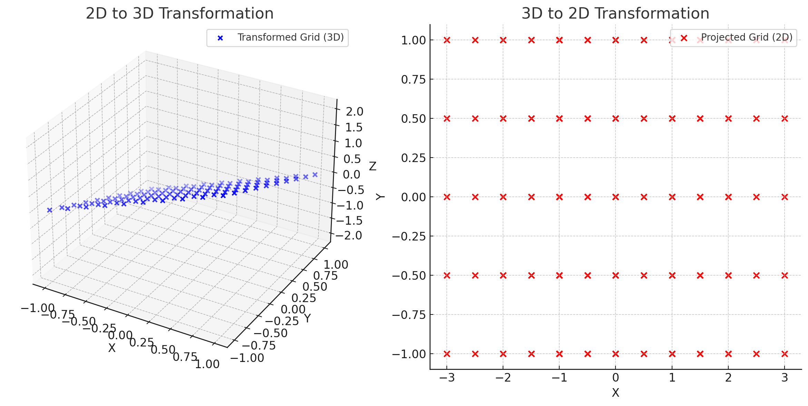

To explore nonsquare matrices, let’s break it down with both mathematical expressions and visual interpretations. We’ll consider cases where matrices represent transformations between different dimensions.

---

### 1. **Definition of Nonsquare Matrices**
A nonsquare matrix has dimensions $m \times n$ , where $m \neq n$. Such matrices are used to map vectors from an $n$ -dimensional space ($\mathbb{R}^n$ ) to an $m$ -dimensional space ($\mathbb{R}^m$ ).

- Example of a $3 \times 2$ matrix:
  $$
  A = 
  \begin{bmatrix}
  a_{11} & a_{12} \\
  a_{21} & a_{22} \\
  a_{31} & a_{32}
  \end{bmatrix}
  $$
  This transforms 2D vectors ($\mathbb{R}^2$ ) into 3D vectors ($\mathbb{R}^3$ ).

---

### 2. **Mapping Basis Vectors**
For a transformation represented by $A$ , the columns of $A$ define where the basis vectors of the input space ($\mathbb{R}^n$ ) land in the output space ($\mathbb{R}^m$ ).

#### Example:
Let $v_1 = \begin{bmatrix} 1 \\ 0 \end{bmatrix}$ and $v_2 = \begin{bmatrix} 0 \\ 1 \end{bmatrix}$ be the basis vectors of $\mathbb{R}^2$. 

Under the transformation $A$ , these vectors are mapped as:
$$
A v_1 = \text{Column 1 of } A
$$
$$
A v_2 = \text{Column 2 of } A
$$

- For $A = \begin{bmatrix} 1 & 0 \\ 0 & 1 \\ 1 & -1 \end{bmatrix}$ , we have:
  $$
  A v_1 = \begin{bmatrix} 1 \\ 0 \\ 1 \end{bmatrix}, \quad A v_2 = \begin{bmatrix} 0 \\ 1 \\ -1 \end{bmatrix}.
  $$

---

### 3. **Geometric Intuition**
When transforming:
1. A $2 \times 3$ matrix reduces dimensions (projects 3D vectors onto 2D space).
2. A $3 \times 2$ matrix adds dimensions (maps 2D vectors to 3D).

#### Case 1: $A$ is $3 \times 2$
- The input $\mathbb{R}^2$ grid is stretched or skewed into $\mathbb{R}^3$.
- Visualization: Imagine a 2D plane in 3D space, where each point in the plane is determined by the two columns of $A$.

#### Case 2: $A$ is $2 \times 3$
- The transformation compresses $\mathbb{R}^3$ onto a 2D plane.
- Visualization: A 3D grid collapses into a 2D one, maintaining the linearity of transformations.

---

### 4. **Mathematical Properties**
#### Rank:
- The rank of $A$ gives the dimension of the image (output space).
- For nonsquare matrices, the rank $r$ satisfies:
  $$
  r \leq \min(m, n)
  $$

#### Null Space:
- Nonsquare matrices often have a nontrivial null space (vectors that map to zero).

#### Example:
Let $A = \begin{bmatrix} 1 & 2 & 0 \\ 0 & 0 & 1 \end{bmatrix}$. For a vector $x = \begin{bmatrix} x_1 \\ x_2 \\ x_3 \end{bmatrix}$ :
$$
A x = \begin{bmatrix} 1 & 2 & 0 \\ 0 & 0 & 1 \end{bmatrix} \begin{bmatrix} x_1 \\ x_2 \\ x_3 \end{bmatrix} = \begin{bmatrix} x_1 + 2x_2 \\ x_3 \end{bmatrix}.
$$
- Null space: $x_1 + 2x_2 = 0, \, x_3 = 0$.

---

### 5. **Plots**
To visualize these transformations, let’s create plots:

1. **2D to 3D Example** ($3 \times 2$ matrix):
   - Input: A grid of 2D points.
   - Output: The grid is stretched into 3D space.

2. **3D to 2D Example** ($2 \times 3$ matrix):
   - Input: A grid of 3D points.
   - Output: The grid collapses onto a 2D plane.



```python
import numpy as np
import matplotlib.pyplot as plt
from mpl_toolkits.mplot3d import Axes3D

# Define a 3x2 matrix (2D to 3D transformation)
A_3x2 = np.array([[1, 0], [0, 1], [1, -1]])

# Generate a grid of points in 2D
x = np.linspace(-1, 1, 10)
y = np.linspace(-1, 1, 10)
X, Y = np.meshgrid(x, y)
grid_2D = np.vstack([X.ravel(), Y.ravel()])  # 2D grid points

# Transform 2D points to 3D
grid_3D = A_3x2 @ grid_2D

# Plot 2D grid in 3D space
fig = plt.figure(figsize=(12, 6))
ax = fig.add_subplot(121, projection='3d')
ax.scatter(grid_3D[0], grid_3D[1], grid_3D[2], c='b', label='Transformed Grid (3D)')
ax.set_title("2D to 3D Transformation")
ax.set_xlabel("X")
ax.set_ylabel("Y")
ax.set_zlabel("Z")
ax.legend()

# Define a 2x3 matrix (3D to 2D transformation)
A_2x3 = np.array([[1, 2, 0], [0, 0, 1]])

# Generate a grid of points in 3D
x = np.linspace(-1, 1, 5)
y = np.linspace(-1, 1, 5)
z = np.linspace(-1, 1, 5)
X, Y, Z = np.meshgrid(x, y, z)
grid_3D_points = np.vstack([X.ravel(), Y.ravel(), Z.ravel()])  # 3D grid points

# Transform 3D points to 2D
grid_2D_proj = A_2x3 @ grid_3D_points

# Plot 3D grid collapsed to 2D
ax2 = fig.add_subplot(122)
ax2.scatter(grid_2D_proj[0], grid_2D_proj[1], c='r', label='Projected Grid (2D)')
ax2.set_title("3D to 2D Transformation")
ax2.set_xlabel("X")
ax2.set_ylabel("Y")
ax2.legend()

plt.tight_layout()
plt.show()


```

Here are two visualizations:

1. **2D to 3D Transformation:** The left plot shows a grid of 2D points mapped into 3D space using a $3 \times 2$ matrix. The result is a plane embedded in 3D space.

2. **3D to 2D Transformation:** The right plot shows a grid of 3D points projected onto a 2D plane using a $2 \times 3$ matrix. The transformation compresses the 3D space into a 2D plane.

These illustrate how nonsquare matrices stretch, skew, or collapse spaces while preserving linearity.