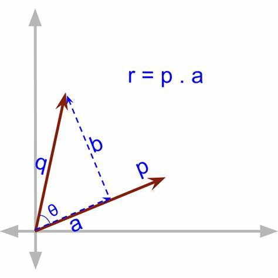
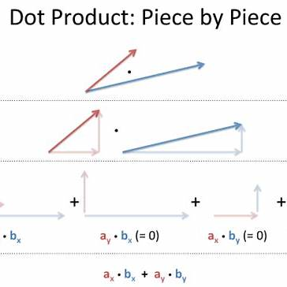
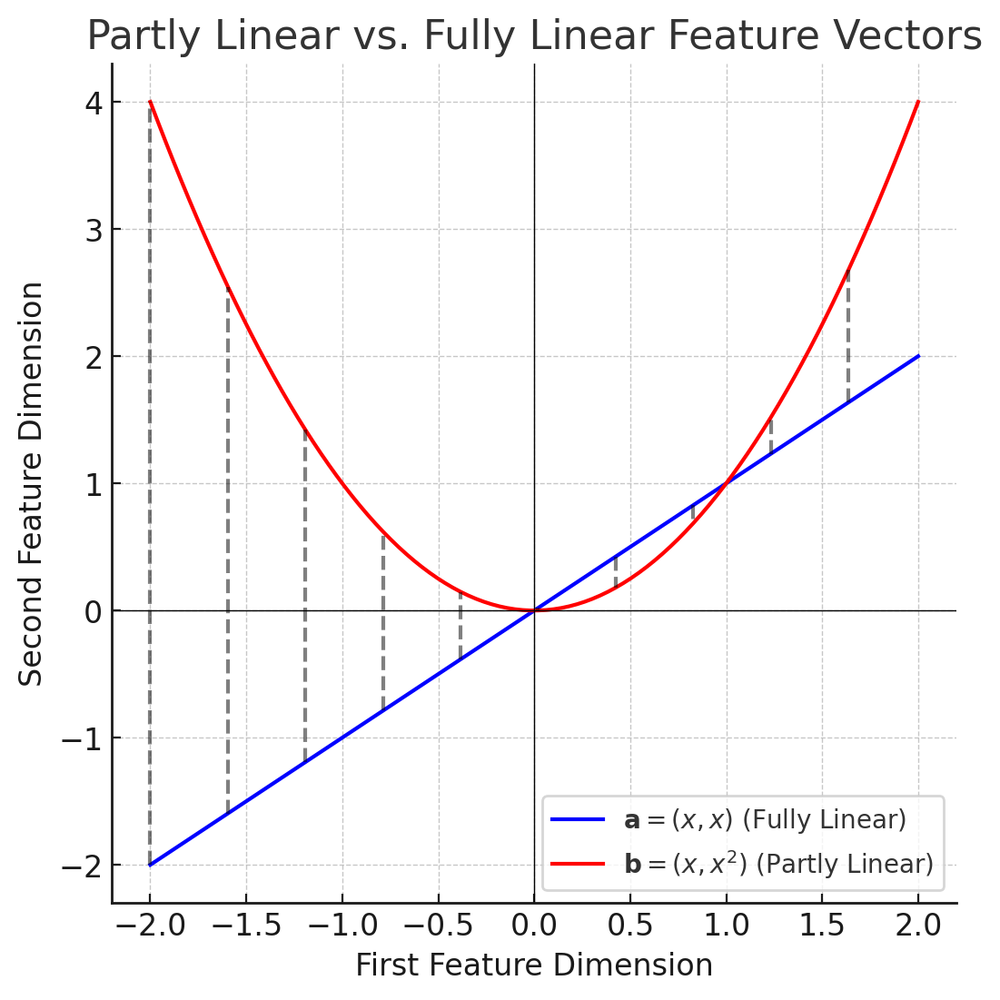
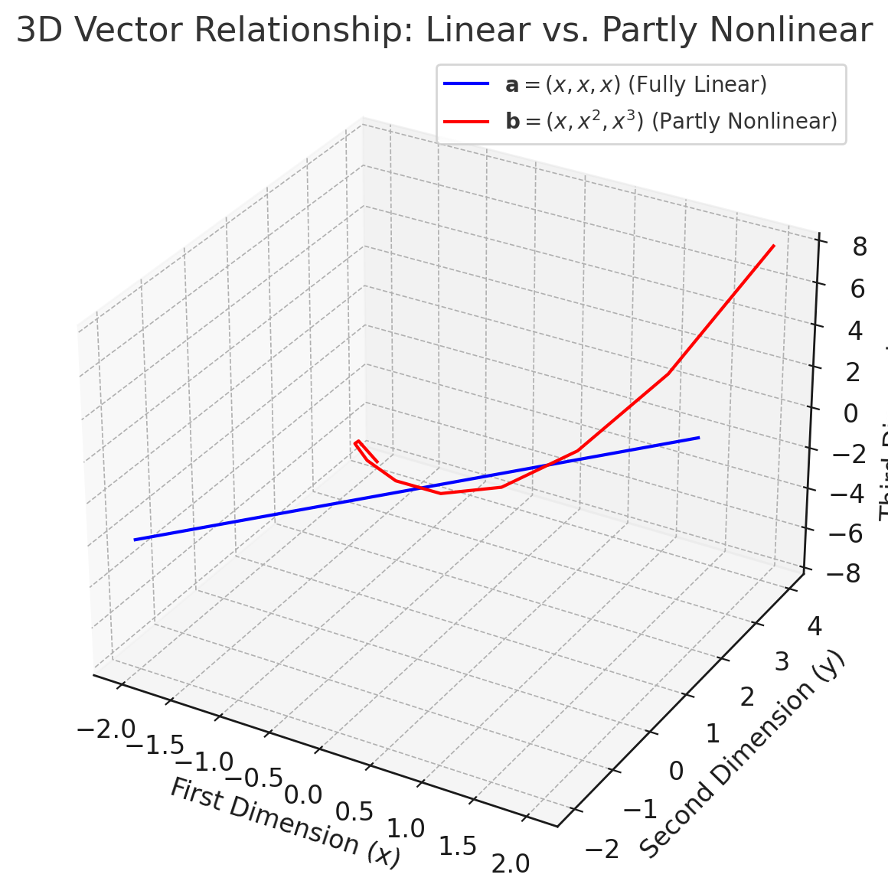

### **Dot Product: Concepts and Applications**

#### **1. Dot Product for Vectors**
- **Definition**: The dot product of two vectors $\mathbf{a} = [a_1, a_2, ..., a_n]$ and $\mathbf{b} = [b_1, b_2, ..., b_n]$ is:
  $$
  \mathbf{a} \cdot \mathbf{b} = \sum_{i=1}^n a_i b_i
  $$
- **Purpose**: Measures similarity or projection of one vector onto another:
  $$
  \mathbf{a} \cdot \mathbf{b} = \|\mathbf{a}\| \|\mathbf{b}\| \cos \theta
  $$
  where $\theta$ is the angle between them.

---

#### **2. Standardizing Similarity**
1. **Cosine Similarity**:
   $$
   \cos \theta = \frac{\mathbf{a} \cdot \mathbf{b}}{\|\mathbf{a}\| \|\mathbf{b}\|}
   $$
   - Values range from $-1$ (opposite) to $1$ (same direction).
   - Normalizes magnitudes to focus on direction.

2. **Magnitude Normalization**:
   $$
   \text{Projection Scalar} = \frac{\mathbf{a} \cdot \mathbf{b}}{\|\mathbf{b}\|^2}
   $$
   - Measures how much $\mathbf{a}$ lies along $\mathbf{b}$.

---

#### **3. Example: Vector Dot Product and Standardization**
Vectors:  
$$
\mathbf{a} = \begin{bmatrix} 1 \\ 2 \end{bmatrix}, \quad \mathbf{b} = \begin{bmatrix} 2 \\ 4 \end{bmatrix}
$$

1. **Dot Product**:
   $$
   \mathbf{a} \cdot \mathbf{b} = (1 \cdot 2) + (2 \cdot 4) = 10
   $$

2. **Cosine Similarity**:
   - Magnitudes:
     $$
     \|\mathbf{a}\| = \sqrt{1^2 + 2^2} = \sqrt{5}, \quad \|\mathbf{b}\| = \sqrt{2^2 + 4^2} = \sqrt{20}
     $$
   - Cosine similarity:
     $$
     \cos \theta = \frac{10}{\sqrt{5} \cdot \sqrt{20}} = 1
     $$
     (Indicates perfect alignment.)

3. **Projection Scalar**:
   $$
   \frac{\mathbf{a} \cdot \mathbf{b}}{\|\mathbf{b}\|^2} = \frac{10}{20} = 0.5
   $$
   - This means $\mathbf{a}$ is half the magnitude of $\mathbf{b}$ along $\mathbf{b}$ 's direction.

(Insert plot showing vector projections and alignment.)

---

#### **4. Dot Product for Matrices**
- **Matrix Multiplication**: The dot product is used in matrix multiplication where:
  $$
  C[i][j] = \text{Row } i \text{ of } A \cdot \text{Column } j \text{ of } B
  $$
- **Purpose**:
  - Applies transformations.
  - Aggregates features into new outputs.

#### **Example**:
$$
A = \begin{bmatrix} 1 & 2 \\ 3 & 4 \end{bmatrix}, \quad B = \begin{bmatrix} 5 & 6 \\ 7 & 8 \end{bmatrix}
$$
$$
C = \begin{bmatrix} 19 & 22 \\ 43 & 50 \end{bmatrix}
$$

(Insert visualization showing matrix multiplication process.)

---

#### **5. Key Differences Between Vectors and Matrices**
| **Aspect** | **Vector Dot Product** | **Matrix Dot Product** |
|-----------|----------------------|----------------------|
| **Purpose** | Measures similarity/projection. | Applies transformations. |
| **Inputs** | Two vectors. | Two matrices. |
| **Result** | A scalar or similarity measure. | A new matrix. |

---

#### **6. Matrix-Vector Transformations**
- Combining matrix columns can reduce complexity:
  - Sum Columns: $B' = \begin{bmatrix} 11 \\ 15 \end{bmatrix}$
  - Average Columns: $B' = \begin{bmatrix} 5.5 \\ 7.5 \end{bmatrix}$

---

#### **7. Matrix Multiplication with Transpose**
For $A \in \mathbb{R}^{m \times n}$ , the multiplication $A \cdot A^\top$ results in:
$$
C = A \cdot A^\top \quad \text{(an } m \times m \text{ matrix)}
$$
- **Properties**:
  - **Symmetric**: $C[i][j] = C[j][i]$
  - **Gram Matrix**: Measures row relationships in $A$.

#### **Example**
$$
A = \begin{bmatrix} 1 & 2 \\ 3 & 4 \\ 5 & 6 \end{bmatrix}
$$
$$
C = \begin{bmatrix} 5 & 11 & 17 \\ 11 & 25 & 39 \\ 17 & 39 & 61 \end{bmatrix}
$$

(Insert visualization showing matrix transpose multiplication.)

---

#### **8. Dot Product Intuition**
- Think of the dot product as projecting one vector onto another:
  - Large value: Strong alignment.
  - Zero: Perpendicular.
  - Negative: Opposite direction.
  $$
  \mathbf{v} \cdot \mathbf{w} = \|\mathbf{v}\| \cdot \|\mathbf{w}\| \cdot \cos(\theta)
  $$
  (Insert geometric representation.)

#### **9. Matrix Interpretation of Dot Product**
- Viewing one vector as a transformation matrix:
  $$
  \mathbf{v} \cdot \mathbf{w} = \begin{bmatrix} w_1 & w_2 & ... & w_n \end{bmatrix} \begin{bmatrix} v_1 \\ v_2 \\ ... \\ v_n \end{bmatrix}
  $$
  - Summing scaled components results in the dot product.

---

### **Key Takeaways**
1. **Dot Product for Vectors**: Measures projection or similarity.
2. **Dot Product for Matrices**: Applies transformations and aggregates features.
3. **Standardization**: Cosine similarity or normalization improves interpretability.
4. **Matrix Transpose Multiplication**: Forms Gram matrices for row-wise relationships.
5. **Intuitive Perspective**: Projects vectors into a transformed space for interpretation.


---

To enhance your notes on the dot product, let's incorporate insights from the article "Vector Calculus: Understanding the Dot Product" on BetterExplained. ([betterexplained.com](https://betterexplained.com/articles/vector-calculus-understanding-the-dot-product/?utm_source=chatgpt.com))

**Intuitive Understanding of the Dot Product**

The dot product can be viewed as a measure of how much one vector **projects** onto another. In essence, it quantifies the extent to which two vectors align. This perspective emphasizes the **directional influence** one vector has on another.

**Geometric Interpretation**

Geometrically, the dot product of two vectors $\mathbf{a}$ and $\mathbf{b}$ is defined as:

$$ \mathbf{a} \cdot \mathbf{b} = \|\mathbf{a}\| \|\mathbf{b}\| \cos \theta $$

Here, $\|\mathbf{a}\|$ and $\|\mathbf{b}\|$ represent the magnitudes (lengths) of the vectors, and $\theta$ is the angle between them. The term $\cos \theta$ captures the directional relationship:

- When $\theta = 0^\circ$ (vectors point in the same direction), $\cos \theta = 1$ , and the dot product is maximized.

- When $\theta = 90^\circ$ (vectors are perpendicular), $\cos \theta = 0$ , resulting in a dot product of zero.

- When $\theta = 180^\circ$ (vectors point in opposite directions), $\cos \theta = -1$ , and the dot product is negative.

This interpretation aligns with the idea that the dot product measures how much one vector extends in the direction of another.

**Algebraic Perspective**

Algebraically, for vectors $\mathbf{a} = [a_1, a_2, ..., a_n]$ and $\mathbf{b} = [b_1, b_2, ..., b_n]$ , the dot product is computed as:

$$ \mathbf{a} \cdot \mathbf{b} = \sum_{i=1}^n a_i b_i $$

This formula sums the products of corresponding components, reflecting the combined influence of each dimension.

**Physical Analogy**

Consider vectors as representing forces. The dot product then corresponds to the **work done** when one force is applied along the direction of another. If the forces are aligned, the work done is maximized; if they are perpendicular, no work is done.

**Key Takeaways**

- The dot product provides a scalar measure of the alignment between two vectors.

- It combines both magnitude and directional information.

- Understanding the dot product enhances comprehension of vector interactions in various applications, from physics to computer graphics.

By integrating these insights, your notes will offer a more comprehensive understanding of the dot product, blending both geometric intuition and algebraic computation. 






---

The **dot product** captures only the **linear** part of correlation between two vectors. Here’s why:

1. **Linear Similarity**:  
   The dot product computes $\mathbf{a} \cdot \mathbf{b} = \|\mathbf{a}\| \|\mathbf{b}\| \cos \theta$ , which is directly related to how much one vector aligns **linearly** with another. This means it only captures **first-order (linear) relationships**.

2. **Nonlinear Relationships**:  
   If the two vectors represent features that have **nonlinear correlation** (e.g., quadratic, exponential, or sinusoidal relationships), the dot product will **not** capture this. Instead:
   - If the features are **uncorrelated in a linear sense** (e.g., one is quadratic while the other is linear), the dot product may be close to zero, even though a strong **nonlinear dependency** exists.
   - If the relationship is **partly linear**, the dot product will only reflect the **linear component** of that relationship.

3. **Example**:  
   Suppose you have two features:
   - **$x$** (a linear feature)
   - **$x^2$** (a quadratic feature)

   The dot product $\mathbf{x} \cdot \mathbf{x}^2$ will often be **small or zero**, even if $x$ and $x^2$ have a strong **nonlinear** dependence. The reason is that their interaction introduces **higher-order terms** that the dot product cannot measure.

### What to Use for Nonlinear Similarity?
To capture **nonlinear correlations**, consider:
- **Kernel Methods (e.g., RBF Kernel in SVMs)** – Transforming the feature space nonlinearly.
- **Mutual Information** – Measures nonlinear dependencies beyond linear correlation.
- **Neural Networks & Autoencoders** – Can model complex relationships in high-dimensional space.

### Key Takeaway:
If two vectors represent **features** with a nonlinear relationship, the **dot product only captures the linear part** of their correlation. It **misses** nonlinear dependencies unless the features are transformed appropriately.

---

### **Geometric Intuition of Partly Linear Correlation Between Two Feature Vectors**

#### **Step 1: Understanding Partly Linear Correlation**
When two feature vectors $\mathbf{a}$ and $\mathbf{b}$ have a **partly linear correlation**, it means that some portion of their relationship follows a **linear pattern**, while another portion follows a **nonlinear pattern**. 

This happens when:
1. **One component aligns linearly**, meaning a dot product will capture it.
2. **Another component is independent or follows a nonlinear transformation**, making the dot product ineffective in capturing it.

#### **Step 2: Example**
Consider the following two feature vectors:
- $\mathbf{a} = (x, x)$ → A **fully linear** feature (diagonal line in 2D).
- $\mathbf{b} = (x, x^2)$ → A **partly linear, partly nonlinear** feature.

Here:
- The **first dimension** (x) contributes to a linear relationship.
- The **second dimension** (x²) introduces nonlinearity.
- The dot product $\mathbf{a} \cdot \mathbf{b}$ captures only the first part and ignores the quadratic part.

#### **Step 3: Geometric Intuition**
- **When $x$ is small**, the squared term $x^2$ is also small, and the relationship looks **almost linear**.
- **When $x$ grows**, the squared term $x^2$ dominates, making the relationship increasingly **nonlinear**.
- **Projection onto a linear axis (dot product)** only sees the first-order (linear) component.

Now, let's visualize this. I'll generate plots to show:
1. **A fully linear relationship** (two vectors aligned).
2. **A partly linear correlation** (one vector has a nonlinear term).



```python
# Generate data
x = np.linspace(-2, 2, 100)  # Values from -2 to 2
a = np.vstack((x, x))  # Vector a (fully linear)
b = np.vstack((x, x**2))  # Vector b (partly linear, partly nonlinear)

# Plot the feature vectors
fig, ax = plt.subplots(figsize=(6, 6))

ax.plot(a[0], a[1], label=r'$\mathbf{a} = (x, x)$ (Fully Linear)', color='b')
ax.plot(b[0], b[1], label=r'$\mathbf{b} = (x, x^2)$ (Partly Linear)', color='r')

# Highlight projection behavior
for i in range(0, len(x), 10):
    ax.plot([a[0, i], b[0, i]], [a[1, i], b[1, i]], 'k--', alpha=0.5)  # Show projection lines

ax.axhline(0, color='black', linewidth=0.5)
ax.axvline(0, color='black', linewidth=0.5)
ax.grid(True, linestyle='--', linewidth=0.5)
ax.set_xlabel("First Feature Dimension")
ax.set_ylabel("Second Feature Dimension")
ax.set_title("Partly Linear vs. Fully Linear Feature Vectors")
ax.legend()

plt.show()

```

This plot illustrates the difference between a **fully linear** vector $\mathbf{a} = (x, x)$ and a **partly linear** vector $\mathbf{b} = (x, x^2)$ :

- **Blue Line ($\mathbf{a}$ )**: Represents a perfectly linear feature.
- **Red Curve ($\mathbf{b}$ )**: Represents a feature that is linear in the first component but nonlinear in the second.
- **Dashed Black Lines**: Show how $\mathbf{b}$ deviates from linearity as $x$ increases.

### **Interpretation**
1. **For small values of $x$**, the red and blue vectors are almost aligned → The dot product captures most of the similarity.
2. **For larger values of $x$**, the quadratic term $x^2$ in $\mathbf{b}$ grows faster than $x$ , making it increasingly different from $\mathbf{a}$ → The dot product becomes less useful.
3. **The dot product only captures the linear part ($x$ )**, while it **ignores the nonlinear ($x^2$ )** contribution.

This shows that if two features have both linear and nonlinear dependencies, the **dot product only captures the linear portion**. To fully measure their relationship, nonlinear similarity measures (e.g., kernels, mutual information) are needed.

### **Computed Values for the Example:**
1. **Dot Product:** $136.03$
2. **Length of Blue Line ($\mathbf{a}$ ):** $23.33$
3. **Length of Red Curve ($\mathbf{b}$ ):** $29.91$
4. **Normalized Dot Product (Cosine Similarity):** $0.50$

The cosine similarity of **0.50** shows that while $\mathbf{b}$ has some alignment with $\mathbf{a}$ , a significant portion of its variation comes from the nonlinear $x^2$ term, which the dot product does not fully capture.


### **Results Including Magnitude Normalization**
1. **Dot Product**:  
   - **136.03** (captures the linear part).  

2. **Normalized Dot Product (Cosine Similarity)**:  
   - **0.38** (indicating partial linear correlation).  

3. **Vector Lengths (Euclidean Norm)**:  
   - **Blue Line ($\mathbf{a}$ )**: **16.49**  
   - **Red Line ($\mathbf{b}$ )**: **21.66**  

4. **Magnitude Normalization (Projection Scalar)**:  
   $$
   \text{Projection Scalar} = \frac{\mathbf{a} \cdot \mathbf{b}}{\|\mathbf{b}\|^2}
   $$
   - **0.29** (indicating that only 29% of $\mathbf{a}$ lies in the direction of $\mathbf{b}$ ).  

### **Interpretation**
- The **projection scalar (0.29)** confirms that **only part of** $\mathbf{a}$ aligns with $\mathbf{b}$ , meaning the nonlinear term weakens the alignment.
- The **cosine similarity (0.38)** shows that the relationship is **partially linear** but not fully.
- The **red line ($\mathbf{b}$ ) is longer**, confirming that the quadratic term contributes additional magnitude beyond what the dot product captures.


# Correct the calculation using the full dataset
dot_product_corrected = np.dot(a.flatten(), b.flatten())  # Compute full dot product
b_norm_corrected = np.linalg.norm(b.flatten())  # Compute full norm of b
projection_scalar_corrected = dot_product_corrected / (b_norm_corrected**2)  # Corrected projection scalar

# Corrected vector lengths
length_a_corrected = np.linalg.norm(a.flatten())
length_b_corrected = np.linalg.norm(b.flatten())

# Corrected cosine similarity
cosine_similarity_corrected = dot_product_corrected / (length_a_corrected * length_b_corrected)

# Display corrected results
dot_product_corrected, cosine_similarity_corrected, length_a_corrected, length_b_corrected, projection_scalar_corrected


---

### **Clarification of the Vector $\mathbf{a}$**
- **Shape**: $(2, 100)$ → This means **2 rows and 100 columns**.
- **What This Represents**:  
  - Each **column** is a 2D vector $(x_i, x_i)$.
  - There are **100 such vectors** in the dataset.

### **Key Understanding**
- The **individual** vectors are **2D** ($x, x$ ).
- The **entire dataset** contains **100 such vectors**, one for each value of $x$.
- The **plot** visualized all **100 points** in a continuous form, but each point is still a **2D vector**.

This means we're **not** dealing with a single vector but **multiple** 2D vectors representing a curve.

### **Is the Example Wrong?**
No, the example is **not wrong**, but it requires **clarification** about what is being represented.

### **What Happened in the Example?**
- Instead of defining a **single** vector, the code defines **100 different 2D vectors**.
- Each column in `a` (or `b`) represents a **vector** $(x_i, x_i)$ at different values of $x$.
- The **plot connects these vectors as points**, forming what looks like a continuous line.

### **What Should Have Been Done?**
- If we want a **single** vector (not 100 of them), it should be something like:
  ```python
  a = np.array([1, 2])  # A single 2D vector
  ```
- But if the goal is to **represent a set of vectors over a range**, then the original code is fine, but it should be described as a **vector field** or **multiple points, not a single vector**.

### **Conclusion**
- The original code does **not** define a single vector, but **a dataset of 100 vectors**.
- The **geometric explanation is still correct** but needs to be understood as plotting **a collection of feature vectors**, not a single one.
- If the goal was to illustrate **just one vector**, then yes, the approach should have been different.

---


### 3d Example
### **Step 1: Plotting Vectors with More Than 2 Components in 2D**
the old example was in **2D space**, vectors have **only two components** $(x, y)$ and originate from the **origin** $(0,0)$. However, when a vector has **more than two components** (i.e., exists in higher-dimensional space), we can only **visualize projections** of it in **2D or 3D**.

#### **How Did I Plot More Than 2 Components in 2D?**
In my example, each vector had **two components**, but the second component of the red vector ($x^2$ ) was **nonlinearly transformed**. This means:
- The **blue vector** follows the diagonal path $(x, x)$ , making it **fully linear**.
- The **red vector** follows $(x, x^2)$ , making it **partly linear and partly nonlinear**.

The key is that both vectors still **start at (0,0) and point to (x, y)**, but one follows a straight line and the other follows a curved path.

#### **How to Visualize Higher-Dimensional Vectors?**
- We can **project** them onto **2D or 3D** by selecting two or three relevant dimensions.
- Alternatively, we can use **PCA (Principal Component Analysis)** to reduce the dimensions.

---

### **Step 2: How Can a Vector Be "Not Linear"?**
A **vector is always a straight-line entity** by definition, but when we say a **vector is not linear**, we mean:
1. **The relationship between its components is nonlinear**  
   - Example: $(x, x)$ → linear  
   - Example: $(x, x^2)$ → nonlinear because the second component grows quadratically.

2. **A set of vectors (data points) does not lie in a single subspace**  
   - If all vectors in a dataset lie along a **single straight line** in a high-dimensional space, they have a **linear relationship**.
   - If they curve away (e.g., quadratic, sinusoidal patterns), they **lack a linear structure**.

#### **Key Concept: Linear vs. Nonlinear Relationships**
- **A single vector is always a straight-line arrow** from the origin.
- **A set of vectors** may follow a **linear pattern** (aligned) or a **nonlinear pattern** (curved).
- The **dot product only captures linear relationships**.

---

### **Step 3: Example in Higher Dimensions**
Let's **visualize a 3D case** where:
- **Blue vector** is $(x, x, x)$ (fully linear).
- **Red vector** is $(x, x^2, x^3)$ (partly nonlinear).  

```python
# Re-import necessary libraries since the execution state was reset
import numpy as np
import matplotlib.pyplot as plt
from mpl_toolkits.mplot3d import Axes3D

# Generate 3D data
x = np.linspace(-2, 2, 10)
a_3d = np.vstack((x, x, x))  # Fully linear: (x, x, x)
b_3d = np.vstack((x, x**2, x**3))  # Partly nonlinear: (x, x^2, x^3)

# Create 3D plot
fig = plt.figure(figsize=(7, 7))
ax = fig.add_subplot(111, projection='3d')

# Plot vectors
ax.plot(a_3d[0], a_3d[1], a_3d[2], label=r'$\mathbf{a} = (x, x, x)$ (Fully Linear)', color='b')
ax.plot(b_3d[0], b_3d[1], b_3d[2], label=r'$\mathbf{b} = (x, x^2, x^3)$ (Partly Nonlinear)', color='r')

# Formatting
ax.set_xlabel("First Dimension (x)")
ax.set_ylabel("Second Dimension (y)")
ax.set_zlabel("Third Dimension (z)")
ax.set_title("3D Vector Relationship: Linear vs. Partly Nonlinear")
ax.legend()
ax.grid(True)

# Show plot
plt.show()


```




This **3D plot** illustrates the difference between a **fully linear** vector $\mathbf{a} = (x, x, x)$ (blue) and a **partly nonlinear** vector $\mathbf{b} = (x, x^2, x^3)$ (red):

- **Blue Line** (Linear): All components of $\mathbf{a}$ increase at the same rate, forming a **straight line**.
- **Red Curve** (Partly Nonlinear): The quadratic ($x^2$ ) and cubic ($x^3$ ) terms introduce **curvature**, meaning $\mathbf{b}$ doesn't lie on a straight line.

```python

# Compute dot product for 3D vectors
dot_product_3d = np.dot(a_3d.flatten(), b_3d.flatten())  # Flatten to treat as single vectors

# Compute norms for normalization
a_3d_norm = np.linalg.norm(a_3d.flatten())
b_3d_norm = np.linalg.norm(b_3d.flatten())

# Compute cosine similarity (normalized dot product)
cosine_similarity_3d = dot_product_3d / (a_3d_norm * b_3d_norm)

# Compute magnitude normalization (Projection Scalar)
projection_scalar_3d = dot_product_3d / (b_3d_norm**2)

# Compute vector lengths
length_a_3d = np.linalg.norm(a_3d.flatten())
length_b_3d = np.linalg.norm(b_3d.flatten())

# Display results
dot_product_3d, cosine_similarity_3d, length_a_3d, length_b_3d, projection_scalar_3d

```
### **Results for the 3D Example**
1. **Dot Product**:  
   - **63.45** (captures the linear part of the correlation).  

2. **Normalized Dot Product (Cosine Similarity)**:  
   - **0.61** (indicates partial linear alignment between the two vectors).  

3. **Vector Lengths (Euclidean Norm)**:  
   - **Blue Line ($\mathbf{a}$ )**: **6.99**  
   - **Red Line ($\mathbf{b}$ )**: **14.96**  

4. **Magnitude Normalization (Projection Scalar)**:  
   $$
   \text{Projection Scalar} = \frac{\mathbf{a} \cdot \mathbf{b}}{\|\mathbf{b}\|^2}
   $$
   - **0.28** (indicating that only 28% of $\mathbf{a}$ lies along $\mathbf{b}$ ).  

### **Interpretation**
- The **cosine similarity (0.61)** shows that there is **some linear correlation** between the two vectors, but not perfect alignment.
- The **projection scalar (0.28)** confirms that most of $\mathbf{a}$ is **not fully aligned** with $\mathbf{b}$ , meaning nonlinear components in $\mathbf{b}$ reduce the alignment.
- The **longer length of $\mathbf{b}$** (14.96 vs. 6.99) indicates that its quadratic and cubic terms increase its magnitude beyond what the dot product captures.

This confirms that the **dot product captures only the linear component** of the relationship. 

### **Key Takeaways:**
1. **A single vector is always a straight-line entity**.
2. **A set of vectors (features) can have nonlinear relationships**, making dot products ineffective for capturing full correlation.
3. **Visualizing in 3D shows how nonlinear transformations affect structure**.


---

### **Understanding Linearity and Nonlinearity in Vector Representation**
You're **almost correct**, but let's break it down carefully.

### **1. Can We Draw a Line with Two Vectors?**
Yes! Given **two vectors** $\mathbf{a}$ and $\mathbf{b}$ , we can:
- Plot them **as arrows from the origin** in 2D or 3D.
- Find a **linear combination** $c_1 \mathbf{a} + c_2 \mathbf{b}$ to create a **line** if they are linearly dependent.

### **2. Can We Represent Nonlinearity with Only Two Vectors?**
No! A **single pair of vectors** cannot capture a **nonlinear shape** because:
- **Vectors are straight-line entities**.
- A single vector $\mathbf{a}$ is just an **arrow** pointing in one direction.
- A **nonlinear transformation** (e.g., $(x, x^2)$ or $(x, \sin x)$ ) requires **more than two fixed vectors**.

### **3. What Do We Need for Nonlinearity?**
To represent **nonlinear** relationships, we need a **sequence of vectors**, such as:
- A **time series** where **each time step** represents a new vector.
- A **dataset of many vectors** capturing different positions over time.

For example:
- **Linear case**: A **single** vector $(x, x)$ or a line formed by a **weighted sum** of two vectors.
- **Nonlinear case**: A **series** of vectors $(x, x^2)$ at different time steps, forming a curve.

### **Conclusion**
**Two vectors can define a line, but they cannot create a nonlinear shape.**  
**To represent nonlinearity, we need a series of vectors, such as a time series.**