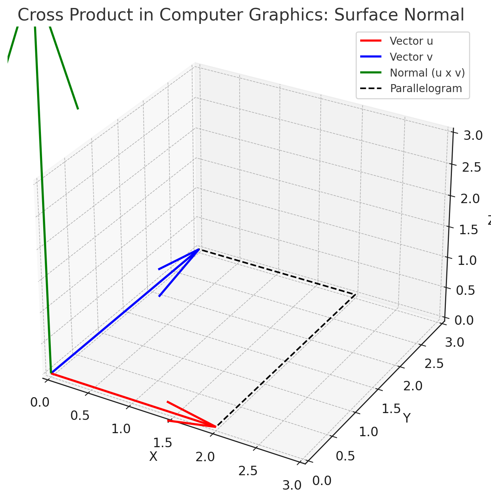

The cross product is a mathematical operation defined in 3-dimensional space that outputs a vector perpendicular to two input vectors. It is represented as:

$$
\mathbf{a} \times \mathbf{b}
$$

### **Step 1: Intuition**
- If you have two vectors, $\mathbf{a}$ and $\mathbf{b}$ , they span a plane in 3D space. The cross product produces a vector perpendicular to this plane.
- The **magnitude** of the cross product represents the area of the parallelogram formed by $\mathbf{a}$ and $\mathbf{b}$.
- The **direction** of the resultant vector is determined by the right-hand rule:
  - Point the fingers of your right hand in the direction of $\mathbf{a}$ , curl them toward $\mathbf{b}$ , and your thumb points in the direction of $\mathbf{a} \times \mathbf{b}$.

---

### **Step 2: Formula**
For two vectors $\mathbf{a} = \begin{bmatrix}a_x \\ a_y \\ a_z\end{bmatrix}$ and $\mathbf{b} = \begin{bmatrix}b_x \\ b_y \\ b_z\end{bmatrix}$ , the cross product is calculated as:

$$
\mathbf{a} \times \mathbf{b} = 
\begin{vmatrix}
\mathbf{i} & \mathbf{j} & \mathbf{k} \\
a_x & a_y & a_z \\
b_x & b_y & b_z
\end{vmatrix}
$$

Here, $\mathbf{i}$ , $\mathbf{j}$ , and $\mathbf{k}$ are the unit vectors along the $x$ , $y$ , and $z$ axes, respectively.

Expanding the determinant:

$$
\mathbf{a} \times \mathbf{b} = 
\mathbf{i}(a_y b_z - a_z b_y) - 
\mathbf{j}(a_x b_z - a_z b_x) + 
\mathbf{k}(a_x b_y - a_y b_x)
$$

---

### **Step 3: Properties**
1. **Antisymmetry:** $\mathbf{a} \times \mathbf{b} = -(\mathbf{b} \times \mathbf{a})$
2. **Zero Vector:** If $\mathbf{a}$ and $\mathbf{b}$ are parallel, then $\mathbf{a} \times \mathbf{b} = \mathbf{0}$.
3. **Distributive Property:** $(\mathbf{a} + \mathbf{b}) \times \mathbf{c} = \mathbf{a} \times \mathbf{c} + \mathbf{b} \times \mathbf{c}$.

---

### **Step 4: Geometric Interpretation**
The magnitude of the cross product is given by:

$$
|\mathbf{a} \times \mathbf{b}| = |\mathbf{a}| |\mathbf{b}| \sin(\theta)
$$

where $\theta$ is the angle between $\mathbf{a}$ and $\mathbf{b}$.

---

### **Example 1: Basic Calculation**
Let $\mathbf{a} = \begin{bmatrix} 1 \\ 2 \\ 3 \end{bmatrix}$ and $\mathbf{b} = \begin{bmatrix} 4 \\ 5 \\ 6 \end{bmatrix}$.

$$
\mathbf{a} \times \mathbf{b} =
\begin{vmatrix}
\mathbf{i} & \mathbf{j} & \mathbf{k} \\
1 & 2 & 3 \\
4 & 5 & 6
\end{vmatrix}
$$

Expanding:

$$
\mathbf{a} \times \mathbf{b} = \mathbf{i}((2)(6) - (3)(5)) - \mathbf{j}((1)(6) - (3)(4)) + \mathbf{k}((1)(5) - (2)(4))
$$

$$
\mathbf{a} \times \mathbf{b} = \mathbf{i}(-3) - \mathbf{j}(-6) + \mathbf{k}(-3)
$$

$$
\mathbf{a} \times \mathbf{b} = \begin{bmatrix} -3 \\ 6 \\ -3 \end{bmatrix}
$$

---

### **Example 2: Perpendicular Vectors**
If $\mathbf{a} = \begin{bmatrix} 1 \\ 0 \\ 0 \end{bmatrix}$ and $\mathbf{b} = \begin{bmatrix} 0 \\ 1 \\ 0 \end{bmatrix}$ , then:

$$
\mathbf{a} \times \mathbf{b} =
\begin{vmatrix}
\mathbf{i} & \mathbf{j} & \mathbf{k} \\
1 & 0 & 0 \\
0 & 1 & 0
\end{vmatrix}
$$

Expanding:

$$
\mathbf{a} \times \mathbf{b} = \mathbf{i}(0 - 0) - \mathbf{j}(0 - 0) + \mathbf{k}(1 - 0)
$$

$$
\mathbf{a} \times \mathbf{b} = \begin{bmatrix} 0 \\ 0 \\ 1 \end{bmatrix}
$$

This result shows that the cross product is along the $z$ -axis.

---

### **Use Cases of the Cross Product**

1. **Physics:**
   - **Torque:** The torque on an object is calculated as:
     $$
     \mathbf{\tau} = \mathbf{r} \times \mathbf{F}
     $$
     where:
     - $\mathbf{r}$ : Position vector from the pivot point.
     - $\mathbf{F}$ : Force applied.
     This measures the rotational effect of the force.
     
   - **Angular Momentum:** The angular momentum of a particle is given by:
     $$
     \mathbf{L} = \mathbf{r} \times \mathbf{p}
     $$
     where:
     - $\mathbf{r}$ : Position vector.
     - $\mathbf{p}$ : Linear momentum.

   - **Magnetic Force:** The force on a charged particle moving in a magnetic field:
     $$
     \mathbf{F} = q (\mathbf{v} \times \mathbf{B})
     $$
     where:
     - $q$ : Charge.
     - $\mathbf{v}$ : Velocity vector.
     - $\mathbf{B}$ : Magnetic field vector.

---

2. **Computer Graphics:**
   - **Surface Normals:** In 3D graphics, the cross product is used to compute a normal vector to a surface, essential for shading and lighting calculations.
     Example: If two edges of a triangle are $\mathbf{u}$ and $\mathbf{v}$ , the normal is:
     $$
     \mathbf{n} = \mathbf{u} \times \mathbf{v}
     $$

     This 3D plot illustrates the use of the cross product in computer graphics to compute a surface normal:


        

```python
import numpy as np
import matplotlib.pyplot as plt
from mpl_toolkits.mplot3d import Axes3D

# Define two vectors in 3D space
u = np.array([2, 0, 0])  # Vector along x-axis
v = np.array([0, 3, 0])  # Vector along y-axis

# Compute the cross product
n = np.cross(u, v)  # Normal vector to the plane formed by u and v

# Create a 3D plot
fig = plt.figure(figsize=(10, 8))
ax = fig.add_subplot(111, projection='3d')

# Plot the origin
origin = np.array([0, 0, 0])
ax.quiver(*origin, *u, color='r', label='Vector u', linewidth=2)
ax.quiver(*origin, *v, color='b', label='Vector v', linewidth=2)
ax.quiver(*origin, *n, color='g', label='Normal (u x v)', linewidth=2)

# Plot the parallelogram spanned by u and v
parallelogram_points = np.array([
    origin, 
    u,
    u + v,
    v,
    origin
])
ax.plot(parallelogram_points[:, 0], parallelogram_points[:, 1], parallelogram_points[:, 2], 
        'k--', label='Parallelogram')

# Set axis limits
ax.set_xlim([0, 3])
ax.set_ylim([0, 3])
ax.set_zlim([0, 3])

# Labels and legend
ax.set_xlabel('X')
ax.set_ylabel('Y')
ax.set_zlabel('Z')
ax.legend()

plt.title("Cross Product in Computer Graphics: Surface Normal")
plt.show()

```
- **Red vector ($\mathbf{u}$ )**: Represents one edge of a surface (e.g., a triangle in a 3D mesh).
- **Blue vector ($\mathbf{v}$ )**: Represents another edge.
- **Green vector ($\mathbf{u} \times \mathbf{v}$ )**: The surface normal, perpendicular to the parallelogram formed by $\mathbf{u}$ and $\mathbf{v}$.

This is commonly used in lighting and shading calculations for 3D rendering.

---

3. **Robotics and Kinematics:**
   - **Rotational Motion:** Used to calculate rotational effects and interactions in robotic arms.
   - **Cross Product Matrices:** Employed in expressing rotational dynamics in robotic manipulators.

---

4. **Navigation and Aerospace:**
   - **Finding Perpendicular Directions:** Cross products are used to compute vectors perpendicular to two known directions.
   - **Stability and Orientation:** Used in algorithms to stabilize drones and spacecraft by determining rotational adjustments.

---

5. **Engineering:**
   - **Structural Analysis:** Used to calculate moments, stresses, and forces acting on structures.
   - **Coupled Rotations:** Common in mechanical systems involving interconnected rotating parts.

---

6. **Mathematics:**
   - **Area of Parallelograms/Triangles:** If two vectors $\mathbf{a}$ and $\mathbf{b}$ span a parallelogram, the area is:
     $$
     \text{Area} = |\mathbf{a} \times \mathbf{b}|
     $$
     For a triangle:
     $$
     \text{Area} = \frac{1}{2} |\mathbf{a} \times \mathbf{b}|
     $$

---

7. **Geosciences:**
   - **Seismology and Tectonics:** Used to calculate forces and moments in tectonic plate movements.
   - **Vector Fields:** Cross products are essential in modeling and analyzing vector fields like wind or ocean currents.

---

8. **Game Development:**
   - **Collision Detection and Response:** Used to calculate normals to detect object boundaries and simulate physics.
   - **Character Animation:** Helps in orienting character bones and limbs in 3D space.

---

The **cross product** can be used in **data monitoring and control charts** in specific scenarios where the directionality or perpendicular relationships in multivariate data provide meaningful insights. Here's how it applies:

---

### **1. Identifying Multivariate Anomalies**
When monitoring a multivariate process, the cross product can help identify anomalies by analyzing geometric relationships between data points.

- **Use Case:**  
  If you have two vectors representing the deviations of two features ($\mathbf{a}$ and $\mathbf{b}$ ) from their means or control limits, the cross product's **magnitude** can measure the extent of deviation and the **direction** can highlight unusual patterns.

- **How to Apply:**
  - Compute deviations:
    $$
    \mathbf{a} = \text{Deviation of Feature 1 from the mean}
    $$
    $$
    \mathbf{b} = \text{Deviation of Feature 2 from the mean}
    $$
  - Compute $\mathbf{a} \times \mathbf{b}$. If the magnitude is large, it indicates significant simultaneous deviations in multiple features.

---

### **2. Analyzing Dependencies Between Variables**
The cross product can assess if two features deviate in a consistent plane or orthogonal directions. This is relevant for detecting correlated or orthogonal patterns.

- **Use Case:**  
  If $\mathbf{a} \times \mathbf{b} = \mathbf{0}$ , the two features are collinear, which could indicate that the two variables are moving in sync. A non-zero result indicates deviation from expected behavior.

---

### **3. Visualizing Multivariate Process Dynamics**
- **Surface Normal:**  
  For three variables ($x, y, z$ ), you can calculate a cross product between deviations $\mathbf{a}$ and $\mathbf{b}$ to get a normal vector. This represents the "direction of control" for a system deviating from its stable region.
  - Example: Monitoring 3 machine sensors in production. If deviations of features span a plane, the normal vector (cross product) shows the deviation's trajectory, aiding corrective action.

---

### **4. Feature Engineering for Anomaly Detection**
Cross products can act as engineered features to detect out-of-control states in high-dimensional control charts. By combining deviations geometrically, cross-product magnitudes may reveal latent patterns.

- **Example:**  
  A 3D process is monitored using principal components ($PC1, PC2, PC3$ ):
  $$
  \mathbf{Deviation}_1 = \begin{bmatrix} PC1 \\ PC2 \\ PC3 \end{bmatrix}, \quad
  \mathbf{Deviation}_2 = \begin{bmatrix} PC4 \\ PC5 \\ PC6 \end{bmatrix}
  $$
  The magnitude of $\mathbf{Deviation}_1 \times \mathbf{Deviation}_2$ highlights abnormal directions in the data.

---

### **5. Dynamic Systems and Directional Anomalies**
- In time-series control charts, cross products can detect directional changes in multivariate processes. This is useful for identifying anomalies in systems where directionality matters, like flow or rotation monitoring.

---

### Summary:
Use the cross product in data monitoring:
- To detect **multivariate anomalies** by analyzing geometric deviations.
- To uncover **correlations or dependencies** in multivariate data.
- As a feature in **anomaly detection models** for multivariate control charts.
- To analyze the **dynamic behavior** of multivariate time series data.

---

### Control Chart For Cross Product Magnitudes


The control chart above displays the **cross product magnitudes** over time, representing deviations in a multivariate process:

- **Blue Line:** Mean of cross product magnitudes.
- **Red Dashed Line:** Upper Control Limit (UCL), calculated as $\text{Mean} + 3 \cdot \text{Std Dev}$.
- **Green Dashed Line:** Lower Control Limit (LCL), calculated as $\text{Mean} - 3 \cdot \text{Std Dev}$.
- **Cross Product Magnitude:** Peaks indicate potential anomalies, correlating with the simulated deviations.

This chart highlights multivariate anomalies dynamically and allows for easy identification of out-of-control events.

```python

import numpy as np
import pandas as pd
import matplotlib.pyplot as plt

# Step 1: Simulate multivariate data (3 features)
np.random.seed(42)
timestamps = pd.date_range(start='2025-01-01', periods=200, freq='T')  # 200 time points
feature1 = np.random.normal(0, 1, size=200)
feature2 = np.random.normal(0, 1, size=200)
feature3 = np.random.normal(0, 1, size=200)

# Introduce some anomalies
feature1[50:55] += 5  # Large deviation in feature1
feature2[120:125] -= 4  # Large deviation in feature2
feature3[170:175] += 6  # Large deviation in feature3

# Create a DataFrame
data = pd.DataFrame({
    'Timestamp': timestamps,
    'Feature1': feature1,
    'Feature2': feature2,
    'Feature3': feature3
})

# Step 2: Define a control chart monitoring rule using cross product magnitude
def calculate_cross_product_magnitudes(data: pd.DataFrame) -> pd.Series:
    deviations = data[['Feature1', 'Feature2', 'Feature3']].values
    magnitudes = []
    for i in range(len(deviations) - 1):
        vector_a = deviations[i]
        vector_b = deviations[i + 1]
        cross_product = np.cross(vector_a, vector_b)
        magnitudes.append(np.linalg.norm(cross_product))
    magnitudes.append(0)  # Add a zero for the last point to keep length consistent
    return pd.Series(magnitudes)

# Step 3: Apply monitoring rule
data['CrossProductMagnitude'] = calculate_cross_product_magnitudes(data)

# Step 4: Define control limits (mean ± 3 * std)
mean_magnitude = data['CrossProductMagnitude'].mean()
std_magnitude = data['CrossProductMagnitude'].std()
ucl = mean_magnitude + 3 * std_magnitude  # Upper Control Limit
lcl = mean_magnitude - 3 * std_magnitude  # Lower Control Limit

# Step 5: Plot control chart
plt.figure(figsize=(14, 6))
plt.plot(data['Timestamp'], data['CrossProductMagnitude'], label='Cross Product Magnitude')
plt.axhline(y=ucl, color='r', linestyle='--', label='UCL (Upper Control Limit)')
plt.axhline(y=lcl, color='g', linestyle='--', label='LCL (Lower Control Limit)')
plt.axhline(y=mean_magnitude, color='b', linestyle='-', label='Mean')
plt.xlabel('Timestamp')
plt.ylabel('Cross Product Magnitude')
plt.title('Control Chart for Cross Product Magnitudes')
plt.legend()
plt.grid()
plt.show()


```


---


### **1. Geometric Interpretation of the Cross Product**
- The cross product of two vectors $\mathbf{a}$ and $\mathbf{b}$ produces a new vector $\mathbf{c} = \mathbf{a} \times \mathbf{b}$.
  - **Magnitude ($|\mathbf{c}|$ )**: Represents the **area** of the parallelogram formed by $\mathbf{a}$ and $\mathbf{b}$ :
    $$
    |\mathbf{a} \times \mathbf{b}| = |\mathbf{a}| |\mathbf{b}| \sin(\theta)
    $$
    where $\theta$ is the angle between $\mathbf{a}$ and $\mathbf{b}$.

  - **Direction**: Perpendicular to both $\mathbf{a}$ and $\mathbf{b}$ , determined by the **right-hand rule**.

  **Key Idea:** The cross product encodes both area (magnitude) and orientation (direction) of the plane spanned by $\mathbf{a}$ and $\mathbf{b}$.

---

### **2. Role in 3D Space**
- The cross product is **specific to 3D space** because it relies on finding a unique vector perpendicular to two input vectors. This concept doesn’t generalize to higher or lower dimensions:
  - In **2D space**, you can compute an area scalar using determinants, but there's no unique perpendicular vector.
  - In **4D space or higher**, multiple perpendicular directions exist, so no single "cross product" is defined.

---

### **3. Anti-Symmetry and Orientation**
- Swapping the vectors changes the direction of the result:
  $$
  \mathbf{a} \times \mathbf{b} = -(\mathbf{b} \times \mathbf{a})
  $$
  - **Intuition:** Reversing the vectors flips the orientation of the parallelogram.

---

### **4. Connection to Determinants**
- The formula for the cross product is derived from the **determinant of a matrix**:
  $$
  \mathbf{a} \times \mathbf{b} =
  \begin{vmatrix}
  \mathbf{i} & \mathbf{j} & \mathbf{k} \\
  a_x & a_y & a_z \\
  b_x & b_y & b_z
  \end{vmatrix}
  $$
  Determinants capture both **area/volume** (magnitude) and **sign** (orientation), making them a natural way to compute cross products.

---

### **5. Physical Applications**
- In **physics** and **engineering**, the cross product appears naturally:
  - **Torque ($\tau$ ):** The rotational effect of a force:
    $$
    \mathbf{\tau} = \mathbf{r} \times \mathbf{F}
    $$
    Here, $\mathbf{r}$ is the position vector, and $\mathbf{F}$ is the force vector.
  - **Angular momentum ($\mathbf{L}$ ):** Related to rotational motion:
    $$
    \mathbf{L} = \mathbf{r} \times \mathbf{p}
    $$
    where $\mathbf{p}$ is the linear momentum vector.

---

### **6. Visualization**
- **Right-Hand Rule:** Used to determine the direction of the resulting vector:
  1. Point your fingers in the direction of $\mathbf{a}$.
  2. Curl them toward $\mathbf{b}$.
  3. Your thumb points in the direction of $\mathbf{a} \times \mathbf{b}$.

- **3D Interpretation:** The cross product "lifts" the 2D plane defined by $\mathbf{a}$ and $\mathbf{b}$ into the 3rd dimension.

---

### **7. Why Only 3D?**
- In 3D space, a unique vector exists that satisfies:
  $$
  \mathbf{c} \cdot \mathbf{a} = 0 \quad \text{and} \quad \mathbf{c} \cdot \mathbf{b} = 0
  $$
  In higher dimensions, there are infinitely many perpendicular vectors, making a single cross product undefined.

---

### **Example to Reinforce Intuition**
Let $\mathbf{a} = \begin{bmatrix} 1 \\ 0 \\ 0 \end{bmatrix}$ and $\mathbf{b} = \begin{bmatrix} 0 \\ 1 \\ 0 \end{bmatrix}$ :
1. These vectors form a square in the $xy$ -plane.
2. Their cross product is:
   $$
   \mathbf{a} \times \mathbf{b} = \begin{bmatrix} 0 \\ 0 \\ 1 \end{bmatrix}
   $$
3. Magnitude: $|\mathbf{a} \times \mathbf{b}| = 1$ , representing the area of the square.
4. Direction: Perpendicular to the $xy$ -plane, along the $z$ -axis.

---

### **Proof of Cross Product Using Duality and Determinants**

The goal is to show how the cross product can be derived using the **duality of 3D space** and the **determinant** of a matrix.

---

### **Step 1: Duality in 3D**
In 3D space, there is a unique relationship between vectors and antisymmetric tensors due to the 3D duality property.

#### **Antisymmetric Tensor Representation**
- A vector $\mathbf{a} = \begin{bmatrix} a_x \\ a_y \\ a_z \end{bmatrix}$ in 3D can be represented as a skew-symmetric matrix $A$ :
  $$
  A = 
  \begin{bmatrix}
  0 & -a_z & a_y \\
  a_z & 0 & -a_x \\
  -a_y & a_x & 0
  \end{bmatrix}
  $$
  This matrix $A$ is called the **antisymmetric tensor** associated with $\mathbf{a}$.

#### **Dual Vector and Cross Product**
- For two vectors $\mathbf{a}$ and $\mathbf{b}$ , their cross product is equivalent to applying the antisymmetric tensor $A$ to $\mathbf{b}$ :
  $$
  \mathbf{a} \times \mathbf{b} = A \mathbf{b}
  $$
  This ensures the result is perpendicular to both $\mathbf{a}$ and $\mathbf{b}$.

---

### **Step 2: Determinant Definition of Cross Product**
The determinant directly relates to the computation of the cross product as an area/volume-preserving operation.

#### **Matrix Form of Cross Product**
To compute $\mathbf{a} \times \mathbf{b}$ , consider the determinant:
$$
\mathbf{a} \times \mathbf{b} = 
\begin{vmatrix}
\mathbf{i} & \mathbf{j} & \mathbf{k} \\
a_x & a_y & a_z \\
b_x & b_y & b_z
\end{vmatrix}
$$
This determinant expands as:
$$
\mathbf{a} \times \mathbf{b} =
\mathbf{i} (a_y b_z - a_z b_y) - 
\mathbf{j} (a_x b_z - a_z b_x) +
\mathbf{k} (a_x b_y - a_y b_x)
$$

This gives the cross product components directly.

---

### **Step 3: Duality Connection**
Using the skew-symmetric matrix $A$ for $\mathbf{a}$ , the product $A \mathbf{b}$ gives:
$$
A \mathbf{b} =
\begin{bmatrix}
0 & -a_z & a_y \\
a_z & 0 & -a_x \\
-a_y & a_x & 0
\end{bmatrix}
\begin{bmatrix}
b_x \\
b_y \\
b_z
\end{bmatrix}
$$

Expanding this:
$$
A \mathbf{b} = 
\begin{bmatrix}
-a_z b_y + a_y b_z \\
a_z b_x - a_x b_z \\
-a_y b_x + a_x b_y
\end{bmatrix}
$$

This matches the component-wise expansion of the determinant:
$$
\mathbf{a} \times \mathbf{b} = \begin{bmatrix}
a_y b_z - a_z b_y \\
a_z b_x - a_x b_z \\
a_x b_y - a_y b_x
\end{bmatrix}
$$

---

### **Step 4: Properties from Duality and Determinants**
- **Perpendicularity:** The result $\mathbf{a} \times \mathbf{b}$ is perpendicular to both $\mathbf{a}$ and $\mathbf{b}$ because the determinant enforces linear independence in 3D space.
- **Area Representation:** The magnitude of $\mathbf{a} \times \mathbf{b}$ is the parallelogram's area:
  $$
  |\mathbf{a} \times \mathbf{b}| = |\mathbf{a}| |\mathbf{b}| \sin(\theta)
  $$
  This follows from the geometric interpretation of the determinant.

---

This proves the cross product using **antisymmetric tensors** (duality) and determinants, connecting its geometric and algebraic definitions.