# Conceptual Explanation of Elliptical Distributions

## Introduction

Elliptical distributions represent a fundamental and elegant generalization of the multivariate normal distribution that maintains mathematical tractability while providing crucial flexibility for real-world data modeling. They form the backbone of robust multivariate statistics and are essential for understanding complex dependency structures in high-dimensional data.

## Fundamental Concept: Beyond Gaussian Limitations

### The Elliptical Framework

At its core, an elliptical distribution is characterized by a simple yet powerful property: **all contours of equal probability density are ellipses**. This geometric constraint provides a natural extension of univariate symmetric distributions to the multivariate setting while preserving essential statistical properties.

The defining mathematical property is that the probability density function depends only on the **quadratic form**:

$$Q(\mathbf{x}) = (\mathbf{x} - \boldsymbol{\mu})^T \mathbf{\Sigma}^{-1} (\mathbf{x} - \boldsymbol{\mu})$$

This means that **all points equidistant from the center (in the Mahalanobis sense) have equal probability density**.

### Visual Intuition with Individual Comparisons

The following individual comparisons show each elliptical distribution against a Gaussian reference, making the differences clear and interpretable:

#### Distribution Shape Comparison

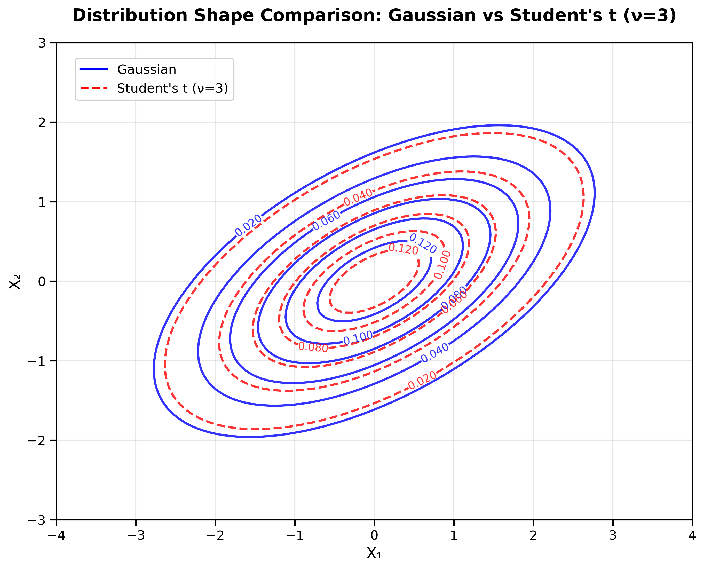

*Figure 0: Contour plot comparison between Gaussian (blue solid lines) and Student's t with ν=3 (red dashed lines). Notice how the t-distribution contours are more spread out, indicating heavier tails.*

**Key Shape Differences:**
- **Gaussian**: Smooth, symmetric contours with moderate concentration
- **Student's t (ν=3)**: Similar shape but more spread out (heavier tails)
- **Student's t (ν=10)**: Very close to Gaussian shape
- **Laplace**: Sharper peak, more concentrated center with exponential decay

#### Student's t-Distribution (ν=3): Heavy Tails

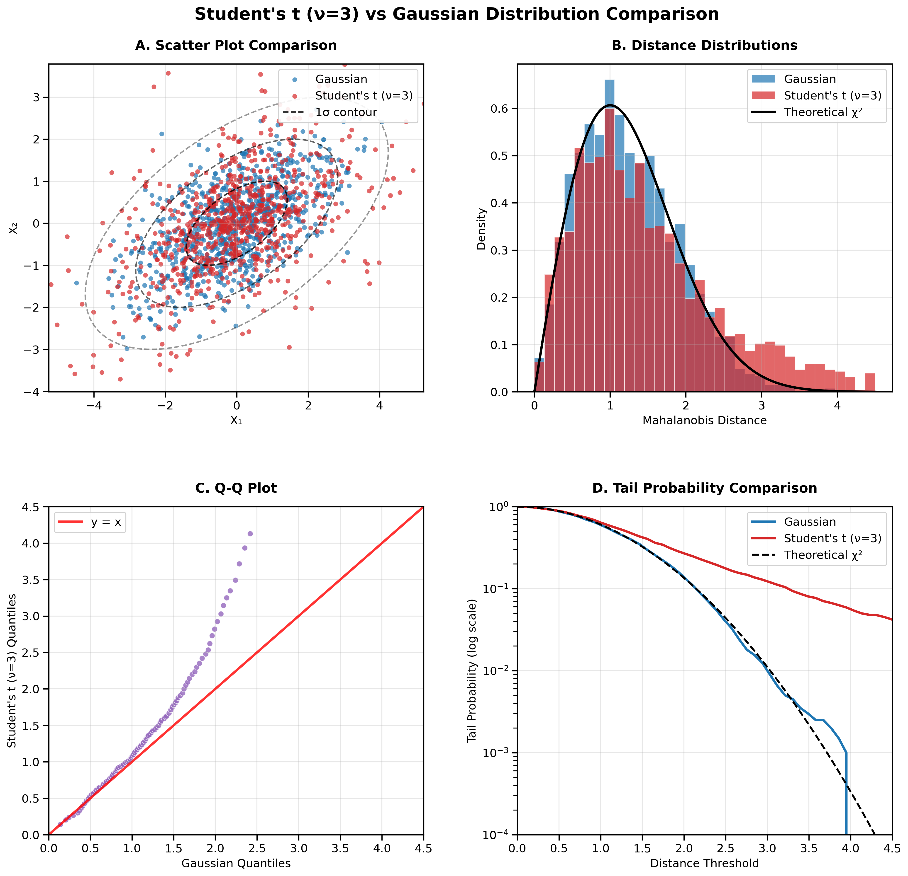

*Figure 1: Student's t-distribution with ν=3 compared to Gaussian distribution across four analytical perspectives.*

**Panel A - Scatter Plot Analysis:**
The scatter plot reveals the fundamental difference in spread between distributions. The Gaussian samples (blue) cluster more tightly around the center, while the t-distribution samples (red) show noticeably more extreme outliers. The dashed elliptical contours (1σ, 2σ, 3σ) provide reference frames - observe how t-distribution points frequently appear beyond the 2σ and 3σ boundaries, indicating the characteristic heavy-tail behavior.

**Panel B - Distance Distribution Comparison:**
The histogram of Mahalanobis distances provides quantitative evidence of tail differences. The theoretical χ² curve (black line) perfectly matches the Gaussian histogram (blue), confirming the expected chi-squared distribution of distances under normality. The t-distribution histogram (red) shows a distinctly different pattern: higher probability mass at larger distances, creating the characteristic "heavy tail" that extends well beyond the Gaussian prediction.

**Panel C - Q-Q Plot Interpretation:**
The Q-Q plot reveals systematic deviations from normality. Points lying on the red reference line would indicate identical distributions. The characteristic upward curve shows that t-distribution quantiles consistently exceed Gaussian quantiles, particularly in the tail regions. This S-shaped deviation is a diagnostic signature of heavy-tailed distributions.

**Panel D - Tail Probability Analysis:**
The logarithmic tail probability plot demonstrates the practical implications of heavy tails. At any given distance threshold, the t-distribution shows substantially higher probabilities of extreme events. This difference becomes critical in risk assessment applications where tail probabilities determine the frequency of rare but impactful events.

## 3D Visualization of Elliptical Distributions

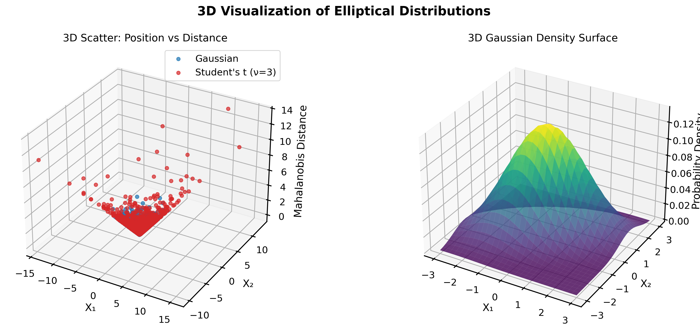

*Figure 4: Three-dimensional visualization showing spatial relationships and probability density surface for elliptical distributions. The left panel demonstrates how Mahalanobis distances vary with position, while the right panel displays the smooth probability density surface characteristic of all elliptical distributions.*


### Student's t-Distribution (ν=10): Moderate Tails

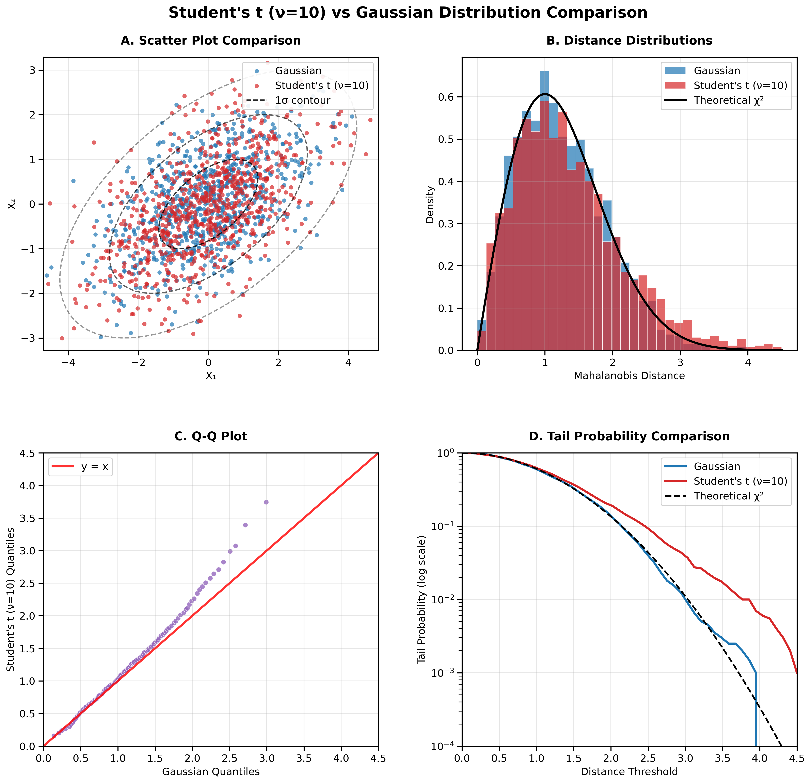

*Figure 2: Student's t-distribution with ν=10 compared to Gaussian distribution, demonstrating the transition toward normality.*

**Convergence to Normality:**
As the degrees of freedom parameter ν increases, the t-distribution converges to the normal distribution. With ν=10, this convergence is already quite advanced:

**Panel A Analysis:** The scatter plots now show much greater similarity between distributions, with outliers being less frequent and less extreme than in the ν=3 case.

**Panel B Analysis:** The distance distributions are nearly indistinguishable, with only subtle differences in the tail regions. The overlap between red and blue histograms is substantial.

**Panel C Analysis:** The Q-Q plot shows points much closer to the reference line, indicating near-normal behavior with only minor deviations at the extremes.

**Panel D Analysis:** Tail probabilities remain slightly elevated compared to Gaussian, but the differences are much smaller than in the heavy-tailed ν=3 case.

#### 3D Visualization

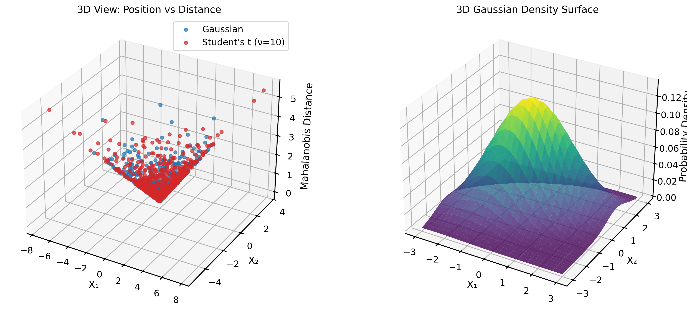

*Figure 2b: Three-dimensional view showing the near-normal characteristics of Student's t-distribution with ν=10.*


#### Multivariate Laplace: Exponential Tails

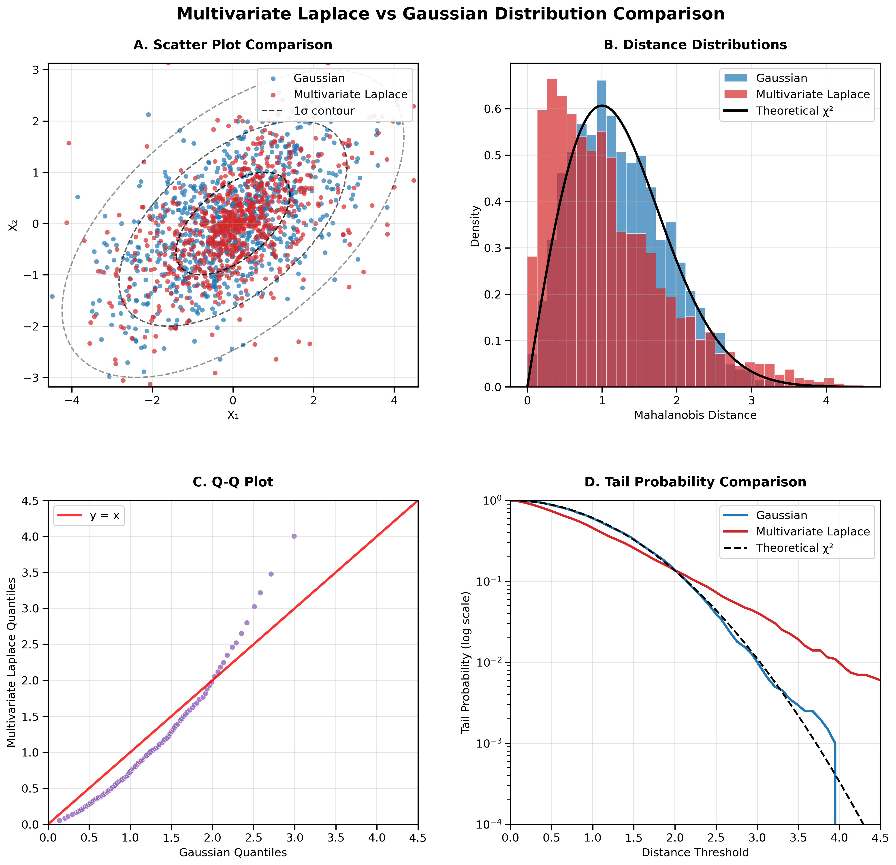

*Figure 3: Multivariate Laplace distribution compared to Gaussian, showing intermediate tail behavior and sparsity-promoting characteristics.*

**Exponential Tail Characteristics:**
The Laplace distribution exhibits tail behavior intermediate between Gaussian and heavy-tailed t-distributions:

**Panel A Analysis:** The scatter plot shows a concentration pattern different from both Gaussian and t-distributions. Points cluster more tightly near the center but with moderate outliers, creating a "spiky" appearance characteristic of sparsity-inducing distributions.

**Panel B Analysis:** The distance distribution shows exponential decay rather than the polynomial decay of t-distributions. This creates a distinctive peak-and-tail pattern where most observations cluster near the center with exponentially decreasing probability of extreme values.

**Panel C Analysis:** The Q-Q plot reveals the Laplace distribution's unique quantile structure. Unlike the smooth curve of t-distributions, the Laplace shows more linear deviations with characteristic break points.

**Panel D Analysis:** Tail probabilities follow the exponential pattern: higher than Gaussian but lower than heavy-tailed t-distributions, making the Laplace distribution optimal for robust estimation with controlled outlier sensitivity.

**Sparsity Applications:** These characteristics make the Laplace distribution particularly valuable in machine learning for regularization (L1 penalty) and compressed sensing applications.

#### 3D Visualization

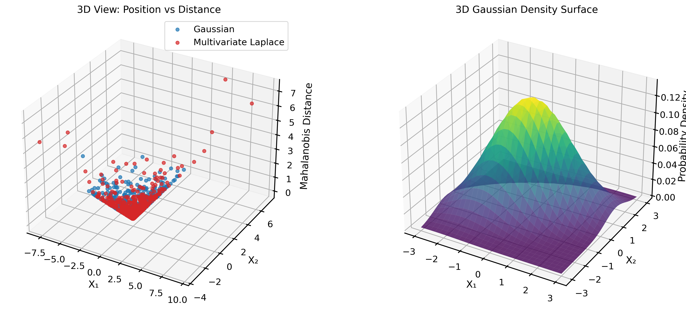

*Figure 3b: Three-dimensional representation of the Multivariate Laplace distribution showing its characteristic sharp peak and exponential decay.*


## Mathematical Foundation: The Generator Function

### Core Principle

Every elliptical distribution can be written as:

$$f(\mathbf{x}) = |\mathbf{\Sigma}|^{-1/2} \cdot g\left((\mathbf{x} - \boldsymbol{\mu})^T \mathbf{\Sigma}^{-1} (\mathbf{x} - \boldsymbol{\mu})\right)$$

where **g(·)** is the **generator function** that completely determines the distribution's shape.

### Generator Function Properties

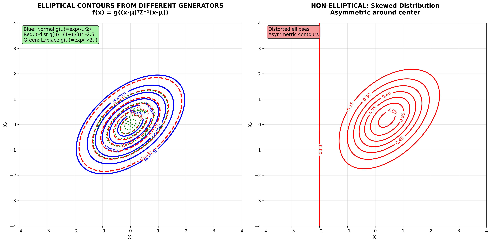

*Figure 5: Comparison of elliptical contours generated by different generator functions. Blue solid lines show Normal distribution contours (g(u) = exp(-u/2)), red dashed lines show t-distribution contours (g(u) = (1+u/3)^(-2.5)), and green dotted lines show Laplace distribution contours (g(u) = exp(-√(2u))). All use the same covariance matrix but different generator functions create different elliptical concentration patterns.*


*Figure 5a: Complete mathematical conditions that define when distributions are elliptical and when they are not.*

#### Generator Function Examples

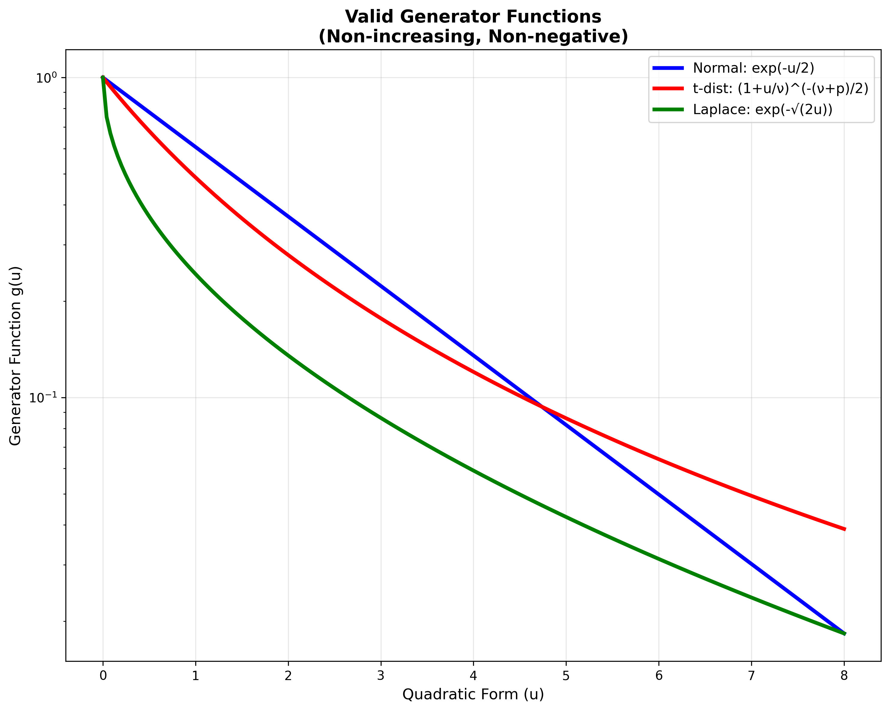

*Figure 5b: Examples of valid generator functions showing their mathematical forms and properties.*

#### Multiple Generator Function Analyses

**Basic Generator Function Comparison:**

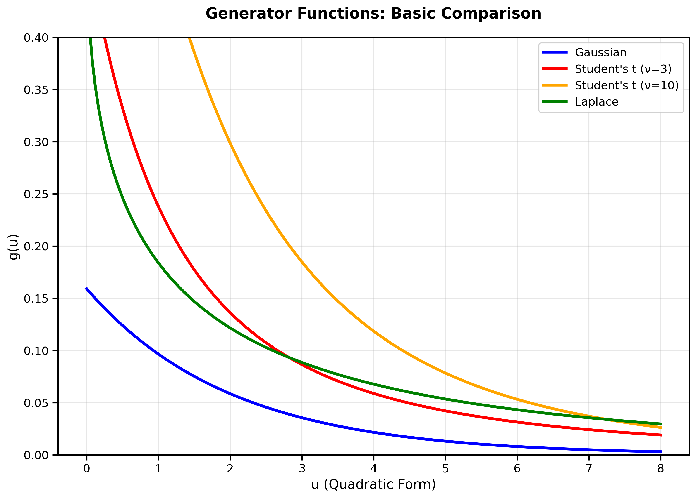

*Figure 6a: Basic comparison of generator functions showing fundamental mathematical differences between elliptical distributions.*

**Logarithmic Scale Analysis (Tail Emphasis):**

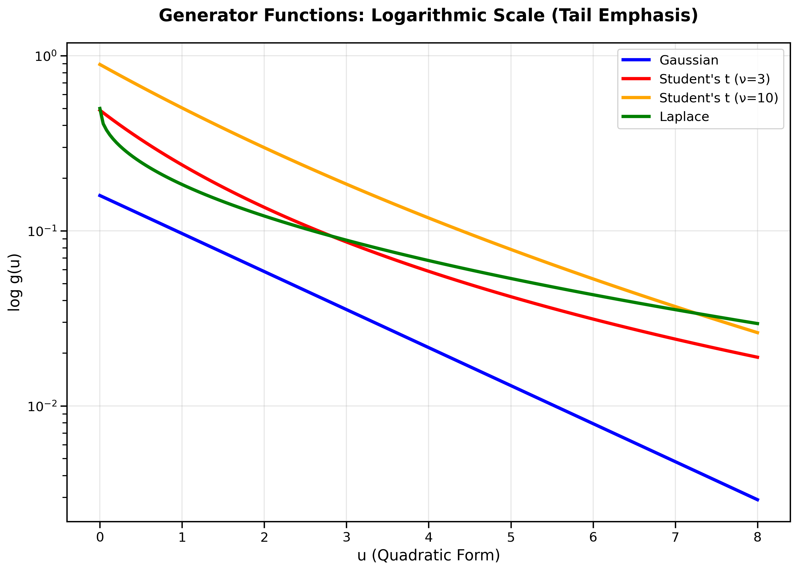

*Figure 6b: Generator functions on logarithmic scale emphasizing tail behavior differences crucial for practical applications.*

**Tail Behavior Focus:**

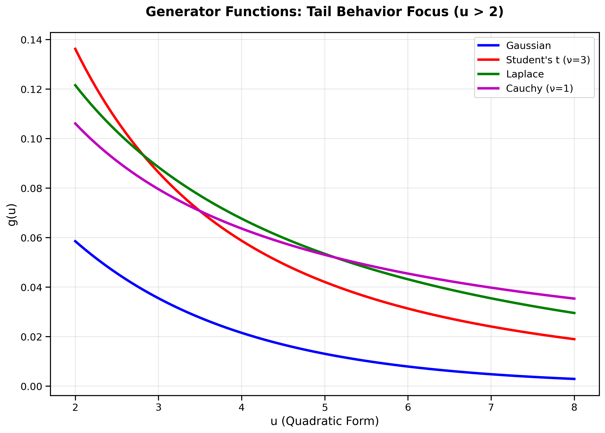

*Figure 6c: Detailed analysis of tail behavior (u > 2) where distributions differ most significantly, showing the heavy tail hierarchy.*

**Mathematical Properties Analysis:**

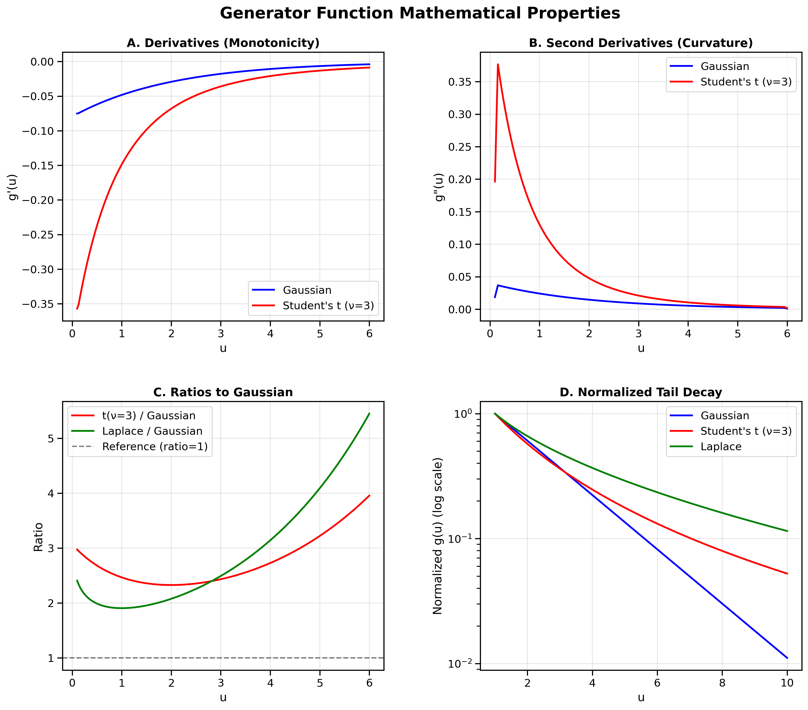

*Figure 6d: Comprehensive mathematical analysis including derivatives, curvature, ratios, and normalized tail decay patterns.*

The generator function must satisfy:

1. **Non-negativity**: $g(u) \geq 0$ for all $u \geq 0$
2. **Monotonicity**: $g(u)$ is non-increasing  
3. **Normalization**: $\int_0^\infty u^{p/2-1} g(u) du = \frac{\Gamma(p/2)}{2^{p/2-1} \pi^{p/2}}$
4. **Integrability**: The integral converges for a proper probability density

### Stochastic Representation

A powerful alternative characterization is the **stochastic representation**:

$$\mathbf{X} \stackrel{d}{=} \boldsymbol{\mu} + \sqrt{R} \mathbf{A} \mathbf{U}$$

where:
- $R \geq 0$ is a **radial random variable** (determines distance from center)
- $\mathbf{U}$ is **uniform on the unit sphere** (determines direction)
- $\mathbf{A}$ is the **matrix square root** of $\mathbf{\Sigma}$
- $R$ and $\mathbf{U}$ are **independent**

This representation reveals that elliptical distributions are **scale mixtures of uniform distributions on ellipsoids**.

## When Distributions Are NOT Elliptical

### Non-Elliptical Examples

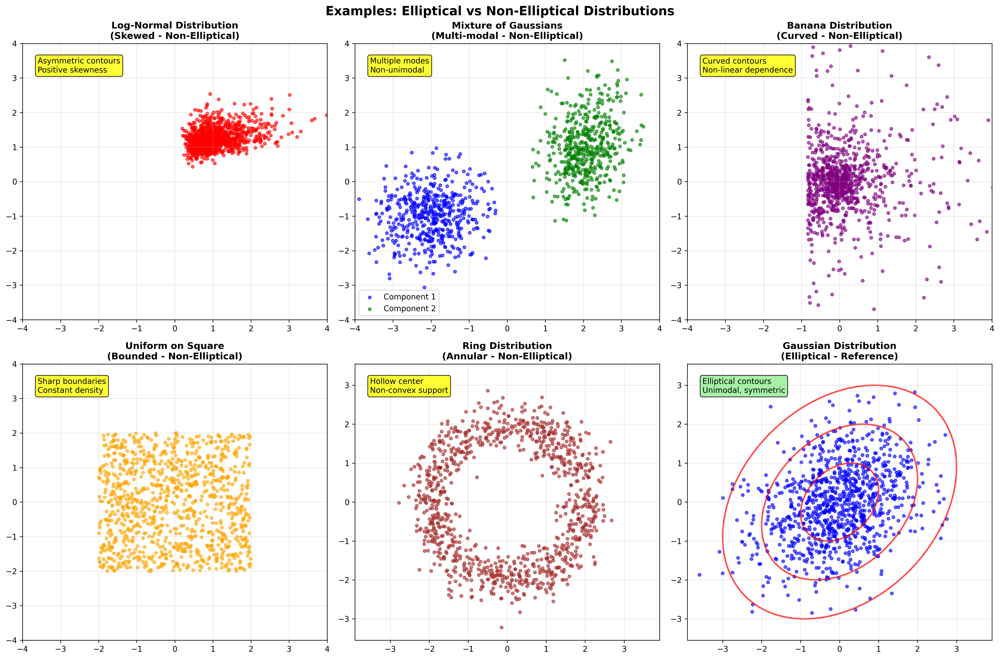

*Figure 5: Examples of non-elliptical distributions showing various violations of elliptical symmetry assumptions.*

### Critical Failures of Elliptical Assumptions

1. **Skewness**: Any asymmetry around the center
   - **Example**: Log-normal distributions
   - **Implication**: $E[(\mathbf{X} - \boldsymbol{\mu})^3] \neq 0$

2. **Multi-modality**: Multiple local maxima
   - **Example**: Mixture of Gaussians with separated components
   - **Implication**: Non-convex level sets

3. **Non-convex support**: Holes or disconnected regions
   - **Example**: Ring distributions, horseshoe shapes
   - **Implication**: Density not determined by quadratic form alone

4. **Asymmetric dependence**: Different tail behavior in different directions
   - **Example**: Copula-based dependencies
   - **Implication**: Violations of radial symmetry

## Why Elliptical Distributions Matter: Practical Importance

### Real-World Data Characteristics

Modern datasets frequently exhibit phenomena that standard Gaussian models cannot capture:

1. **Heavy tails**: Financial returns, sensor measurements, process data
2. **Robustness needs**: Contaminated data, outliers, model uncertainty
3. **Flexible correlation**: Non-linear relationships within elliptical constraints
4. **Computational efficiency**: Maintaining tractability with increased realism

### Statistical Advantages

#### Robust Inference
- **Breakdown point**: Many elliptical estimators remain valid under substantial contamination
- **Efficiency**: Near-optimal performance under correct model specification
- **Adaptivity**: Automatic adjustment to tail heaviness

#### Unified Framework
- **Consistent notation**: All elliptical distributions share parameter interpretation
- **Scalable algorithms**: Methods work across the entire family
- **Theoretical foundation**: Rich mathematical theory supports inference

#### Practical Computation
- **Simulation algorithms**: Efficient generation using stochastic representation
- **Parameter estimation**: Robust EM-type algorithms available
- **Hypothesis testing**: Extensions of classical multivariate tests

## Distribution Taxonomy: Complete Classification

### Primary Families

#### 1. **Location-Scale Family** (Light to Moderate Tails)
- **Multivariate Normal**: $g(u) = (2\pi)^{-p/2} \exp(-u/2)$
- **Multivariate Logistic**: Sigmoid-type generator functions
- **Power Exponential**: $g(u) \propto \exp(-u^s)$ for $s > 0$

#### 2. **Student's t-Family** (Heavy Tails)
- **Cauchy** (ν=1): Extremely heavy tails, no finite moments
- **Moderate t** (ν=3-10): Finite variance, heavy tails
- **Near-normal t** (ν>10): Approaching Gaussian behavior

#### 3. **Laplace Family** (Sparsity-Inducing)
- **Symmetric Laplace**: Exponential tails, promotes sparsity
- **Asymmetric Laplace**: Directional sparsity patterns
- **Generalized Laplace**: Power modifications of exponential decay

#### 4. **Scale Mixture Representations**
- **Variance Gamma**: Gamma-mixed normal
- **Normal Inverse Gaussian**: Inverse Gaussian mixing
- **Generalized Hyperbolic**: Comprehensive parametric family

### Advanced Extensions

#### **Kotz Distribution**
- **Flexible tails**: $g(u) \propto u^r \exp(-u^s)$
- **Parameter control**: Both tail weight (s) and central behavior (r)
- **Generalizations**: Includes many standard cases

#### **Pearson Type Distributions**
- **Bounded support**: Finite range elliptical distributions
- **Beta-type mixing**: Complex tail behaviors
- **Applications**: Constrained optimization, bounded data

## Computational Aspects

### Simulation Methods

1. **Stochastic representation method**:
   ```
   1. Generate R from radial distribution
   2. Generate U uniformly on unit sphere
   3. Return μ + √R × A × U
   ```

2. **Acceptance-rejection**: For complex generator functions

3. **Transformation methods**: Using copula decompositions

### Parameter Estimation Strategies

1. **Method of Moments**: Simple but inefficient
2. **Maximum Likelihood**: Optimal but requires numerical optimization
3. **Robust M-estimators**: Tyler's estimator, MCD
4. **Bayesian approaches**: MCMC for complex models

## Applications Landscape

### Financial Modeling
- **Portfolio optimization**: Heavy-tailed asset returns
- **Risk management**: VaR calculations with realistic tail behavior
- **Derivative pricing**: Non-Gaussian underlying processes

### Process Monitoring
- **Robust control charts**: Insensitive to outliers
- **Fault detection**: Better separation of normal vs. abnormal operation
- **Quality control**: Handling measurement errors and process variations

### Machine Learning
- **Robust classification**: Gaussian mixture model alternatives
- **Regularization**: Laplace priors for sparse learning
- **Anomaly detection**: Flexible baseline modeling

### Signal Processing
- **Robust filtering**: Heavy-tailed noise models
- **Source separation**: Non-Gaussian independent components
- **Compressed sensing**: Sparsity-promoting distributions

## Theoretical Connections

### Information Theory
- **Entropy relationships**: Maximum entropy under elliptical constraints
- **Divergence measures**: Fisher information and relative entropy
- **Coding theory**: Optimal quantization under elliptical assumptions

### Probability Theory
- **Central limit theorems**: Generalized convergence results
- **Large deviations**: Tail probability asymptotics
- **Extreme value theory**: Connection to max-stable processes

### Statistical Decision Theory
- **Optimal testing**: Uniformly most powerful tests under elliptical alternatives
- **Estimation theory**: Admissibility and minimaxity results
- **Robustness theory**: Influence functions and breakdown points

## Future Directions

The study of elliptical distributions continues to evolve with emerging applications in:

- **High-dimensional statistics**: Sparsity and dimension reduction
- **Machine learning**: Deep learning with robust loss functions
- **Network analysis**: Modeling dependencies in complex systems
- **Computational statistics**: Scalable algorithms for big data

This rich mathematical framework provides both theoretical elegance and practical utility, making elliptical distributions indispensable tools for modern statistical analysis and data science applications.

## Next Steps

To fully master elliptical distributions, explore:

1. **[Mathematical Formulation](./02-Mathematical-Formulation.md)** - Rigorous mathematical development
2. **[Parameter Estimation](./03-Parameter-Estimation.md)** - Practical estimation techniques  
3. **[Generator Function Theory](./04-Generator-Function-Theory.md)** - Deep theoretical understanding
4. **[Process Monitoring Applications](./05-Process-Monitoring-Applications.md)** - Real-world implementations
5. **[Python Examples](./Python%20Examples/)** - Computational tools and implementations

Each component builds systematically toward comprehensive understanding and practical mastery of this fundamental statistical framework.