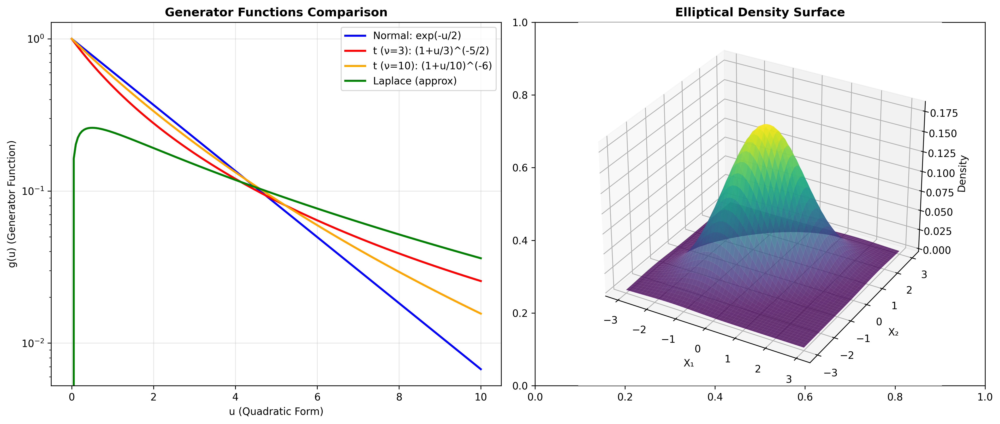
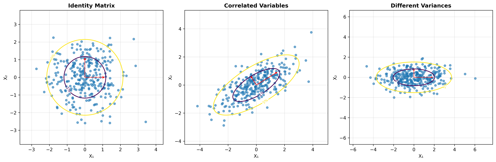

# Mathematical Formulation of Elliptical Distributions

## General Definition

A random vector $\mathbf{X} \in \mathbb{R}^p$ follows an elliptical distribution if its probability density function (when it exists) can be written as:

$$f(\mathbf{x}) = |\mathbf{\Sigma}|^{-1/2} g\left((\mathbf{x} - \boldsymbol{\mu})^T \mathbf{\Sigma}^{-1} (\mathbf{x} - \boldsymbol{\mu})\right)$$

where:

- $\boldsymbol{\mu} \in \mathbb{R}^p$ is the **location parameter** (center of the distribution)
- $\mathbf{\Sigma} \in \mathbb{R}^{p \times p}$ is a positive definite **scatter matrix** (analogous to covariance)
- $g: [0, \infty) \rightarrow [0, \infty)$ is the **generator function** (density generator)

We denote this as $\mathbf{X} \sim EC_p(\boldsymbol{\mu}, \mathbf{\Sigma}, g)$.

## Key Properties

### Quadratic Form

The fundamental characteristic of elliptical distributions is that the density depends only on the quadratic form:

$$Q(\mathbf{x}) = (\mathbf{x} - \boldsymbol{\mu})^T \mathbf{\Sigma}^{-1} (\mathbf{x} - \boldsymbol{\mu})$$

This quadratic form has several important properties:

1. **Non-negativity**: $Q(\mathbf{x}) \geq 0$ for all $\mathbf{x}$
2. **Elliptical contours**: The set $\{\mathbf{x} : Q(\mathbf{x}) = c\}$ forms an ellipse for any $c > 0$
3. **Scale invariance**: Under affine transformations, the quadratic form structure is preserved

### Normalization Condition

For the density to integrate to 1, the generator function must satisfy:

$$\int_0^\infty u^{p/2-1} g(u) du = \frac{\Gamma(p/2)}{2^{p/2-1} \pi^{p/2}}$$

where $\Gamma(\cdot)$ is the gamma function.

## Generator Function $g(\cdot)$

### Definition and Role

The generator function $g: [0, \infty) \rightarrow [0, \infty)$ completely determines the shape of the distribution while preserving the elliptical contour structure. It controls:

1. **Tail behavior**: How probability decreases as we move away from the center
2. **Kurtosis**: The "peakedness" of the distribution
3. **Robustness properties**: Sensitivity to outliers

### Examples of Generator Functions

#### 1. Multivariate Normal Distribution

$$g(u) = (2\pi)^{-p/2} \exp\left(-\frac{u}{2}\right)$$

**Properties:**

- Exponential decay in tails
- Light-tailed distribution
- Optimal under Gaussian assumptions

#### 2. Multivariate Student's t-Distribution

$$g(u) = \frac{\Gamma\left(\frac{\nu + p}{2}\right)}{\Gamma\left(\frac{\nu}{2}\right) (\nu\pi)^{p/2}} \left(1 + \frac{u}{\nu}\right)^{-(\nu+p)/2}$$

where $\nu > 0$ is the degrees of freedom parameter.

**Properties:**

- Polynomial decay in tails
- Heavy-tailed for small $\nu$
- Robust to outliers

#### 3. Multivariate Laplace Distribution

$$g(u) = \frac{2^{(1-p)/2}}{\Gamma(p/2)} u^{(p-1)/2} K_{(p-1)/2}(\sqrt{2u})$$

where $K_\alpha(\cdot)$ is the modified Bessel function of the second kind.

**Properties:**

- Intermediate tail behavior
- Sparsity-inducing properties
- Used in regularization

*Figure 1: Comparison of generator functions (left) and example of a 3D elliptical density surface (right) showing the mathematical structure of elliptical distributions.*

### Generator Function Properties

A valid generator function must satisfy:

1. **Non-negativity**: $g(u) \geq 0$ for all $u \geq 0$
2. **Monotonicity**: $g(u)$ is non-increasing (typically)
3. **Integrability**: The normalization integral must converge
4. **Regularity**: Sufficient smoothness for desired statistical properties

## Relationship Between Covariance Structure and Contours

### Scatter Matrix vs. Covariance Matrix

For elliptical distributions, the scatter matrix $\mathbf{\Sigma}$ is related to, but not necessarily equal to, the covariance matrix $\text{Cov}(\mathbf{X})$.

The relationship is:

$$\text{Cov}(\mathbf{X}) = \kappa \cdot \mathbf{\Sigma}$$

where $\kappa$ is a scalar that depends on the generator function:

$$\kappa = \frac{2\int_0^\infty u^{p/2} g(u) du}{\int_0^\infty u^{p/2-1} g(u) du}$$

### Geometric Interpretation

#### Contour Ellipses

The contours of constant density are ellipses defined by:

$$\{\mathbf{x} : (\mathbf{x} - \boldsymbol{\mu})^T \mathbf{\Sigma}^{-1} (\mathbf{x} - \boldsymbol{\mu}) = c\}$$

where $c > 0$ is a constant.

*Figure 2: Effect of different scatter matrices on elliptical distribution shape. Red arrows show the principal directions (eigenvectors) scaled by the square roots of eigenvalues.*

#### Principal Axes

The principal axes of these ellipses are determined by the eigenvectors of $\mathbf{\Sigma}$:

- **Eigenvectors**: $\mathbf{v}_1, \mathbf{v}_2, \ldots, \mathbf{v}_p$ (directions of principal axes)
- **Eigenvalues**: $\lambda_1, \lambda_2, \ldots, \lambda_p$ (squared lengths of semi-axes)

#### Semi-axis Lengths

For a contour at level $c$, the semi-axis lengths are:

$$a_i = \sqrt{c \lambda_i}, \quad i = 1, 2, \ldots, p$$

### Correlation Structure

The correlation between variables $X_i$ and $X_j$ is determined by:

$$\text{Corr}(X_i, X_j) = \frac{\Sigma_{ij}}{\sqrt{\Sigma_{ii} \Sigma_{jj}}}$$

This is independent of the generator function and depends only on the scatter matrix.

## Stochastic Representation

### Fundamental Representation

Any elliptically distributed random vector can be represented as:

$$\mathbf{X} = \boldsymbol{\mu} + R \cdot \mathbf{A} \mathbf{U}$$

where:

- $R \geq 0$ is a scalar random variable (generating variate)
- $\mathbf{U}$ is uniformly distributed on the unit sphere $S^{p-1}$
- $\mathbf{A}$ is a matrix such that $\mathbf{A}\mathbf{A}^T = \mathbf{\Sigma}$
- $R$ and $\mathbf{U}$ are independent

### Generating Variate Distribution

The distribution of $R^2$ has density:

$$f_{R^2}(r) = \frac{2^{p/2-1} \pi^{p/2}}{\Gamma(p/2)} r^{p/2-1} g(r), \quad r \geq 0$$

This representation is fundamental for:

1. **Simulation algorithms**
2. **Theoretical analysis**
3. **Parameter estimation**

## Characteristic Function

The characteristic function of an elliptical distribution has the form:

$$\phi_{\mathbf{X}}(\mathbf{t}) = \exp(i \mathbf{t}^T \boldsymbol{\mu}) \psi(\mathbf{t}^T \mathbf{\Sigma} \mathbf{t})$$

where $\psi: [0, \infty) \rightarrow \mathbb{R}$ is the **characteristic generator**, related to $g$ through the normalization condition.

### Properties

1. **Real-valued**: $\psi(u) \in \mathbb{R}$ for all $u \geq 0$
2. **Monotonic**: $\psi(u)$ is non-increasing
3. **Normalized**: $\psi(0) = 1$

## Marginal and Conditional Distributions

### Marginal Distributions

If $\mathbf{X} \sim EC_p(\boldsymbol{\mu}, \mathbf{\Sigma}, g)$, then any subset of components also follows an elliptical distribution with the same generator function.

For $\mathbf{X} = (\mathbf{X}_1^T, \mathbf{X}_2^T)^T$ where $\mathbf{X}_1 \in \mathbb{R}^{p_1}$ and $\mathbf{X}_2 \in \mathbb{R}^{p_2}$:

$$\mathbf{X}_1 \sim EC_{p_1}(\boldsymbol{\mu}_1, \mathbf{\Sigma}_{11}, g)$$

where $\boldsymbol{\mu}_1$ and $\mathbf{\Sigma}_{11}$ are the corresponding subvectors and submatrices.

### Conditional Distributions

Conditional distributions of elliptical distributions are generally **not** elliptical, except in special cases (e.g., multivariate normal).

## Applications in Statistical Inference

### Likelihood Function

When the density exists, the log-likelihood function is:

$$\ell(\boldsymbol{\mu}, \mathbf{\Sigma}) = -\frac{n}{2} \log |\mathbf{\Sigma}| + \sum_{i=1}^n \log g\left((\mathbf{x}_i - \boldsymbol{\mu})^T \mathbf{\Sigma}^{-1} (\mathbf{x}_i - \boldsymbol{\mu})\right)$$

### Robust Estimation

Many elliptical distributions lead to robust estimators that are less sensitive to outliers than classical Gaussian methods.

This mathematical foundation provides the theoretical basis for understanding and working with elliptical distributions in practice.