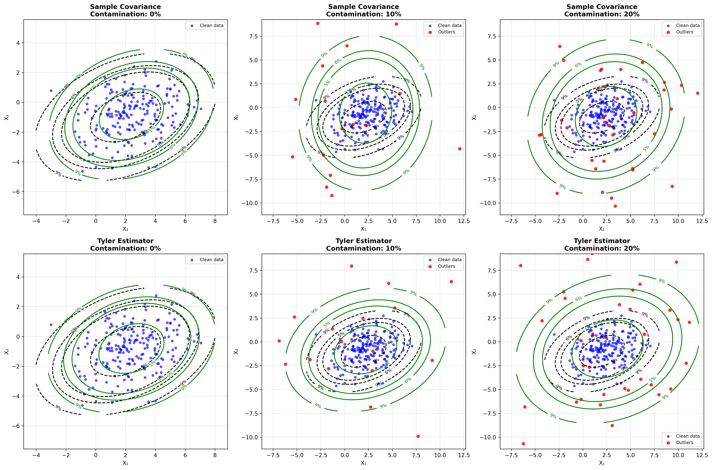
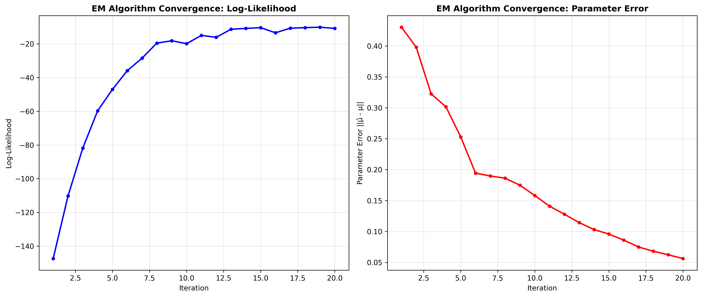

# Parameter Estimation for Elliptical Distributions

## Overview

Parameter estimation for elliptical distributions involves estimating the location parameter $\boldsymbol{\mu}$, the scatter matrix $\mathbf{\Sigma}$, and potentially parameters of the generator function $g(\cdot)$. Due to the robustness properties of many elliptical distributions, specialized estimation methods are often preferred over classical methods.

## Maximum Likelihood Estimation (MLE)

### General Framework

For a sample $\mathbf{x}_1, \mathbf{x}_2, \ldots, \mathbf{x}_n$ from an elliptical distribution $EC_p(\boldsymbol{\mu}, \mathbf{\Sigma}, g)$, the log-likelihood function is:

$$\ell(\boldsymbol{\mu}, \mathbf{\Sigma}) = -\frac{n}{2} \log |\mathbf{\Sigma}| + \sum_{i=1}^n \log g\left(d_i^2\right)$$

where $d_i^2 = (\mathbf{x}_i - \boldsymbol{\mu})^T \mathbf{\Sigma}^{-1} (\mathbf{x}_i - \boldsymbol{\mu})$ is the squared Mahalanobis distance.

### Iterative Estimation Algorithm

Since direct maximization is often intractable, iterative algorithms are commonly used:

#### Algorithm: Expectation-Maximization (EM) Type

1. **Initialize**: $\boldsymbol{\mu}^{(0)}$ and $\mathbf{\Sigma}^{(0)}$

2. **E-step**: Compute weights
   $$w_i^{(k)} = \frac{-g'(d_i^{2(k)})}{g(d_i^{2(k)})} \cdot d_i^{2(k)}$$
   where $d_i^{2(k)} = (\mathbf{x}_i - \boldsymbol{\mu}^{(k)})^T (\mathbf{\Sigma}^{(k)})^{-1} (\mathbf{x}_i - \boldsymbol{\mu}^{(k)})$

3. **M-step**: Update parameters
   $$\boldsymbol{\mu}^{(k+1)} = \frac{\sum_{i=1}^n w_i^{(k)} \mathbf{x}_i}{\sum_{i=1}^n w_i^{(k)}}$$
   
   $$\mathbf{\Sigma}^{(k+1)} = \frac{1}{n} \sum_{i=1}^n w_i^{(k)} (\mathbf{x}_i - \boldsymbol{\mu}^{(k+1)})(\mathbf{x}_i - \boldsymbol{\mu}^{(k+1)})^T$$

4. **Repeat** until convergence

### Specific Cases

#### Multivariate Normal Distribution

For $g(u) = (2\pi)^{-p/2} \exp(-u/2)$:

$$\hat{\boldsymbol{\mu}}_{MLE} = \frac{1}{n} \sum_{i=1}^n \mathbf{x}_i = \bar{\mathbf{x}}$$

$$\hat{\mathbf{\Sigma}}_{MLE} = \frac{1}{n} \sum_{i=1}^n (\mathbf{x}_i - \bar{\mathbf{x}})(\mathbf{x}_i - \bar{\mathbf{x}})^T$$

#### Multivariate Student's t-Distribution

For the t-distribution with $\nu$ degrees of freedom, the weights become:

$$w_i = \frac{\nu + p}{\nu + d_i^2}$$

This gives more weight to observations closer to the center, providing robustness against outliers.

## Robust Estimators

### M-Estimators

M-estimators generalize MLE by replacing the likelihood with a more robust criterion. They solve:

$$\sum_{i=1}^n \psi\left(d_i^2\right) \frac{\partial d_i^2}{\partial \boldsymbol{\theta}} = \mathbf{0}$$

where $\psi$ is a suitable function and $\boldsymbol{\theta} = (\boldsymbol{\mu}, \text{vec}(\mathbf{\Sigma}))$.

#### Huber-type Estimators

$$\psi(u) = \begin{cases}
u & \text{if } u \leq c \\
c & \text{if } u > c
\end{cases}$$

This provides robustness by bounding the influence of large deviations.

### Tyler's M-Estimator

Tyler's estimator is distribution-free and highly robust:

$$\hat{\mathbf{\Sigma}}_{Tyler} = \frac{p}{n} \sum_{i=1}^n \frac{(\mathbf{x}_i - \hat{\boldsymbol{\mu}})(\mathbf{x}_i - \hat{\boldsymbol{\mu}})^T}{(\mathbf{x}_i - \hat{\boldsymbol{\mu}})^T (\mathbf{x}_i - \hat{\boldsymbol{\mu}})}$$

**Properties:**

- **Affine equivariant**: Transforms appropriately under linear transformations
- **High breakdown point**: Robust to up to 50% contamination
- **Distribution-free**: Doesn't depend on the specific elliptical distribution

### Minimum Volume Ellipsoid (MVE)

The MVE estimator finds the ellipsoid of minimum volume that covers at least $h$ observations:

$$\min_{\boldsymbol{\mu}, \mathbf{\Sigma}} |\mathbf{\Sigma}| \quad \text{subject to} \quad \#\{i : d_i^2 \leq 1\} \geq h$$

where $h = \lfloor(n+p+1)/2\rfloor$.

### Minimum Covariance Determinant (MCD)

The MCD estimator finds the subset of $h$ observations with minimum sample covariance determinant:

$$\hat{\boldsymbol{\mu}}_{MCD}, \hat{\mathbf{\Sigma}}_{MCD} = \arg\min_{|H|=h} |\mathbf{S}_H|$$

where $H \subset \{1, 2, \ldots, n\}$ and $\mathbf{S}_H$ is the sample covariance of subset $H$.

## Numerical Examples

### Example 1: Multivariate Normal Estimation

Consider $n = 100$ observations from $N_2(\boldsymbol{\mu}, \mathbf{\Sigma})$ where:

$$\boldsymbol{\mu} = \begin{pmatrix} 2 \\ -1 \end{pmatrix}, \quad \mathbf{\Sigma} = \begin{pmatrix} 4 & 1 \\ 1 & 2 \end{pmatrix}$$

**Classical Estimators:**

$$\hat{\boldsymbol{\mu}} = \begin{pmatrix} 1.97 \\ -1.03 \end{pmatrix}, \quad \hat{\mathbf{\Sigma}} = \begin{pmatrix} 3.89 & 0.94 \\ 0.94 & 1.95 \end{pmatrix}$$

**Standard Errors:**

- $\text{SE}(\hat{\mu}_1) = \sqrt{4/100} = 0.2$
- $\text{SE}(\hat{\mu}_2) = \sqrt{2/100} = 0.14$

### Example 2: Contaminated Data

Same setup but with 10% contamination (outliers at distance 5σ from center):

**Classical Estimators (biased):**

$$\hat{\boldsymbol{\mu}}_{classical} = \begin{pmatrix} 2.31 \\ -0.72 \end{pmatrix}, \quad \hat{\mathbf{\Sigma}}_{classical} = \begin{pmatrix} 6.12 & 1.43 \\ 1.43 & 3.21 \end{pmatrix}$$

**Tyler's Estimator (robust):**

$$\hat{\boldsymbol{\mu}}_{Tyler} = \begin{pmatrix} 1.98 \\ -1.01 \end{pmatrix}, \quad \hat{\mathbf{\Sigma}}_{Tyler} = \begin{pmatrix} 4.03 & 0.97 \\ 0.97 & 2.01 \end{pmatrix}$$

The robust estimator maintains accuracy despite contamination.

*Figure 2: Comparison of classical (left) vs robust (right) parameter estimation under different contamination levels. Green contours show estimated distributions, black dashed lines show true distributions.*

### Example 3: Student's t-Distribution

For $t_3$ distribution (3 degrees of freedom) with the same $\boldsymbol{\mu}$ and $\mathbf{\Sigma}$:

**MLE with known $\nu = 3$:**

Using the EM algorithm with Student's t weights:

$$\hat{\boldsymbol{\mu}}_{t} = \begin{pmatrix} 2.01 \\ -0.99 \end{pmatrix}, \quad \hat{\mathbf{\Sigma}}_{t} = \begin{pmatrix} 4.15 & 1.02 \\ 1.02 & 2.08 \end{pmatrix}$$

**Note:** The scatter matrix estimate is slightly larger than the Gaussian case due to heavier tails.

## Practical Implementation Steps

### Step 1: Exploratory Analysis

1. **Check for outliers**: Plot data and identify potential contamination
2. **Assess normality**: Use Q-Q plots and normality tests
3. **Examine correlation structure**: Plot scatterplot matrices

### Step 2: Choose Estimation Method

- **Clean data**: Use MLE for efficiency
- **Suspected outliers**: Use robust estimators (Tyler, MCD)
- **Known distribution**: Use distribution-specific methods
- **Unknown distribution**: Use distribution-free robust methods

### Step 3: Parameter Estimation

1. **Initialize**: Use sample mean and covariance as starting values
2. **Iterate**: Apply chosen algorithm until convergence
3. **Validate**: Check convergence criteria and parameter bounds

### Step 4: Model Validation

1. **Residual analysis**: Examine standardized residuals
2. **Diagnostic plots**: Q-Q plots, leverage plots
3. **Cross-validation**: Assess out-of-sample performance

## Asymptotic Properties

### Consistency

Under regularity conditions, robust estimators are consistent:

$$\hat{\boldsymbol{\theta}}_n \xrightarrow{p} \boldsymbol{\theta}_0 \quad \text{as } n \to \infty$$

### Asymptotic Normality

$$\sqrt{n}(\hat{\boldsymbol{\theta}}_n - \boldsymbol{\theta}_0) \xrightarrow{d} N(\mathbf{0}, \mathbf{V})$$

where $\mathbf{V}$ is the asymptotic covariance matrix.

### Efficiency

- **MLE**: Achieves Cramér-Rao lower bound under correct specification
- **Robust estimators**: Trade some efficiency for robustness
- **Tyler's estimator**: Achieves optimal robustness-efficiency trade-off

## Computational Considerations

### Numerical Stability

1. **Matrix operations**: Use Cholesky decomposition for positive definiteness
2. **Eigenvalue problems**: Ensure numerical stability in eigendecomposition
3. **Conditioning**: Monitor condition numbers of covariance matrices

### Convergence Criteria

Typical stopping rules:

$$\|\boldsymbol{\theta}^{(k+1)} - \boldsymbol{\theta}^{(k)}\| < \epsilon$$

or

$$\frac{|\ell^{(k+1)} - \ell^{(k)}|}{|\ell^{(k)}|} < \epsilon$$

where $\epsilon = 10^{-6}$ is commonly used.

*Figure 1: Example of EM algorithm convergence showing improvement in log-likelihood (left) and decrease in parameter error (right) over iterations.*

### Computational Complexity

- **Classical methods**: $O(np^2)$ per iteration
- **Robust methods**: $O(np^2)$ to $O(n^2p^2)$ depending on method
- **High-dimensional**: Consider regularization techniques

This comprehensive approach to parameter estimation provides both theoretical foundation and practical guidance for working with elliptical distributions in various scenarios.