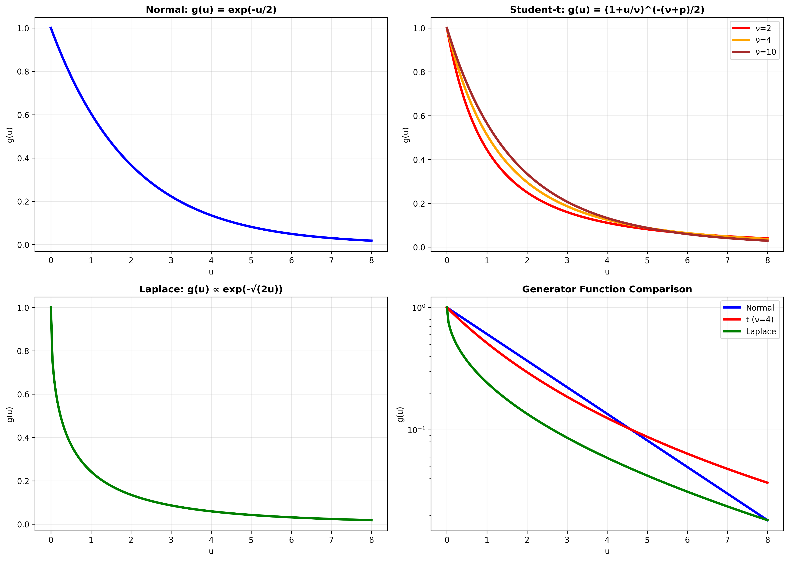
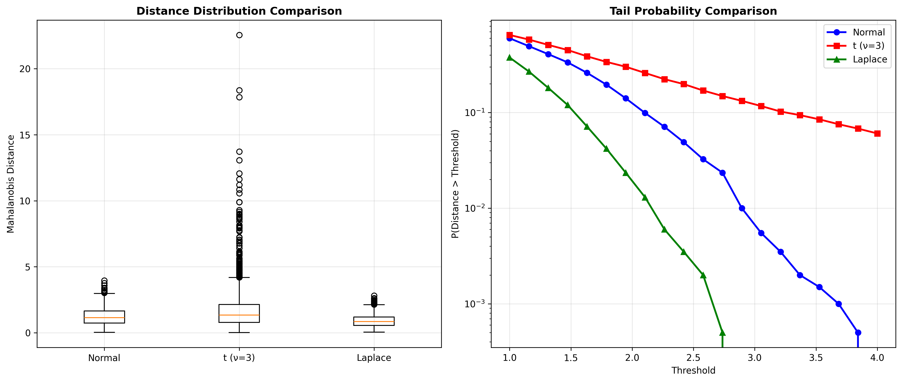

# Generator Function Theory

## Formal Definition

The generator function $g: [0, \infty) \rightarrow [0, \infty)$ is the core component that defines the shape of an elliptical distribution. It determines how the probability density decreases as we move away from the center of the distribution.

### Mathematical Requirements

For a function $g$ to be a valid generator function, it must satisfy:

1. **Non-negativity**: $g(u) \geq 0$ for all $u \geq 0$

2. **Monotonicity**: $g(u)$ is non-increasing (typically strictly decreasing)

3. **Normalization**: The integral condition
   $$\int_0^\infty u^{p/2-1} g(u) du = \frac{\Gamma(p/2)}{2^{p/2-1} \pi^{p/2}}$$
   
4. **Integrability**: The integral must converge to ensure a proper probability density

### Geometric Interpretation

The generator function can be understood as:

- **Radial density**: $g(u)$ determines the density at radial distance $\sqrt{u}$ from the center
- **Contour height**: For fixed $u$, $g(u)$ gives the "height" of the elliptical contour
- **Tail behavior**: The asymptotic behavior of $g(u)$ as $u \to \infty$ controls the tail properties

## Examples of Generator Functions

### 1. Multivariate Normal Distribution

$$g(u) = (2\pi)^{-p/2} \exp\left(-\frac{u}{2}\right)$$

**Derivation:**

Starting from the standard multivariate normal density:

$$f(\mathbf{x}) = (2\pi)^{-p/2} |\mathbf{\Sigma}|^{-1/2} \exp\left(-\frac{1}{2}(\mathbf{x} - \boldsymbol{\mu})^T \mathbf{\Sigma}^{-1} (\mathbf{x} - \boldsymbol{\mu})\right)$$

Setting $u = (\mathbf{x} - \boldsymbol{\mu})^T \mathbf{\Sigma}^{-1} (\mathbf{x} - \boldsymbol{\mu})$, we obtain:

$$g(u) = (2\pi)^{-p/2} \exp\left(-\frac{u}{2}\right)$$

**Properties:**

- **Exponential decay**: $g(u) \sim \exp(-u/2)$ as $u \to \infty$
- **Light tails**: Probability decreases very rapidly
- **Smooth**: Infinitely differentiable
- **Optimal**: Maximizes entropy under second-moment constraints

### 2. Multivariate Student's t-Distribution

$$g(u) = \frac{\Gamma\left(\frac{\nu + p}{2}\right)}{\Gamma\left(\frac{\nu}{2}\right) (\nu\pi)^{p/2}} \left(1 + \frac{u}{\nu}\right)^{-(\nu+p)/2}$$

**Derivation:**

The multivariate t-distribution can be derived as a scale mixture of normals:

$$\mathbf{X} | W \sim N_p(\boldsymbol{\mu}, W^{-1}\mathbf{\Sigma})$$

where $W \sim \text{Gamma}(\nu/2, \nu/2)$.

Integrating out $W$ yields the generator function above.

**Properties:**

- **Polynomial decay**: $g(u) \sim u^{-(\nu+p)/2}$ as $u \to \infty$
- **Heavy tails**: For small $\nu$, much heavier than Gaussian
- **Robustness**: Less sensitive to outliers than normal distribution
- **Limiting behavior**: As $\nu \to \infty$, approaches normal distribution

**Tail Behavior Analysis:**

For large $u$:
$$g(u) \approx \frac{\Gamma\left(\frac{\nu + p}{2}\right)}{\Gamma\left(\frac{\nu}{2}\right) (\nu\pi)^{p/2}} \nu^{(\nu+p)/2} u^{-(\nu+p)/2}$$

### 3. Multivariate Laplace Distribution

$$g(u) = \frac{2^{(1-p)/2}}{\Gamma(p/2)} u^{(p-1)/2} K_{(p-1)/2}(\sqrt{2u})$$

where $K_\alpha(\cdot)$ is the modified Bessel function of the second kind.

**Derivation:**

The multivariate Laplace distribution can be constructed as:

$$\mathbf{X} = \boldsymbol{\mu} + \sqrt{W} \mathbf{A} \mathbf{U}$$

where $W \sim \text{Exponential}(1)$ and $\mathbf{U}$ is uniform on the unit sphere.

**Properties:**

- **Exponential-type decay**: $g(u) \sim \exp(-\sqrt{2u})$ as $u \to \infty$
- **Intermediate tails**: Between normal and t-distribution
- **Sparsity**: Promotes sparsity in regularization applications

### 4. Kotz Distribution

$$g(u) = \frac{s \Gamma(p/2)}{\pi^{p/2} \Gamma((p+2r)/2s)} u^r \exp(-u^s)$$

where $r > -p/2$ and $s > 0$ are shape parameters.

**Properties:**

- **Flexible tails**: Parameter $s$ controls tail behavior
- **Generalization**: Includes normal ($r=0, s=1$) and other distributions
- **Sub/Super-Gaussian**: Can model both light and heavy tails

*Figure 1: Comparison of different generator function families showing their distinct functional forms and how they control the shape of elliptical distributions.*

## How $g$ Controls Tail Behavior

### Tail Classification

The asymptotic behavior of $g(u)$ as $u \to \infty$ determines the tail weight:

1. **Light tails**: $g(u) = O(\exp(-au))$ for some $a > 0$
   - Example: Normal distribution with $g(u) \sim \exp(-u/2)$

2. **Medium tails**: $g(u) = O(\exp(-au^b))$ for $0 < b < 1$
   - Example: Laplace distribution with $g(u) \sim \exp(-\sqrt{2u})$

3. **Heavy tails**: $g(u) = O(u^{-a})$ for some $a > 0$
   - Example: t-distribution with $g(u) \sim u^{-(\nu+p)/2}$

*Figure 2: Demonstration of how different generator functions control tail behavior, showing distance distributions and tail probabilities for various elliptical distributions.*

### Kurtosis and Shape

The generator function also controls the kurtosis (peakedness) of the distribution:

$$\text{Kurtosis} = \frac{E[(\mathbf{X} - \boldsymbol{\mu})^T \mathbf{\Sigma}^{-1} (\mathbf{X} - \boldsymbol{\mu})]^2}{p(p+2)}$$

This is determined by the fourth moment of the generating variate $R^2$.

### Moment Existence

The existence of moments depends on the tail behavior of $g$:

- **All moments exist**: If $\int_0^\infty u^k g(u) du < \infty$ for all $k$
- **Finite moments up to order $m$**: If the integral converges for $k \leq m$ but diverges for $k > m$

## Derivations and Worked Examples

### Example 1: Deriving the Normalization Constant

**Problem**: Find the normalization constant for $g(u) = \exp(-u/2)$.

**Solution:**

We need to solve:
$$\int_0^\infty u^{p/2-1} \exp(-u/2) du = C$$

Using the substitution $t = u/2$:
$$\int_0^\infty (2t)^{p/2-1} \exp(-t) \cdot 2 dt = 2^{p/2} \int_0^\infty t^{p/2-1} \exp(-t) dt$$

$$= 2^{p/2} \Gamma(p/2)$$

For normalization:
$$C = \frac{\Gamma(p/2)}{2^{p/2-1} \pi^{p/2}}$$

Therefore:
$$g(u) = \frac{1}{2^{p/2} \pi^{p/2}} \exp(-u/2) = (2\pi)^{-p/2} \exp(-u/2)$$

### Example 2: Moment Calculation for t-Distribution

**Problem**: Calculate $E[R^4]$ for the t-distribution generator.

**Solution:**

For the t-distribution, $R^2$ has density:
$$f_{R^2}(r) = \frac{2^{p/2-1} \pi^{p/2}}{\Gamma(p/2)} r^{p/2-1} g(r)$$

$$= \frac{2^{p/2-1} \pi^{p/2}}{\Gamma(p/2)} r^{p/2-1} \frac{\Gamma\left(\frac{\nu + p}{2}\right)}{\Gamma\left(\frac{\nu}{2}\right) (\nu\pi)^{p/2}} \left(1 + \frac{r}{\nu}\right)^{-(\nu+p)/2}$$

Simplifying:
$$f_{R^2}(r) = \frac{\Gamma\left(\frac{\nu + p}{2}\right)}{\Gamma\left(\frac{\nu}{2}\right) \Gamma\left(\frac{p}{2}\right)} \frac{(\nu/2)^{\nu/2} (1/2)^{p/2}}{B(\nu/2, p/2)} r^{p/2-1} \left(1 + \frac{r}{\nu}\right)^{-(\nu+p)/2}$$

This is a scaled F-distribution. The fourth moment exists if $\nu > 8$ and equals:
$$E[R^4] = \frac{\nu^2 (p+2)(p+4)}{(\nu-4)(\nu-6)} \quad \text{for } \nu > 8$$

### Example 3: Constructing a New Generator Function

**Problem**: Construct a generator function that interpolates between normal and Laplace distributions.

**Solution:**

Consider the family:
$$g_\alpha(u) = C_\alpha \exp(-u^{\alpha/2}) \quad \text{for } \alpha \in (0, 2]$$

where $C_\alpha$ is the normalization constant.

- **$\alpha = 2$**: Normal distribution
- **$\alpha = 1$**: Related to Laplace distribution

The normalization constant is:
$$C_\alpha = \frac{\Gamma(p/2)}{2^{p/\alpha} \Gamma(p/\alpha) \pi^{p/2}}$$

This family provides a smooth transition between different tail behaviors.

## Relationship to Characteristic Functions

### Characteristic Generator

The generator function $g$ is related to the characteristic generator $\psi$ through:

$$\psi(t) = \int_0^\infty \cos(\sqrt{t u}) \frac{2^{p/2-1} \pi^{p/2}}{\Gamma(p/2)} u^{p/2-1} g(u) du$$

### Examples

1. **Normal**: $\psi(t) = \exp(-t/2)$
2. **t-distribution**: $\psi(t) = \frac{(\sqrt{\nu t})^{\nu/2} K_{\nu/2}(\sqrt{\nu t})}{\Gamma(\nu/2) 2^{\nu/2-1}}$
3. **Laplace**: More complex involving Bessel functions

## Applications in Distribution Design

### Robustness Considerations

When designing robust procedures, the choice of generator function affects:

1. **Breakdown point**: How many outliers can be tolerated
2. **Efficiency**: Statistical efficiency under the assumed model
3. **Computational complexity**: Ease of parameter estimation

### Optimal Generator Functions

For specific criteria, optimal generator functions can be derived:

1. **Minimax robustness**: Minimize worst-case bias
2. **Maximum entropy**: Subject to moment constraints
3. **Computational efficiency**: Ensure fast algorithms

This comprehensive understanding of generator functions provides the foundation for selecting appropriate elliptical distributions for specific applications and for developing new distributions when needed.