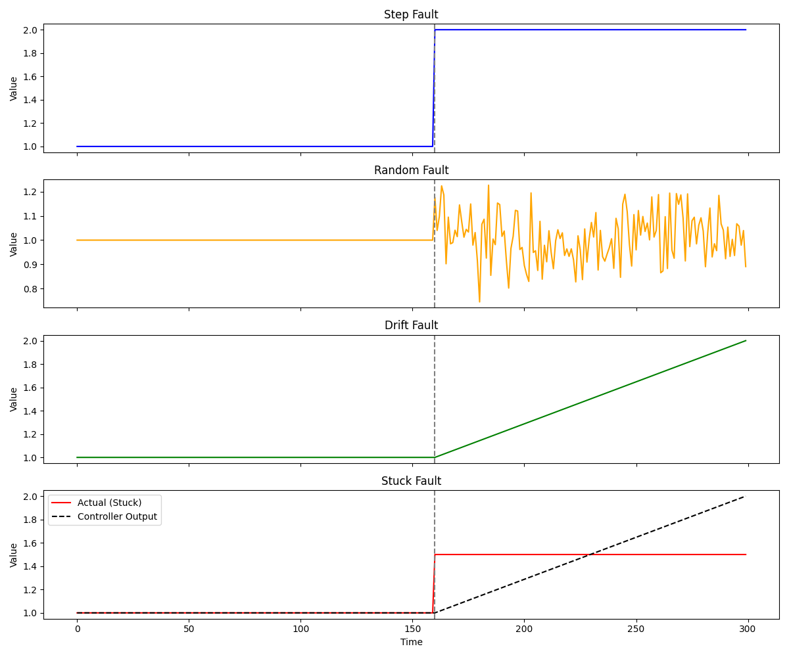

## **Fault Types in the Tennessee Eastman Process (TEP): Group Differences**

Each fault group simulates a different type of real-world process disturbance. Their behaviors differ in timing, duration, detectability, and root cause. Below is a structured comparison:

---

## **1. Step Faults**

### **Definition**

A sudden and sustained change in a process variable or parameter at a fixed time.

### **Characteristics**

* Occurs instantly at a specific time (usually at t = 160).
* Remains constant after the change.
* Easy to detect via control chart signals or PCA score shifts.

### **Example (IDV 1)**

IDV 1(Index of Disturbance Variable)
Change in A/B feed ratio → Immediate impact on reactor input composition.

### **Real-world analogy**

Operator sets a new valve position or a pump suddenly fails to a fixed speed.

---

## **2. Random Faults (Stochastic Noise)**

### **Definition**

High-frequency noise or small fluctuations added to process variables.

### **Characteristics**

* Varies over time with no clear pattern.
* Difficult to detect early due to overlapping with normal process variability.
* Often modeled as Gaussian noise with small amplitude.

### **Example (IDV 11)**

Random fluctuation in reactor temperature → May not trigger alarms immediately.

### **Real-world analogy**

Sensor noise, minor upstream feed quality fluctuations, or ambient temperature changes.

---

## **3. Drift Faults (Slow Change)**

### **Definition**

Gradual and continuous deviation of a variable or parameter over time.

### **Characteristics**

* No sudden jump; change occurs progressively.
* Often undetectable with short-term monitoring.
* Critical in long-term process health monitoring.

### **Example (IDV 13)**

Reaction kinetics slowly degrade → Catalyst deactivation over time.

### **Real-world analogy**

Fouling in heat exchangers, aging of sensors, or slow valve leakage.

---

## **4. Stuck Faults (Actuator Failures)**

### **Definition**

A control element (e.g., valve) becomes fixed at its current position and no longer responds to control signals.

### **Characteristics**

* Output/input signal frozen despite controller effort.
* Easily detectable if controller output continues to change but process variable does not.
* Can cause cascading faults in the process.

### **Example (IDV 19)**

Feed valve (XMV$$
3]) becomes unresponsive → Flow rate stays constant.

### **Real-world analogy**

Valve failure, actuator disconnection, or mechanical blockage.

---

## **Summary Table**

| Type   | Change Behavior      | Detectability    | Duration | Root Cause Example              |
| ------ | -------------------- | ---------------- | -------- | ------------------------------- |
| Step   | Instant, permanent   | High             | Long     | Operator action, abrupt failure |
| Random | Noisy, unpredictable | Low-medium       | Variable | Sensor noise, feed variability  |
| Drift  | Gradual over time    | Low (short-term) | Long     | Fouling, wear, catalyst decay   |
| Stuck  | Frozen actuator      | Medium-high      | Long     | Valve jam, actuator disconnect  |

---

## **Tennessee Eastman Process (TEP): Explanation of Each Fault Scenario (IDV1–21])**

Each fault (indexed by `IDV`) (Index of Disturbance Variable) represents a specific process disturbance. Below is a detailed explanation of what each fault means operationally:

---

## **Step Faults (Sudden Permanent Changes)**

| IDV | Description                                     | Explanation                                                                                                                          |
| --- | ----------------------------------------------- | ------------------------------------------------------------------------------------------------------------------------------------ |
| 1   | A feed ratio, B composition constant (stream 4) | Sudden increase or decrease in the ratio of A to B in the reactor feed; total flow remains the same. Affects reaction stoichiometry. |
| 2   | B feed ratio, A composition constant (stream 4) | Reverse of IDV 1; alters B proportion while keeping A fixed. Tests sensitivity to B dominance.                                       |
| 3   | D feed temperature                              | Instant change in feed D’s temperature. May cause changes in reaction rate or yield.                                                 |
| 4   | Reactor cooling water valve                     | Cooling valve opens/closes suddenly. Influences reactor temperature control.                                                         |
| 5   | Condenser cooling water valve                   | Sudden change in condenser cooling valve position; affects vapor condensation efficiency.                                            |
| 6   | A feed loss (stream 1)                          | Complete or partial sudden shutdown of feed A. Strong effect on product formation and stoichiometry.                                 |
| 7   | C header pressure loss – reduced availability   | Simulates upstream issue: reduced pressure in C source line. Impacts flow into the system.                                           |
| 16  | Step change in process gain                     | Artificial change in process sensitivity (e.g., system responds twice as strongly to control actions). Impacts controller tuning.    |

---

## **Random Faults (Noisy Disturbances)**

| IDV | Description                              | Explanation                                                                                               |
| --- | ---------------------------------------- | --------------------------------------------------------------------------------------------------------- |
| 8   | A, B, C feed composition                 | Stochastic variation in raw material quality. Tests robustness to changing input specifications.          |
| 9   | D feed temperature                       | Continuous random noise added to D’s temperature. Subtle but persistent effect on process energy balance. |
| 10  | C feed temperature                       | Similar to IDV 9, but applied to C feed.                                                                  |
| 11  | Reactor temperature                      | Random disturbance in reactor temperature; could be due to heater or sensor issue.                        |
| 12  | Condenser temperature                    | Noise in condenser temperature control. Could reflect fouling or cooling system inefficiency.             |
| 14  | Reactor cooling water flow               | Random variation in coolant flow to reactor. Tests disturbance rejection in energy subsystem.             |
| 15  | Condenser cooling water flow             | Noisy variation in condenser’s cooling water; can impact separation and pressure.                         |
| 17  | Random variation in reaction kinetics    | Simulates catalyst fouling or chemical inconsistency. Reaction rates fluctuate over time.                 |
| 18  | Random variation in separator efficiency | Reflects mechanical wear, foaming, or fouling in separation equipment. Affects product purity.            |

---

## **Drift Faults (Slow Degradation)**

| IDV | Description       | Explanation                                                                                                   |
| --- | ----------------- | ------------------------------------------------------------------------------------------------------------- |
| 13  | Reaction kinetics | Gradual drift in kinetics (e.g., due to catalyst aging or fouling). Changes become noticeable over long time. |

---

## **Stuck Valve Faults (Actuator Failures)**

| IDV | Description                                      | Explanation                                                                |
| --- | ------------------------------------------------ | -------------------------------------------------------------------------- |
| 19  | Valve stuck – XMV$$
3] (A + C feed valve)         | Valve controlling feed of A+C becomes immobile (fixed at last value).      |
| 20  | Valve stuck – XMV$$
6] (Reactor cooling valve)    | Cooling valve stuck; reactor temperature becomes harder to control.        |
| 21  | Valve stuck – XMV$$
10] (Product separator valve) | Output stream valve stuck; affects separation, flow balance, and pressure. |

---

**Note:**

* These faults cover various operational challenges: raw material variability, control failures, actuator faults, and physical equipment degradation.
* Most datasets inject the fault at time step 160 to evaluate detection delay and fault impact propagation.
