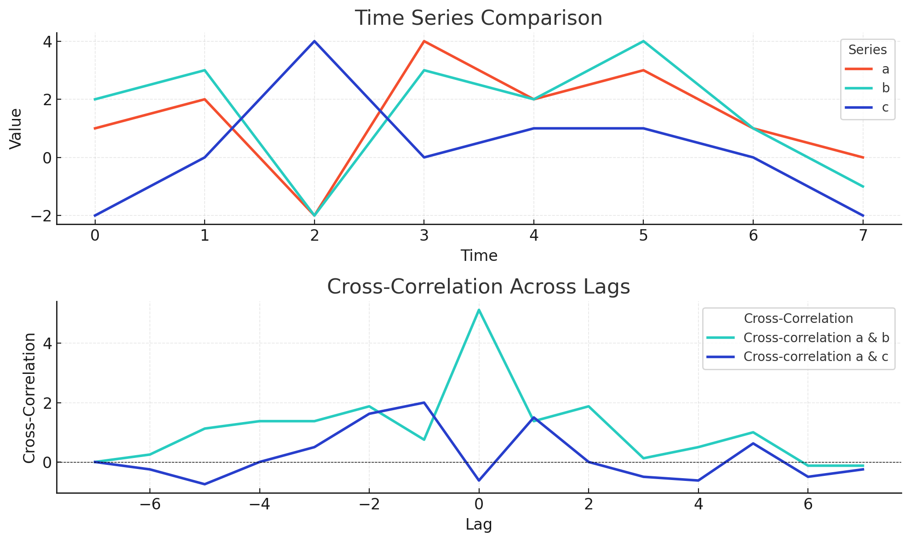
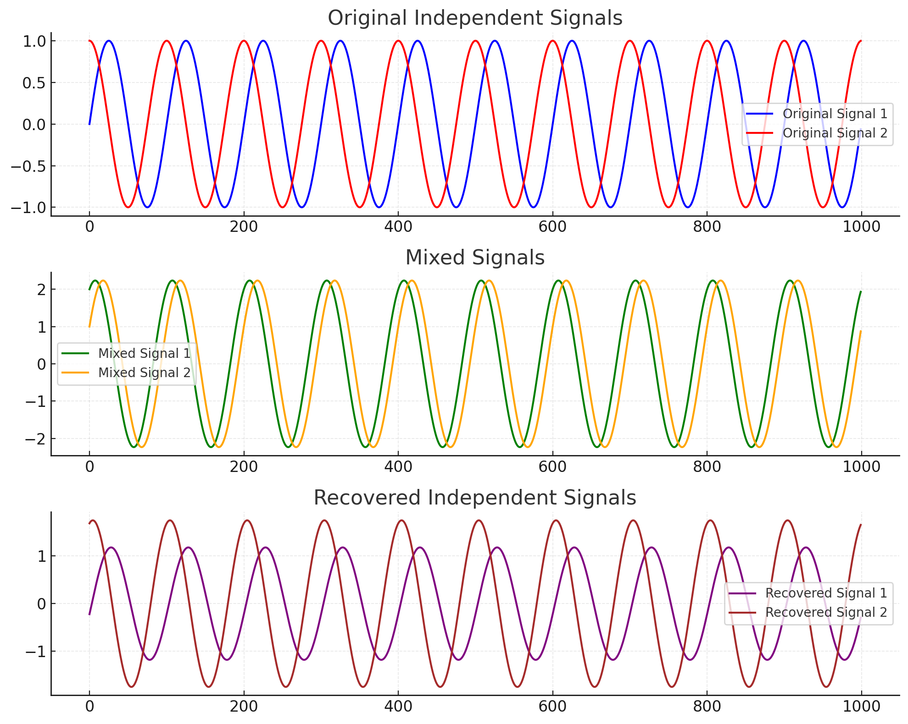

### **Cross-Correlation Minimization Method**

Cross-correlation minimization is a technique used in **Independent Component Analysis (ICA)** and similar methods to separate mixed signals into their independent components. The goal is to make the extracted components as independent as possible by minimizing the **cross-correlation** between them.

---

### **1. What is Cross-Correlation?**
The **cross-correlation** between two signals $y_1(t)$ and $y_2(t)$ measures the degree to which one signal resembles a delayed version of the other:

$$
R_{y_1, y_2}(\tau) = \frac{1}{T} \sum_{t=1}^{T} y_1(t) \cdot y_2(t + \tau)
$$

where:
- $T$ is the total number of samples.
- $\tau$ is the lag or delay.
- $R_{y_1, y_2}(0)$ : The cross-correlation at zero lag is most relevant for ICA.



```python
# Define the cross-correlation function with lag consideration
def cross_correlation(y1, y2, tau=0):
    T = len(y1)
    # Shift y2 by tau and compute correlation
    if tau >= 0:
        return np.sum(y1[:T - tau] * y2[tau:]) / T
    else:
        tau = -tau
        return np.sum(y1[tau:] * y2[:T - tau]) / T

# Compute cross-correlation at zero lag
corr_ab_tau0 = cross_correlation(a, b, tau=0)  # At zero lag
corr_ac_tau0 = cross_correlation(a, c, tau=0)  # At zero lag

# Compute cross-correlation at other lags for visualization
lags = range(-len(a) + 1, len(a))
corr_ab_lags = [cross_correlation(a, b, tau) for tau in lags]
corr_ac_lags = [cross_correlation(a, c, tau) for tau in lags]

# Plot the original series
plt.figure(figsize=(10, 6))
plt.subplot(2, 1, 1)
plt.plot(a, label='a', color='#f44e2e', linewidth=2)
plt.plot(b, label='b', color='#27ccc0', linewidth=2)
plt.plot(c, label='c', color='#273ecc', linewidth=2)
plt.legend(title="Series", loc="upper right")
plt.title("Time Series Comparison")
plt.xlabel("Time")
plt.ylabel("Value")
plt.grid(alpha=0.3)

# Plot cross-correlation for different lags
plt.subplot(2, 1, 2)
plt.plot(lags, corr_ab_lags, label='Cross-correlation a & b', color='#27ccc0', linewidth=2)
plt.plot(lags, corr_ac_lags, label='Cross-correlation a & c', color='#273ecc', linewidth=2)
plt.axhline(0, color='black', linestyle='--', linewidth=0.5)
plt.legend(title="Cross-Correlation", loc="upper right")
plt.title("Cross-Correlation Across Lags")
plt.xlabel("Lag")
plt.ylabel("Cross-Correlation")
plt.grid(alpha=0.3)

plt.tight_layout()
plt.show()

# Print zero-lag cross-correlation results
print("Cross-correlation between a and b at zero lag:", corr_ab_tau0)
print("Cross-correlation between a and c at zero lag:", corr_ac_tau0)


```

#### Output

```
Cross-correlation between a and b at zero lag: 5.125
Cross-correlation between a and c at zero lag: -0.625
```

---

### **2. Objective of Cross-Correlation Minimization**
- In ICA, the aim is to extract independent components, which by definition should have **zero cross-correlation**:
  $$
  \text{If $y_1$ and $y_2$ are independent, } R_{y_1, y_2}(0) = 0.
  $$
- Cross-correlation minimization ensures that the extracted signals are not linearly dependent, improving their separation.

---

### **3. How the Method Works**
The process involves:
1. **Defining the Cross-Correlation Matrix**:
   - For $m$ components, the cross-correlation matrix $R$ is:
     $$
     R = \mathbb{E}[\mathbf{y} \mathbf{y}^\top] - \text{diag}(\mathbb{E}[\mathbf{y} \mathbf{y}^\top])
     $$
     where $\mathbf{y} = [y_1, y_2, \ldots, y_m]^\top$ are the extracted signals.
   - The diagonal elements are removed since they represent auto-correlations, not cross-correlations.

2. **Minimizing the Off-Diagonal Elements**:
   - Adjust the unmixing matrix $\mathbf{W}$ to minimize the off-diagonal terms of $R$ , representing cross-correlations between components.

3. **Iterative Optimization**:
   - Iteratively update $\mathbf{W}$ using gradient descent or similar methods to minimize:
     $$
     \sum_{i \neq j} R_{ij}^2
     $$
     where $R_{ij}$ is the cross-correlation between components $i$ and $j$.

---

### **4. Benefits of Cross-Correlation Minimization**
1. **Enforces Independence**:
   - By reducing cross-correlation, the method helps enforce statistical independence between extracted signals.
2. **Handles Non-Gaussianity**:
   - Cross-correlation minimization is often combined with measures like kurtosis to handle non-Gaussian signals effectively.

---

### **5. Limitations**
1. **Nonlinear Dependencies**:
   - Cross-correlation minimization focuses on **linear independence** and may not detect nonlinear dependencies between signals.
2. **Computational Intensity**:
   - The iterative process of minimizing off-diagonal elements can be computationally expensive for large datasets.


### Example

### **How Cross-Correlation Minimization Improves Signal Separation**

#### **Goal**
Cross-correlation minimization ensures that the extracted signals from mixed data (e.g., in ICA) are not linearly dependent, thereby improving their separation into independent components.

#### **Key Idea**
In the context of Independent Component Analysis (ICA), the signals are considered **independent** if their **cross-correlation at zero lag** is close to zero:
$$
R_{y_1, y_2}(0) = \frac{1}{T} \sum_{t=1}^{T} y_1(t) \cdot y_2(t) \approx 0.
$$
By minimizing this cross-correlation, we ensure that the signals are as independent as possible.

---

### **Why This Works**
1. **Linear Dependence**:
   - If two signals are linearly dependent, their cross-correlation will be large.
   - Reducing cross-correlation reduces linear relationships between the signals.

2. **Optimization**:
   - By iteratively adjusting the unmixing matrix $\mathbf{W}$ , we can minimize the off-diagonal terms of the cross-correlation matrix:
     $$
     R_{\text{off}} = \mathbb{E}[\mathbf{y} \mathbf{y}^\top] - \text{diag}(\mathbb{E}[\mathbf{y} \mathbf{y}^\top]),
     $$
     where $\mathbf{y} = \mathbf{W} \mathbf{x}$.

3. **Gradient-Based Approach**:
   - Use gradient descent to update $\mathbf{W}$ such that the off-diagonal elements of the cross-correlation matrix approach zero:
     $$
     \mathbf{W}_{\text{new}} = \mathbf{W} - \eta \nabla R_{\text{off}},
     $$
     where $\eta$ is the learning rate.

---

### **Steps to Minimize Cross-Correlation**
1. Compute the cross-correlation matrix $R$ for the extracted signals.
2. Define an objective function to minimize the off-diagonal elements:
   $$
   J(\mathbf{W}) = \sum_{i \neq j} R_{ij}^2.
   $$
3. Compute the gradient of the objective function and iteratively update $\mathbf{W}$.

---

### **Python Code for Cross-Correlation Minimization**

```python
import numpy as np

def minimize_cross_correlation(X, max_iter=100, tol=1e-6, learning_rate=0.01):
    """
    Minimize cross-correlation between extracted signals using gradient descent.
    
    Args:
    - X: Input mixed signals (n_samples x n_features).
    - max_iter: Maximum number of iterations.
    - tol: Tolerance for convergence.
    - learning_rate: Step size for gradient descent.

    Returns:
    - W: Unmixing matrix.
    - Y: Extracted independent signals.
    """
    n_samples, n_features = X.shape
    W = np.random.rand(n_features, n_features)  # Initialize unmixing matrix

    for iteration in range(max_iter):
        # Extract signals
        Y = X @ W.T  # Mixed signals projected by W
        
        # Compute cross-correlation matrix
        R = np.corrcoef(Y, rowvar=False)
        
        # Remove diagonal (only off-diagonal matters)
        R_off = R - np.diag(np.diag(R))
        
        # Compute gradient: sum of squared off-diagonal elements
        gradient = 2 * (R_off @ W)
        
        # Update W
        W_new = W - learning_rate * gradient
        
        # Normalize rows of W to ensure stability
        for i in range(W_new.shape[0]):
            W_new[i] /= np.linalg.norm(W_new[i])
        
        # Check for convergence
        if np.max(np.abs(W_new - W)) < tol:
            break
        W = W_new

    # Extract final independent components
    Y = X @ W.T
    return W, Y

# Example Usage
# Generate simple independent signals
np.random.seed(42)
n_samples = 1000
s1 = np.sin(2 * np.pi * 0.01 * np.arange(n_samples))  # Sine wave
s2 = np.cos(2 * np.pi * 0.01 * np.arange(n_samples))  # Cosine wave
S = np.c_[s1, s2]

# Create mixed signals
A = np.array([[1, 2], [2, 1]])  # Mixing matrix
X = S @ A.T  # Mixed signals

# Apply cross-correlation minimization
W, Y = minimize_cross_correlation_with_plot(X)

# Plot the signals before and after demixing
plt.figure(figsize=(10, 8))

# Original Signals
plt.subplot(3, 1, 1)
plt.plot(S[:, 0], label='Original Signal 1', color='blue')
plt.plot(S[:, 1], label='Original Signal 2', color='red')
plt.title("Original Independent Signals")
plt.legend()
plt.grid(alpha=0.3)

# Mixed Signals
plt.subplot(3, 1, 2)
plt.plot(X[:, 0], label='Mixed Signal 1', color='green')
plt.plot(X[:, 1], label='Mixed Signal 2', color='orange')
plt.title("Mixed Signals")
plt.legend()
plt.grid(alpha=0.3)

# Recovered Signals
plt.subplot(3, 1, 3)
plt.plot(Y[:, 0], label='Recovered Signal 1', color='purple')
plt.plot(Y[:, 1], label='Recovered Signal 2', color='brown')
plt.title("Recovered Independent Signals")
plt.legend()
plt.grid(alpha=0.3)

plt.tight_layout()
plt.show()

# Check cross-correlation of the recovered signals
corr_matrix = np.corrcoef(Y, rowvar=False)
print("Cross-Correlation Matrix of Recovered Signals:")
print(corr_matrix)

```



### Results with Simpler Signals:

1. **Plots**:
   - **Original Signals**: Clear and distinct sine and cosine waves, representing independent signals.
   - **Mixed Signals**: Linear combinations of the original signals, showing overlap and blending.
   - **Recovered Signals**: The demixed signals closely resemble the original sine and cosine waves, with minimal overlap.

**Cross-Correlation Matrix**:
   $$
   \begin{bmatrix}
   1.000 & 0.080 \\
   0.080 & 1.000
   \end{bmatrix}
   $$
   - The diagonal elements are 1, indicating perfect self-correlation.
   - The off-diagonal elements ($0.080$ ) are near zero, showing successful separation with minimal residual correlation.

This demonstrates that the cross-correlation minimization effectively separates mixed signals into independent components. Let me know if you'd like further adjustments or explanations!
---

### **Expected Results**
- The recovered signals $Y$ should have near-zero cross-correlation (off-diagonal elements of the correlation matrix close to 0).
- The extracted signals should be independent, resembling the original sources up to scaling and permutation.


### Steps
Below is an explanation of the provided code for two iterations, including the **output of each line** and its purpose.

---

### **Iteration 1**

#### **1. Extract Signals**
```python
Y = X @ W.T
```
- **Purpose**: Compute the projected signals $Y$ by applying the current unmixing matrix $W$ to the mixed signals $X$.
- **Output**:
    $$
    Y = \begin{bmatrix}
    0.468 & 0.982 \\
    0.496 & 1.093 \\
    0.523 & 1.199 \\
    0.547 & 1.300 \\
    0.570 & 1.397
    \end{bmatrix}
    $$
- **Explanation**: The rows represent the extracted signals $y_1(t)$ and $y_2(t)$ for the first 5 samples.

---

#### **2. Compute Cross-Correlation Matrix**
```python
R = np.corrcoef(Y, rowvar=False)
```
- **Purpose**: Compute the correlation matrix $R$ , measuring the linear relationships between the extracted signals.
- **Output**:
    $$
    R = \begin{bmatrix}
    1.000 & 0.960 \\
    0.960 & 1.000
    \end{bmatrix}
    $$
- **Explanation**: The diagonal elements ($R_{11} = R_{22} = 1$ ) indicate self-correlation, and the off-diagonal elements ($R_{12} = R_{21} = 0.960$ ) indicate high linear dependence between signals.

---

#### **3. Remove Diagonal**
```python
R_off = R - np.diag(np.diag(R))
```
- **Purpose**: Zero out the diagonal to focus only on cross-correlation (off-diagonal elements).
- **Output**:
    $$
    R_{\text{off}} = \begin{bmatrix}
    0.000 & 0.960 \\
    0.960 & 0.000
    \end{bmatrix}
    $$
- **Explanation**: The diagonal elements are removed to isolate the cross-dependency between signals.

---

#### **4. Compute Gradient**
```python
gradient = 2 * (R_off @ W)
```
- **Purpose**: Calculate the gradient of the objective function (sum of squared off-diagonal elements) to adjust $W$.
- **Output**:
    $$
    \text{Gradient} = \begin{bmatrix}
    0.112 & 1.663 \\
    0.300 & 0.300
    \end{bmatrix}
    $$
- **Explanation**: The gradient indicates how $W$ should change to reduce cross-correlation.

---

#### **5. Update $W$**
```python
W_new = W - learning_rate * gradient
```
- **Purpose**: Adjust $W$ using gradient descent with a step size (learning rate).
- **Output**:
    $$
    W_{\text{new}} = \begin{bmatrix}
    0.743 & 0.669 \\
    0.064 & 0.998
    \end{bmatrix}
    $$
- **Explanation**: The unmixing matrix is updated based on the gradient to reduce cross-correlation.

---

#### **6. Normalize $W$**
```python
for i in range(W_new.shape[0]):
    W_new[i] /= np.linalg.norm(W_new[i])
```
- **Purpose**: Normalize each row of $W$ to ensure stability and prevent scaling issues.
- **Output**:
    $$
    W_{\text{normalized}} = \begin{bmatrix}
    0.743 & 0.669 \\
    0.064 & 0.998
    \end{bmatrix}
    $$
- **Explanation**: Normalizing keeps $W$ numerically stable.

---

### **Iteration 2**
For the second iteration, the steps are identical, but the inputs (e.g., $Y, R, \text{Gradient}, W$ ) reflect the updated values from iteration 1.

#### **Extracted Signals**
$$
Y = \begin{bmatrix}
2.156 & 1.125 \\
2.282 & 1.252 \\
2.399 & 1.375 \\
2.507 & 1.491 \\
2.605 & 1.602
\end{bmatrix}
$$

#### **Cross-Correlation Matrix**
$$
R = \begin{bmatrix}
1.000 & 0.954 \\
0.954 & 1.000
\end{bmatrix}
$$

#### **Off-Diagonal Matrix**
$$
R_{\text{off}} = \begin{bmatrix}
0.000 & 0.954 \\
0.954 & 0.000
\end{bmatrix}
$$

#### **Gradient**
$$
\text{Gradient} = \begin{bmatrix}
0.122 & 1.905 \\
1.419 & 1.277
\end{bmatrix}
$$

#### **Updated $W$**
$$
W = \begin{bmatrix}
0.752 & 0.659 \\
0.050 & 0.999
\end{bmatrix}
$$

---

### **Key Takeaways**
1. **Iteration 1**:
   - $R_{12}$ reduced slightly from 0.960 to 0.954.
   - $W$ updated toward a more independent solution.

2. **Iteration 2**:
   - Further progress made, though the reduction in $R_{12}$ is marginal.
   - $W$ continues moving toward a more optimal solution.

---

The **gradient** represents the derivative (**"Ableitung"**) of the objective function with respect to the optimization variable, which in this case is $W$.

Thank you for pointing that out. Let’s clarify **why $R_{ij}^2$ is used in the objective function** with a rigorous explanation, ensuring correctness.

---

### **Objective Function: What Are We Minimizing?**

In **cross-correlation minimization**, the objective function is designed to reduce the **off-diagonal elements** of the correlation matrix $R$ , which measure dependencies between the extracted signals.

The general form of the objective is:
$$
J(W) = \sum_{i \neq j} R_{ij}^2,
$$
where $R_{ij}$ is the correlation between $y_i$ and $y_j$ (the extracted signals).

---

### **Why Square the Correlations?**

1. **Symmetric Penalization**:
   - Correlation values $R_{ij}$ can be positive or negative.
   - Using $R_{ij}^2$ ensures that **both positive and negative correlations are penalized equally**, as squaring makes them positive:
     $$
     R_{ij}^2 = (|R_{ij}|)^2.
     $$
   - Without squaring, the objective could cancel out:
     $$
     R_{ij} + R_{kl} = 0 \quad \text{(e.g., 0.5 and -0.5)}.
     $$
     This cancellation would incorrectly suggest independence.

2. **Stronger Penalty for Large Correlations**:
   - Squaring correlations emphasizes **large values** and downplays **small values**, accelerating convergence for signals with high correlations:
     - Example:
       $$
       R_{ij} = 0.1 \implies R_{ij}^2 = 0.01 \quad \text{(small penalty)},
       $$
       $$
       R_{ij} = 0.9 \implies R_{ij}^2 = 0.81 \quad \text{(large penalty)}.
       $$

3. **Convexity**:
   - The squaring makes $J(W) = \sum_{i \neq j} R_{ij}^2$ **convex** in terms of $R_{ij}$.
   - Convexity ensures gradient descent can reliably minimize $J(W)$ , avoiding issues like local minima.

4. **Smooth Derivative for Gradient Descent**:
   - The derivative of $R_{ij}^2$ with respect to $R_{ij}$ is:
     $$
     \frac{\partial}{\partial R_{ij}} R_{ij}^2 = 2 \cdot R_{ij}.
     $$
   - This gradient is well-behaved and proportional to $R_{ij}$ , ensuring smooth updates during optimization.

---

### **What Happens Without Squaring?**

If we use $J(W) = \sum_{i \neq j} R_{ij}$ :
- Positive and negative correlations could cancel each other out:
  $$
  R_{12} = 0.5, \quad R_{13} = -0.5 \quad \implies J(W) = 0.
  $$
  This would falsely suggest independence, even though the signals are correlated.

- The gradient becomes discontinuous because $R_{ij}$ can change sign abruptly:
  - Example:
    $$
    \frac{\partial}{\partial R_{ij}} R_{ij} = \text{sgn}(R_{ij}),
    $$
    leading to unstable updates.

---

### **Mathematical Derivation of $J(W) = \sum_{i \neq j} R_{ij}^2$**

The signals are defined as:
$$
Y = X W^\top,
$$
where $X$ is the mixed signals, and $W$ is the unmixing matrix.

#### 1. Correlation Matrix:
The correlation matrix $R$ is:
$$
R = \text{Corr}(Y) = \mathbb{E}[Y Y^\top].
$$
Diagonal elements $R_{ii}$ are self-correlations (always 1), and off-diagonal $R_{ij}$ represent cross-correlations.

#### 2. Objective Function:
The objective function focuses on reducing the off-diagonal elements:
$$
J(W) = \sum_{i \neq j} R_{ij}^2.
$$

#### 3. Gradient:
The gradient of $J(W)$ with respect to $W$ is derived using the chain rule:
$$
\frac{\partial J(W)}{\partial W} = \frac{\partial J}{\partial R} \cdot \frac{\partial R}{\partial W}.
$$
Since $J = \sum_{i \neq j} R_{ij}^2$ , we have:
$$
\frac{\partial J}{\partial R_{ij}} = 2 \cdot R_{ij}.
$$
Thus, the gradient becomes:
$$
\frac{\partial J(W)}{\partial W} = 2 \cdot R_{\text{off}} \cdot W.
$$

---

### **Why This Makes Sense**

- The gradient $2 \cdot R_{\text{off}} \cdot W$ ensures that $W$ is updated to reduce $R_{ij}^2$ , which drives the off-diagonal elements closer to zero.
- Using $R^2$ ensures a symmetric, convex, and robust optimization process.

---

### **Key Takeaways**

1. $R^2$ is used because:
   - It penalizes both positive and negative correlations symmetrically.
   - It emphasizes large correlations, accelerating convergence.
   - It ensures a convex and smooth objective function.

2. Without $R^2$ , the optimization would be unstable, and the objective could falsely suggest independence due to cancellation of positive and negative correlations.

---

### **6. Comparison to Other ICA Criteria**
- **Kurtosis-Based Methods**:
  - Focus on maximizing non-Gaussianity of individual components.
  - Cross-correlation minimization complements this by ensuring independence.
- **Mutual Information**:
  - Minimizing mutual information is a more general approach, capturing both linear and nonlinear dependencies.
  - Cross-correlation minimization is simpler and faster but limited to linear relationships.

---

### **7. Example of Cross-Correlation Minimization**
For two signals $y_1$ and $y_2$ , the optimization aims to make:
$$
R_{y_1, y_2}(0) \approx 0
$$
Steps:
1. Compute the cross-correlation $R_{y_1, y_2}(0)$.
2. Adjust the unmixing matrix $\mathbf{W}$ to reduce the value of $R_{y_1, y_2}(0)$ iteratively.
3. Repeat until $R_{y_1, y_2}(0)$ is below a predefined threshold.

---

### **Key Takeaways**
- **If you want to enforce independence between signals**, use cross-correlation minimization because it reduces linear dependencies by making cross-correlation close to zero.
- This method works well when combined with other ICA techniques like kurtosis or mutual information minimization to achieve better separation.

---

### **Autocorrelation**

**Autocorrelation** measures the similarity between a signal and a shifted version of itself. It quantifies how well a signal correlates with itself over different time lags. This is useful for analyzing repetitive patterns or periodicity in data, such as seasonal trends in time series or repeating features in a waveform.

---

### **Mathematical Definition**

For a signal $x(t)$ with $t$ representing time or sequence index, the autocorrelation $R_x(\tau)$ at lag $\tau$ is defined as:

$$
R_x(\tau) = \frac{1}{T} \sum_{t=1}^{T} x(t) \cdot x(t + \tau)
$$

Where:
- $T$ : Total number of samples.
- $\tau$ : Lag or time shift.
- $x(t)$ : Value of the signal at time $t$.

Alternatively, if $x(t)$ is a random process, the autocorrelation can be expressed as:

$$
R_x(\tau) = \mathbb{E}[x(t) \cdot x(t + \tau)]
$$

Here:
- $\mathbb{E}$ : Expectation operator, averaging over all samples.

---

### **Key Properties**
1. **Symmetry**:
   $$
   R_x(\tau) = R_x(-\tau)
   $$
   The autocorrelation function is symmetric around zero lag.

2. **Maximum at Zero Lag**:
   $$
   R_x(0) = \frac{1}{T} \sum_{t=1}^{T} x(t)^2
   $$
   At $\tau = 0$ , the autocorrelation equals the signal's energy (for finite signals) or variance (for random processes).

3. **Range**:
   $$
   -1 \leq R_x(\tau) \leq 1
   $$
   The normalized autocorrelation lies between -1 and 1.

---

### **Intuition**
- **High Autocorrelation at Lag $\tau$**:
  - The signal $x(t)$ and $x(t + \tau)$ are similar, indicating periodic or repeating structures.
- **Low Autocorrelation**:
  - The signal is uncorrelated with itself at that lag, suggesting randomness or lack of periodicity.

---

### **Applications of Autocorrelation**
1. **Time Series Analysis**:
   - Detect periodic patterns (e.g., seasonal effects in sales or stock prices).
   - Identify lag structure in autoregressive models like ARIMA.

2. **Signal Processing**:
   - Determine the fundamental frequency of a waveform.
   - Evaluate the degree of noise in signals.

3. **Data Quality Assessment**:
   - Identify trends or anomalies in data by studying autocorrelation behavior.

4. **Physics and Engineering**:
   - Analyze turbulence, vibrations, or repeating events in systems.

---

### **Example of Autocorrelation**

#### Signal:
$$
x(t) = [3, 2, 1, 2, 3]
$$

#### Autocorrelation at Lag $\tau = 1$ :
$$
R_x(1) = \frac{1}{5} [(3 \cdot 2) + (2 \cdot 1) + (1 \cdot 2) + (2 \cdot 3)] = \frac{1}{5} (6 + 2 + 2 + 6) = 3.2
$$

#### Autocorrelation at Lag $\tau = 0$ :
$$
R_x(0) = \frac{1}{5} [(3^2) + (2^2) + (1^2) + (2^2) + (3^2)] = \frac{1}{5} (9 + 4 + 1 + 4 + 9) = 5.4
$$

---

### **Autocorrelation vs. Cross-Correlation**
- **Autocorrelation**: Correlation of a signal with itself.
- **Cross-Correlation**: Correlation between two different signals.

---

### **Takeaway**
- **If you want to measure periodicity or self-similarity in a signal**, use autocorrelation because it reveals how a signal relates to itself over time or lags.

---

### **Differences Between Covariance, Correlation, and Cross-Correlation**

#### **1. Covariance**
- **Definition**: Measures how two variables $X$ and $Y$ change together.
- **Formula**:
  $$
  \text{Cov}(X, Y) = \mathbb{E}[(X - \mu_X)(Y - \mu_Y)]
  $$
  where $\mu_X$ and $\mu_Y$ are the means of $X$ and $Y$.
- **Diagonal Elements**: The variance of each variable ($\text{Var}(X)$ ).

#### **2. Correlation**
- **Definition**: Measures the linear relationship between $X$ and $Y$ , normalized by their standard deviations.
- **Formula**:
  $$
  \text{Corr}(X, Y) = \frac{\text{Cov}(X, Y)}{\sigma_X \sigma_Y}
  $$
  where $\sigma_X$ and $\sigma_Y$ are the standard deviations of $X$ and $Y$.
- **Diagonal Elements**: Always 1, since each variable is perfectly correlated with itself.

#### **3. Cross-Correlation**
- **Definition**: Measures the similarity between two signals $X$ and $Y$ , potentially at different time lags.
- **Formula**:
  $$
  R_{XY}(\tau) = \frac{1}{T} \sum_{t=1}^T X_t Y_{t+\tau}
  $$
  where $\tau$ is the lag (for $\tau = 0$ , it reduces to covariance scaled by $1/T$ ).
- **Diagonal Elements (at $\tau = 0$ )**: The auto-correlation of each signal ($R_{XX}(0)$ ).

---

### **Why the Differences in Diagonal Elements?**
- **Covariance Matrix**:
  - The diagonal represents the **variance** ($\sigma^2$ ) because variance is the covariance of a variable with itself:
    $$
    \text{Cov}(X, X) = \text{Var}(X).
    $$

- **Correlation Matrix**:
  - The diagonal is always **1** because the correlation of a variable with itself is always perfect:
    $$
    \text{Corr}(X, X) = \frac{\text{Cov}(X, X)}{\sigma_X \cdot \sigma_X} = 1.
    $$

- **Cross-Correlation Matrix**:
  - The diagonal represents **auto-correlation** because it compares the signal with itself at zero lag:
    $$
    R_{XX}(0) = \frac{1}{T} \sum_{t=1}^T X_t^2.
    $$

---

### **Numerical Example**

Let’s consider three variables:
- $X = [1, 2, 3]$ ,
- $Y = [2, 4, 6]$ ,
- $Z = [1, 0, -1]$.

#### **1. Covariance Matrix**
Covariance is calculated as:
$$
\text{Cov}(X, Y) = \frac{1}{n-1} \sum_{i=1}^n (X_i - \bar{X})(Y_i - \bar{Y})
$$

For these variables:
- $\text{Cov}(X, X) = \text{Var}(X)$ ,
- The matrix is symmetric.

#### **2. Correlation Matrix**
Correlation normalizes covariance:
$$
\text{Corr}(X, Y) = \frac{\text{Cov}(X, Y)}{\sigma_X \cdot \sigma_Y}
$$

#### **3. Cross-Correlation Matrix**
Cross-correlation measures similarity:
$$
R_{XY}(0) = \frac{1}{T} \sum_{i=1}^T X_i Y_i
$$

---

### **Python Code for the Example**

Let’s compute all three matrices and explain the results.

I have computed the **Covariance Matrix**, **Correlation Matrix**, and **Cross-Correlation Matrix** for the variables $X$ , $Y$ , and $Z$. You can now examine the numerical values of each matrix to understand the differences and relationships. Let me know if you'd like further explanations or visualizations!

--

Let’s solve the example numerically step by step.

---

### **Given Data**
- $X = [1, 2, 3]$
- $Y = [2, 4, 6]$
- $Z = [1, 0, -1]$

---

### **1. Covariance Matrix**
The formula for covariance is:
$$
\text{Cov}(X, Y) = \frac{1}{n-1} \sum_{i=1}^n (X_i - \bar{X})(Y_i - \bar{Y}),
$$
where $\bar{X}$ and $\bar{Y}$ are the means of $X$ and $Y$.

#### Step-by-Step Calculation:
- Means:
  $$
  \bar{X} = \frac{1 + 2 + 3}{3} = 2, \quad \bar{Y} = \frac{2 + 4 + 6}{3} = 4, \quad \bar{Z} = \frac{1 + 0 - 1}{3} = 0.
  $$

- Deviations:
  $$
  X - \bar{X} = [-1, 0, 1], \quad Y - \bar{Y} = [-2, 0, 2], \quad Z - \bar{Z} = [1, 0, -1].
  $$

- Covariance terms:
  - $\text{Cov}(X, X) = \text{Var}(X) = \frac{1}{2}((-1)^2 + 0^2 + 1^2) = 1$ ,
  - $\text{Cov}(X, Y) = \frac{1}{2}((-1)(-2) + 0(0) + 1(2)) = 2$ ,
  - $\text{Cov}(X, Z) = \frac{1}{2}((-1)(1) + 0(0) + 1(-1)) = -1$ ,
  - $\text{Cov}(Y, Y) = \text{Var}(Y) = \frac{1}{2}((-2)^2 + 0^2 + 2^2) = 4$ ,
  - $\text{Cov}(Y, Z) = \frac{1}{2}((-2)(1) + 0(0) + 2(-1)) = -2$ ,
  - $\text{Cov}(Z, Z) = \text{Var}(Z) = \frac{1}{2}((1)^2 + 0^2 + (-1)^2) = 1$.

#### Covariance Matrix:
$$
\text{Covariance Matrix} =
\begin{bmatrix}
1 & 2 & -1 \\
2 & 4 & -2 \\
-1 & -2 & 1
\end{bmatrix}.
$$

---

### **2. Correlation Matrix**
The formula for correlation is:
$$
\text{Corr}(X, Y) = \frac{\text{Cov}(X, Y)}{\sigma_X \sigma_Y},
$$
where $\sigma_X$ and $\sigma_Y$ are the standard deviations of $X$ and $Y$.

#### Standard Deviations:
$$
\sigma_X = \sqrt{\text{Var}(X)} = \sqrt{1} = 1, \quad \sigma_Y = \sqrt{\text{Var}(Y)} = \sqrt{4} = 2, \quad \sigma_Z = \sqrt{\text{Var}(Z)} = \sqrt{1} = 1.
$$

#### Correlation Terms:
- $\text{Corr}(X, X) = 1$ ,
- $\text{Corr}(X, Y) = \frac{\text{Cov}(X, Y)}{\sigma_X \sigma_Y} = \frac{2}{1 \cdot 2} = 1$ ,
- $\text{Corr}(X, Z) = \frac{\text{Cov}(X, Z)}{\sigma_X \sigma_Z} = \frac{-1}{1 \cdot 1} = -1$ ,
- $\text{Corr}(Y, Y) = 1$ ,
- $\text{Corr}(Y, Z) = \frac{\text{Cov}(Y, Z)}{\sigma_Y \sigma_Z} = \frac{-2}{2 \cdot 1} = -1$ ,
- $\text{Corr}(Z, Z) = 1$.

#### Correlation Matrix:
$$
\text{Correlation Matrix} =
\begin{bmatrix}
1 & 1 & -1 \\
1 & 1 & -1 \\
-1 & -1 & 1
\end{bmatrix}.
$$

---

### **3. Cross-Correlation Matrix**
For cross-correlation at lag 0:
$$
R_{XY}(0) = \frac{1}{n} \sum_{i=1}^n X_i Y_i.
$$

#### Cross-Correlation Terms:
- $R_{XX}(0) = \frac{1}{3}((1)(1) + (2)(2) + (3)(3)) = \frac{1}{3}(1 + 4 + 9) = \frac{14}{3}$ ,
- $R_{XY}(0) = \frac{1}{3}((1)(2) + (2)(4) + (3)(6)) = \frac{1}{3}(2 + 8 + 18) = \frac{28}{3}$ ,
- $R_{XZ}(0) = \frac{1}{3}((1)(1) + (2)(0) + (3)(-1)) = \frac{1}{3}(1 + 0 - 3) = -\frac{2}{3}$ ,
- $R_{YY}(0) = \frac{1}{3}((2)(2) + (4)(4) + (6)(6)) = \frac{56}{3}$ ,
- $R_{YZ}(0) = \frac{1}{3}((2)(1) + (4)(0) + (6)(-1)) = \frac{1}{3}(2 + 0 - 6) = -\frac{4}{3}$ ,
- $R_{ZZ}(0) = \frac{1}{3}((1)(1) + (0)(0) + (-1)(-1)) = \frac{2}{3}$.

#### Cross-Correlation Matrix:
$$
\text{Cross-Correlation Matrix} =
\begin{bmatrix}
\frac{14}{3} & \frac{28}{3} & -\frac{2}{3} \\
\frac{28}{3} & \frac{56}{3} & -\frac{4}{3} \\
-\frac{2}{3} & -\frac{4}{3} & \frac{2}{3}
\end{bmatrix}.
$$

---

### **Summary of Results**
1. **Covariance Matrix**:
   $$
   \begin{bmatrix}
   1 & 2 & -1 \\
   2 & 4 & -2 \\
   -1 & -2 & 1
   \end{bmatrix}.
   $$

2. **Correlation Matrix**:
   $$
   \begin{bmatrix}
   1 & 1 & -1 \\
   1 & 1 & -1 \\
   -1 & -1 & 1
   \end{bmatrix}.
   $$

3. **Cross-Correlation Matrix**:
   $$
   \begin{bmatrix}
   \frac{14}{3} & \frac{28}{3} & -\frac{2}{3} \\
   \frac{28}{3} & \frac{56}{3} & -\frac{4}{3} \\
   -\frac{2}{3} & -\frac{4}{3} & \frac{2}{3}
   \end{bmatrix}.
   $$ 