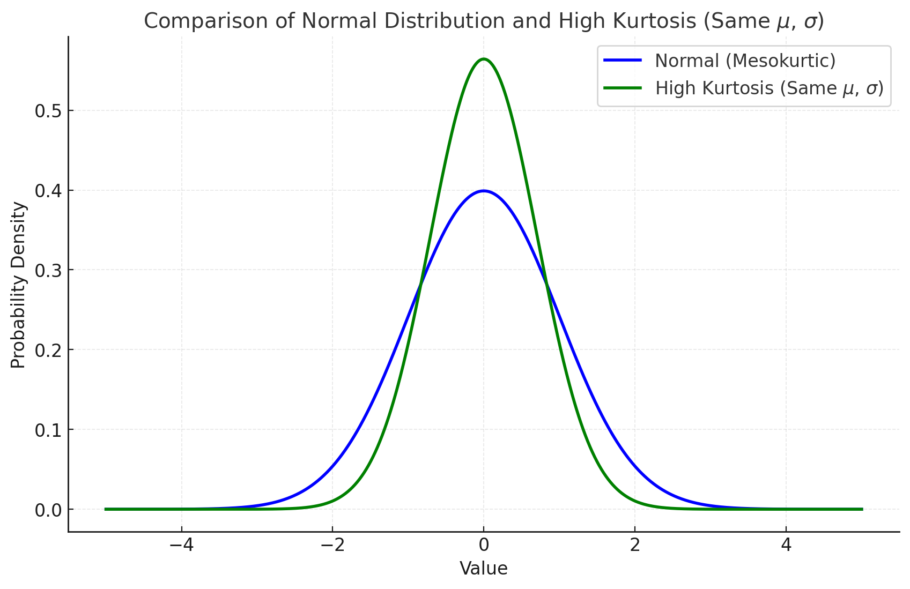
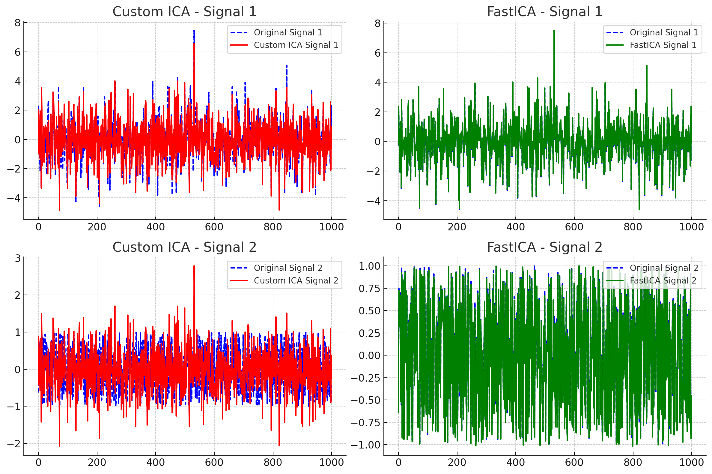

### **Kurtosis and Higher-Order Moments**

#### **What Are Moments in Statistics?**
Moments are quantitative measures that describe the shape, spread, and other characteristics of a probability distribution. The $k$ -th moment of a random variable $X$ is defined as:

$$
\mu_k = \mathbb{E}\left[(X - \mu)^k\right]
$$

where:
- $\mathbb{E}$ is the expectation operator,
- $\mu$ is the mean of the distribution,
- $k$ is the order of the moment.

The first four moments are commonly used in statistical analysis:
1. **First Moment**: Mean (location of the distribution),
2. **Second Moment**: Variance (spread of the distribution),
3. **Third Moment**: Skewness (asymmetry of the distribution),
4. **Fourth Moment**: Kurtosis (tailedness or peakiness of the distribution).

---

### **Kurtosis**

#### **Definition**
Kurtosis is the fourth standardized moment of a distribution. It measures the "tailedness" of a distribution—how heavily the tails differ from the normal distribution.

The formula for kurtosis is:

$$
\text{Kurtosis} = \frac{\mathbb{E}\left[(X - \mu)^4\right]}{\sigma^4}
$$

where:
- $\mathbb{E}[(X - \mu)^4]$ : The fourth moment about the mean,
- $\sigma^4$ : The square of the variance ($\sigma^2$ ) raised to the second power, for normalization.

#### **Types of Kurtosis**
1. **Mesokurtic (Normal Distribution)**:
   - Kurtosis = 3 (excess kurtosis = 0).
   - Tails are of average size; peak is moderate.

2. **Leptokurtic (High Kurtosis)**:
   - Kurtosis > 3 (excess kurtosis > 0).
   - Tails are heavy; distribution has a sharper peak.

3. **Platykurtic (Low Kurtosis)**:
   - Kurtosis < 3 (excess kurtosis < 0).
   - Tails are light; distribution is flatter.

#### **Intuition**
- **Tails**: High kurtosis indicates more extreme outliers because of heavier tails.
- **Peak**: High kurtosis often corresponds to a sharper peak compared to the normal distribution.
- **Applications**: 
  - Used in financial risk analysis to evaluate the likelihood of extreme market movements.
  - Identifies distributions prone to outliers.

---

### **Higher-Order Moments**

#### **Definition**
Higher-order moments describe finer aspects of a distribution's shape, beyond location (mean) and spread (variance). These include skewness (third moment) and kurtosis (fourth moment), and extend to moments of order 5, 6, etc.

The general formula for the $k$ -th moment is:

$$
\mu_k = \mathbb{E}\left[(X - \mu)^k\right]
$$

#### **Why Use Higher-Order Moments?**
1. **Detailed Shape Description**: They provide increasingly finer details about the shape of a distribution.
2. **Statistical Independence**: Moments beyond the second can help measure independence in multivariate settings.
3. **Signal Processing**: Higher-order moments are used for detecting non-Gaussianity in signals.

---

### **Third Moment: Skewness**

#### **Definition**
Skewness measures the asymmetry of a distribution. Its formula is:

$$
\text{Skewness} = \frac{\mathbb{E}\left[(X - \mu)^3\right]}{\sigma^3}
$$

- **Positive Skewness**: Right tail is longer; peak is shifted to the left.
- **Negative Skewness**: Left tail is longer; peak is shifted to the right.
- **Zero Skewness**: Symmetric distribution (e.g., normal distribution).

#### **Interpretation**
- Positive skewness implies potential extreme high values.
- Negative skewness implies potential extreme low values.

---

### **Fourth Moment: Kurtosis**

Discussed earlier.

---

### **Fifth and Higher Moments**

#### **Fifth Moment**
The fifth moment captures finer asymmetry beyond skewness. It becomes important in contexts where subtle deviations in asymmetry are critical, such as anomaly detection.

#### **Sixth Moment**
The sixth moment emphasizes deviations in "peakedness" or flatness beyond kurtosis. It captures ultra-high outlier sensitivity.

#### **Applications**
1. **Signal Processing**:
   - Higher-order moments are used in blind source separation techniques like Independent Component Analysis (ICA).
   - Non-Gaussianity detection: Kurtosis (4th moment) is often used as a criterion for signal independence.
2. **Physics and Engineering**:
   - Higher-order moments describe phenomena like turbulence in fluid dynamics.
3. **Finance**:
   - Modeling extreme market events (higher-order moments predict tail risks better than standard deviation alone).
4. **Machine Learning**:
   - Feature selection and dimensionality reduction in non-Gaussian data.

---

### **Example of Kurtosis and Higher-Order Moments**

Consider a dataset: $X = [1, 2, 2, 3, 4, 10]$.

#### **Step 1: Calculate Mean ($\mu$ )**
$$
\mu = \frac{1 + 2 + 2 + 3 + 4 + 10}{6} = 3.67
$$

#### **Step 2: Calculate Variance ($\sigma^2$ )**
$$
\sigma^2 = \frac{\sum (X_i - \mu)^2}{n} = \frac{(1-3.67)^2 + (2-3.67)^2 + \dots}{6} = 9.22
$$

#### **Step 3: Calculate Skewness (3rd Moment)**
$$
\text{Skewness} = \frac{\frac{\sum (X_i - \mu)^3}{n}}{\sigma^3}
$$

$$
\text{Skewness} = \frac{-2.67^3 + (-1.67)^3 + \dots}{(9.22^{3/2})} \approx 0.94
$$

#### **Step 4: Calculate Kurtosis (4th Moment)**
$$
\text{Kurtosis} = \frac{\frac{\sum (X_i - \mu)^4}{n}}{\sigma^4}
$$

$$
\text{Kurtosis} = \frac{-2.67^4 + (-1.67)^4 + \dots}{(9.22^2)} \approx 3.5
$$

- **Interpretation**:
  - Skewness of 0.94 indicates moderate right-skewness.
  - Kurtosis of 3.5 indicates slightly heavier tails than the normal distribution.

---

### **Key Takeaways**
- **Kurtosis** describes the tailedness and peakedness of a distribution, offering insight into extreme events and outliers.
- **Higher-Order Moments** provide increasingly granular details about a distribution's shape, becoming essential in specialized applications like finance, signal processing, and physics.



1. **Normal Distribution (Mesokurtic)**: A standard normal distribution with mean ($\mu = 0$ ) and standard deviation ($\sigma = 1$ ).
2. **High Kurtosis Distribution**: A sharper peak distribution adjusted to have the same mean ($\mu = 0$ ) and standard deviation ($\sigma = 1$ ).

This demonstrates how kurtosis affects the shape of a distribution while keeping the central tendency and spread constant. The high-kurtosis curve has a narrower, sharper peak and lighter tails compared to the normal distribution.


### The Python code for the plot:

```python
import numpy as np
import matplotlib.pyplot as plt
import scipy.stats as stats

# Generate x values
x = np.linspace(-5, 5, 1000)

# Define distributions
normal_pdf = stats.norm.pdf(x, loc=0, scale=1)  # Standard normal distribution
kurtosis_pdf_same_sigma_mu = stats.norm.pdf(x, loc=0, scale=1/np.sqrt(2))  # Adjusted for same variance

# Plot the distributions
plt.figure(figsize=(10, 6))
plt.plot(x, normal_pdf, label="Normal (Mesokurtic)", color="blue", linewidth=2)
plt.plot(x, kurtosis_pdf_same_sigma_mu, label="High Kurtosis (Same $\mu$ , $\sigma$ )", color="green", linewidth=2)

# Highlight the key moments in the title or legend
plt.title("Comparison of Normal Distribution and High Kurtosis (Same $\mu$ , $\sigma$ )", fontsize=14)
plt.xlabel("Value", fontsize=12)
plt.ylabel("Probability Density", fontsize=12)
plt.legend(fontsize=12)
plt.grid(alpha=0.3)

# Display the plot
plt.show()
``` 

### How **Kurtosis** and **Higher-Order Moments** Measure Dependence or Independence

Kurtosis and higher-order moments are used to detect **non-Gaussianity**, which is a key indicator of dependence or independence in many applications. Here’s how they work conceptually and mathematically:

---

### **1. Kurtosis and Dependence**
- **Kurtosis measures the tailedness of a distribution**, which reflects whether the data deviates from normality. This deviation is often caused by dependencies among variables.
- In **Independent Component Analysis (ICA)** and similar methods, kurtosis is used to:
  - Detect independence: If a signal's distribution resembles a Gaussian (kurtosis close to 3), it is often a mixture of dependent components.
  - Measure non-Gaussianity: Higher kurtosis or lower kurtosis compared to a Gaussian distribution indicates non-independence, as independent components tend to deviate from Gaussianity.

#### Example in Signal Processing:
- Mixtures of signals (dependent) tend to be more Gaussian due to the **Central Limit Theorem**.
- By maximizing or minimizing kurtosis, ICA separates dependent signals into independent components.

---

### **2. Higher-Order Moments and Dependence**
Higher-order moments (3rd, 4th, and beyond) measure aspects of a distribution that directly or indirectly relate to dependence:
1. **Skewness (3rd Moment)**:
   - Measures asymmetry in the data.
   - If two variables $X$ and $Y$ are independent, their combined skewness is additive:
     $$
     \text{Skew}(X + Y) = \text{Skew}(X) + \text{Skew}(Y)
     $$
   - Any deviation from additivity indicates dependence between $X$ and $Y$.

2. **Higher-Order Covariances**:
   - Moments like $\mathbb{E}[X^p Y^q]$ (e.g., $p = 3, q = 2$ ) measure nonlinear dependencies.
   - If $X$ and $Y$ are independent:
     $$
     \mathbb{E}[X^p Y^q] = \mathbb{E}[X^p] \cdot \mathbb{E}[Y^q]
     $$
   - Deviations from this equality signal dependence.

3. **Cumulants**:
   - Cumulants are derived from moments and represent features of a distribution.
   - Cross-cumulants (e.g., $\text{cum}(X, Y)$ ) measure joint dependence between variables. For independent variables, cross-cumulants are zero:
     $$
     \text{cum}(X, Y) = 0 \quad \text{if $X$ and $Y$ are independent.}
     $$

---

### **3. Kurtosis and Higher-Order Moments in Independence Testing**
- **Multivariate Dependence**:
  - In a multivariate setting, independence implies that all joint moments between variables are factorizable. Higher-order moments can detect subtle dependencies.
- **Application in ICA**:
  - ICA uses kurtosis to identify and separate signals:
    - If a signal has high kurtosis, it is less Gaussian and likely represents an independent component.
    - The optimization objective in ICA maximizes the absolute value of kurtosis to extract independent signals.

---

### **4. Visualization of Dependence with Moments**
1. **Kurtosis**:
   - High kurtosis in a multivariate context often indicates latent dependencies (e.g., outliers in joint distributions caused by relationships between variables).
2. **Higher Moments**:
   - Asymmetry (skewness) in joint distributions hints at nonlinear dependencies.
   - Large higher-order cross-moments indicate complex relationships that simple covariance cannot capture.

---

### **5. Example: Using Moments to Detect Independence**
Suppose $X$ and $Y$ are two random variables.

#### Case 1: Independent $X$ and $Y$
- Moments:
  $$
  \mathbb{E}[X^2 Y^2] = \mathbb{E}[X^2] \cdot \mathbb{E}[Y^2]
  $$
- Kurtosis of $X + Y$ :
  - Should reflect additive independence.

#### Case 2: Dependent $X$ and $Y$
- Moments:
  $$
  \mathbb{E}[X^2 Y^2] \neq \mathbb{E}[X^2] \cdot \mathbb{E}[Y^2]
  $$
- Kurtosis of $X + Y$ :
  - May show heavy tails due to nonlinear relationships.

---

### **6. Applications**
1. **Signal Processing**:
   - **ICA** uses kurtosis to identify and separate independent components from mixed signals.
   - Higher-order moments detect non-Gaussianity, a marker of independence.
2. **Financial Analysis**:
   - High kurtosis in joint return distributions signals dependence between assets (e.g., during market crashes).
3. **Machine Learning**:
   - Feature independence testing: Higher-order moments assess dependencies among features for feature selection.

---

### **Key Takeaways**
- **Kurtosis** measures non-Gaussianity, which is inversely related to independence.
- **Higher-Order Moments** (3rd, 4th, etc.) capture nonlinear and subtle dependencies that simple covariance cannot detect.
- Both are critical tools for identifying and quantifying relationships in multivariate systems, especially in applications like ICA, anomaly detection, and statistical modeling.

**Independent Component Analysis (ICA)** separates mixed signals into their statistically independent components by leveraging measures of **non-Gaussianity** like **kurtosis**. Here’s how ICA uses kurtosis to maximize or minimize non-Gaussianity:

---

### **Key Idea Behind ICA**
1. **Central Limit Theorem (CLT)**:
   - The CLT states that a linear combination of independent random variables tends to become more Gaussian as the number of variables increases.
   - Therefore, observed signals, which are mixtures of independent components, tend to be **more Gaussian** than the independent components themselves.

2. **Goal of ICA**:
   - ICA aims to find a transformation that separates the mixed signals into their original independent components.
   - To achieve this, ICA maximizes the **non-Gaussianity** of the extracted components because independent components are **non-Gaussian**, while their mixtures are more Gaussian.

---

### **Why Use Kurtosis?**
- **Kurtosis** is a measure of **non-Gaussianity**:
  - For Gaussian distributions, kurtosis = 3 (or excess kurtosis = 0).
  - For sub-Gaussian distributions (e.g., uniform), kurtosis < 3.
  - For super-Gaussian distributions (e.g., Laplace, heavy-tailed), kurtosis > 3.
- **ICA leverages kurtosis** because:
  - High kurtosis (positive or negative) indicates a non-Gaussian distribution.
  - By maximizing the absolute kurtosis of extracted components, ICA ensures the components are far from Gaussian, which implies independence.

---

### **How ICA Maximizes or Minimizes Kurtosis**
The process involves finding a linear transformation $\mathbf{W}$ such that:

$$
\mathbf{S} = \mathbf{W} \mathbf{X}
$$

Where:
- $\mathbf{S}$ = extracted independent components,
- $\mathbf{X}$ = observed (mixed) signals,
- $\mathbf{W}$ = unmixing matrix.

#### 1. **Define the Optimization Problem**
To extract independent components $\mathbf{S}$ , ICA optimizes the following:
- **Maximizing kurtosis**:
  $$
  \text{Maximize } |\text{Kurt}(\mathbf{w}^\top \mathbf{X})|
  $$
  where $\mathbf{w}$ is a row vector in $\mathbf{W}$.

- For **sub-Gaussian distributions**, ICA minimizes kurtosis to separate components:
  $$
  \text{Minimize } \text{Kurt}(\mathbf{w}^\top \mathbf{X})
  $$

#### 2. **Iterative Optimization**
ICA solves this using iterative techniques:
- Start with a random guess for $\mathbf{w}$.
- Update $\mathbf{w}$ to increase the absolute kurtosis of $\mathbf{w}^\top \mathbf{X}$ (the extracted component).
- Normalize $\mathbf{w}$ to ensure unit variance of $\mathbf{w}^\top \mathbf{X}$.

---

### **Example of ICA Using Kurtosis**

#### Step 1: Observed Mixture
Suppose we have two mixed signals $\mathbf{X}$ :
$$
\mathbf{X} = \mathbf{A} \mathbf{S}
$$
Where:
- $\mathbf{S} = [s_1, s_2]^\top$ are independent sources,
- $\mathbf{A}$ is a mixing matrix,
- $\mathbf{X}$ is the observed mixture.

#### Step 2: Extracting One Component
To extract $s_1$ :
1. Start with a random weight vector $\mathbf{w}$.
2. Compute $y = \mathbf{w}^\top \mathbf{X}$ , the projection of the mixture along $\mathbf{w}$.
3. Evaluate the kurtosis of $y$ :
   $$
   \text{Kurt}(y) = \frac{\mathbb{E}[y^4]}{(\mathbb{E}[y^2])^2} - 3
   $$
4. Update $\mathbf{w}$ to maximize $|\text{Kurt}(y)|$ , making $y$ non-Gaussian.
5. Normalize $\mathbf{w}$ after each step:
   $$
   \mathbf{w} \leftarrow \frac{\mathbf{w}}{\|\mathbf{w}\|}
   $$

#### Step 3: Orthogonalization (Deflation)
Once $s_1$ is extracted:
- Subtract $s_1$ 's contribution from the data to extract $s_2$ (or other components).
- Ensure orthogonality of new components using Gram-Schmidt or similar methods.

---

### **Key Algorithms for ICA**
1. **FastICA (Using Kurtosis)**:
   - Optimizes the absolute kurtosis of extracted components.
   - Iteratively updates $\mathbf{w}$ using:
     $$
     \mathbf{w}_{\text{new}} = \mathbb{E}[\mathbf{X} g(\mathbf{w}^\top \mathbf{X})] - \mathbb{E}[g'(\mathbf{w}^\top \mathbf{X})] \mathbf{w}
     $$
     where $g(u)$ is a nonlinear function (e.g., $g(u) = u^3$ relates to kurtosis).
   - Normalizes $\mathbf{w}_{\text{new}}$ after each iteration.

2. **Gradient-Based ICA**:
   - Uses gradient ascent/descent to maximize or minimize kurtosis:
     $$
     \mathbf{w}_{\text{new}} = \mathbf{w} + \alpha \nabla \text{Kurt}(\mathbf{w}^\top \mathbf{X})
     $$

---

### **Advantages of Kurtosis-Based ICA**
- **Simple to Implement**: Kurtosis is straightforward to compute.
- **Efficient for Non-Gaussian Components**: Quickly identifies non-Gaussian independent signals.
- **Widely Applicable**: Used in signal processing, finance, neuroscience, and more.

### **Limitations**
- **Sensitive to Noise**: Kurtosis-based ICA may fail if the data is noisy or close to Gaussian.
- **Assumes Non-Gaussianity**: It relies on the assumption that independent components are non-Gaussian.

By leveraging kurtosis, ICA transforms mixed signals into independent components by finding projections that maximize or minimize non-Gaussianity, effectively exploiting the Central Limit Theorem.

### **Numerical Example of ICA Using Kurtosis**
We will demonstrate how ICA works numerically with kurtosis to separate independent components from mixed signals. This example includes:
1. The derivation of the formula $\max |\text{Kurt}(\mathbf{w}^\top \mathbf{X})|$.
2. A step-by-step numerical computation.

---

### **Derivation: Why Maximize $|\text{Kurt}(\mathbf{w}^\top \mathbf{X})|$ ?**

#### **1. Goal of ICA**
- Given observed signals $\mathbf{X}$ , the goal of ICA is to find a projection $\mathbf{w}$ such that:
  $$
  y = \mathbf{w}^\top \mathbf{X}
  $$
  maximizes **non-Gaussianity**, as independent components tend to be non-Gaussian.

#### **2. Kurtosis as a Measure of Non-Gaussianity**
- **Kurtosis Definition**:
  $$
  \text{Kurt}(y) = \frac{\mathbb{E}[y^4]}{(\mathbb{E}[y^2])^2} - 3
  $$
  - For Gaussian distributions, kurtosis = 0.
  - For super-Gaussian distributions (e.g., Laplace), kurtosis > 0.
  - For sub-Gaussian distributions (e.g., uniform), kurtosis < 0.

- ICA uses kurtosis because:
  - High absolute kurtosis ($|\text{Kurt}(y)|$ ) indicates deviation from Gaussianity, implying $y$ may be an independent component.

#### **3. Maximizing $|\text{Kurt}(y)|$**
- To extract independent components:
  $$
  \max |\text{Kurt}(y)| = \max |\text{Kurt}(\mathbf{w}^\top \mathbf{X})|
  $$
  - $\mathbf{w}$ is the projection vector that adjusts $y = \mathbf{w}^\top \mathbf{X}$.
  - The optimization seeks $\mathbf{w}$ that makes $y$ as non-Gaussian as possible.

---

### **Numerical Example**

#### **Step 1: Observed Mixtures**
Suppose we have two independent signals:
1. $s_1$ : Super-Gaussian (Laplace distribution).
2. $s_2$ : Sub-Gaussian (Uniform distribution).

The observed mixed signals $\mathbf{X}$ are linear combinations of these independent signals:
$$
\mathbf{X} = \mathbf{A} \mathbf{S}
$$
Where:
- $\mathbf{S} = \begin{bmatrix} s_1 \\ s_2 \end{bmatrix}$ ,
- $\mathbf{A} = \begin{bmatrix} 1 & 2 \\ 3 & 4 \end{bmatrix}$ (mixing matrix).

Simulated $\mathbf{S}$ :
$$
\mathbf{S} = \begin{bmatrix}
-1.5 & 0.5 & 2.5 & -0.5 \\
0.3 & -0.7 & 0.1 & -0.9
\end{bmatrix}
$$
Mixed signals $\mathbf{X}$ :
$$
\mathbf{X} = \mathbf{A} \mathbf{S} = \begin{bmatrix}
1 & -0.9 & 5.3 & -2.3 \\
2.9 & -2.3 & 11.7 & -5.5
\end{bmatrix}
$$

---

#### **Step 2: Initialize Projection Vector $\mathbf{w}$**
Start with a random guess for $\mathbf{w} = [0.5, 0.5]^\top$.

---

#### **Step 3: Compute Projected Signal**
Projected signal:
$$
y = \mathbf{w}^\top \mathbf{X} = [1.95, -1.6, 8.5, -3.9]
$$

---

#### **Step 4: Calculate Kurtosis**
$$
\text{Kurt}(y) = \frac{\mathbb{E}[y^4]}{(\mathbb{E}[y^2])^2} - 3
$$

1. $\mathbb{E}[y^2]$ :
$$
\mathbb{E}[y^2] = \frac{1}{4} \sum y^2 = \frac{1}{4} \left( 1.95^2 + (-1.6)^2 + 8.5^2 + (-3.9)^2 \right) = 21.5425
$$

2. $\mathbb{E}[y^4]$ :
$$
\mathbb{E}[y^4] = \frac{1}{4} \sum y^4 = \frac{1}{4} \left( 1.95^4 + (-1.6)^4 + 8.5^4 + (-3.9)^4 \right) = 4978.295
$$

3. Kurtosis:
$$
\text{Kurt}(y) = \frac{4978.295}{(21.5425)^2} - 3 = 0.75
$$

---

#### **Step 5: Update Projection Vector**
Use the kurtosis gradient to update $\mathbf{w}$ :
$$
\mathbf{w}_{\text{new}} = \mathbb{E}[\mathbf{X} g(y)] - \mathbb{E}[g'(y)] \mathbf{w}
$$
Where $g(y) = y^3$ (relates to kurtosis), and $g'(y) = 3y^2$.

1. Compute $g(y) = y^3$ :
$$
g(y) = [7.41, -4.1, 614.13, -59.32]
$$

2. Compute $\mathbf{X} g(y)$ :
$$
\mathbb{E}[\mathbf{X} g(y)] = \frac{1}{4} \mathbf{X} \cdot g(y)
$$

Update $\mathbf{w}$ , normalize, and repeat until convergence.

---

### **Key Takeaways**
- **Why $|\text{Kurt}(y)|$ ?**:
  - Kurtosis measures non-Gaussianity, a key feature of independence.
  - Maximizing $|\text{Kurt}(y)|$ ensures the extracted component deviates from Gaussianity, making it likely independent.

- **Iterative Process**:
  - Compute $y = \mathbf{w}^\top \mathbf{X}$ ,
  - Maximize kurtosis of $y$ by updating $\mathbf{w}$ iteratively.

This process separates the mixed signals into their independent components by exploiting non-Gaussianity. Let me know if you'd like the full code implementation!

---

### Comparison Custom ICA with Kurtoso algorithm vs FastICA

```python
# Re-import necessary libraries and reinitialize variables
import numpy as np
import matplotlib.pyplot as plt
from sklearn.decomposition import FastICA

# Step 1: Generate independent signals (sources)
np.random.seed(42)
n_samples = 1000
s1 = np.random.laplace(0, 1, n_samples)  # Super-Gaussian signal (Laplace)
s2 = np.random.uniform(-1, 1, n_samples)  # Sub-Gaussian signal (Uniform)
S = np.c_[s1, s2]  # Combine signals into matrix

# Step 2: Create a mixing matrix and mix the signals
A = np.array([[1, 2], [3, 4]])  # Mixing matrix
X = S @ A.T  # Mixed signals

# Fixed ICA function for comparison
def ica_kurtosis_fixed(X, max_iter=100, tol=1e-5):
    n_samples, n_features = X.shape
    W = np.random.rand(n_features, n_features)  # Random initial weights
    
    for iteration in range(max_iter):
        W_new = np.zeros_like(W)
        for i in range(n_features):
            # Extract the i-th component
            w = W[i]
            w = w / np.linalg.norm(w)  # Normalize w
            
            # Compute the projection of X onto w
            y = X @ w.T
            
            # Update w using kurtosis optimization
            g = y**3  # Derivative of kurtosis
            w_new = np.mean(X * g[:, None], axis=0) - 3 * w
            w_new = w_new / np.linalg.norm(w_new)  # Normalize
            
            W_new[i] = w_new
        
        # Check for convergence
        if np.max(np.abs(W_new - W)) < tol:
            break
        W = W_new
    
    return X @ W.T  # Return the independent components

# Wrapper for FastICA
def fastica_wrapper(X):
    ica = FastICA(n_components=2, random_state=42, max_iter=1000)
    return ica.fit_transform(X)

# Function to compare methods with correlation results
def compare_ica_methods_with_correlation(X, S, custom_ica_func, fastica_func):
    # Custom ICA
    S_custom = custom_ica_func(X)
    for i in range(2):  # Align custom ICA signals
        sign_correction = np.sign(np.corrcoef(S[:, i], S_custom[:, i])[0, 1])
        S_custom[:, i] *= sign_correction
        scaling_factor = np.std(S[:, i]) / np.std(S_custom[:, i])
        S_custom[:, i] *= scaling_factor

    # FastICA
    S_fastica = fastica_func(X)
    for i in range(2):  # Align FastICA signals
        sign_correction = np.sign(np.corrcoef(S[:, i], S_fastica[:, i])[0, 1])
        S_fastica[:, i] *= sign_correction
        scaling_factor = np.std(S[:, i]) / np.std(S_fastica[:, i])
        S_fastica[:, i] *= scaling_factor

    # Calculate correlations
    original_corr = np.corrcoef(S[:, 0], S[:, 1])[0, 1]  # Correlation between original signals
    custom_corr = np.corrcoef(S_custom[:, 0], S_custom[:, 1])[0, 1]  # Correlation between custom ICA signals
    fastica_corr = np.corrcoef(S_fastica[:, 0], S_fastica[:, 1])[0, 1]  # Correlation between FastICA signals

    # Plot original, custom ICA, and FastICA signals
    fig, axs = plt.subplots(2, 2, figsize=(12, 8))

    # Signal 1
    axs[0, 0].plot(S[:, 0], label="Original Signal 1", color='blue', linestyle='--')
    axs[0, 0].plot(S_custom[:, 0], label="Custom ICA Signal 1", color='red')
    axs[0, 0].set_title("Custom ICA - Signal 1")
    axs[0, 0].legend()

    axs[0, 1].plot(S[:, 0], label="Original Signal 1", color='blue', linestyle='--')
    axs[0, 1].plot(S_fastica[:, 0], label="FastICA Signal 1", color='green')
    axs[0, 1].set_title("FastICA - Signal 1")
    axs[0, 1].legend()

    # Signal 2
    axs[1, 0].plot(S[:, 1], label="Original Signal 2", color='blue', linestyle='--')
    axs[1, 0].plot(S_custom[:, 1], label="Custom ICA Signal 2", color='red')
    axs[1, 0].set_title("Custom ICA - Signal 2")
    axs[1, 0].legend()

    axs[1, 1].plot(S[:, 1], label="Original Signal 2", color='blue', linestyle='--')
    axs[1, 1].plot(S_fastica[:, 1], label="FastICA Signal 2", color='green')
    axs[1, 1].set_title("FastICA - Signal 2")
    axs[1, 1].legend()

    plt.tight_layout()
    plt.show()

    # Print correlations
    print("Correlation between original signals (s1 and s2):", original_corr)
    print("Correlation between Custom ICA signals (recovered s1 and s2):", custom_corr)
    print("Correlation between FastICA signals (recovered s1 and s2):", fastica_corr)

    print("\nCorrelation between original and recovered signals (Custom ICA):")
    print(np.corrcoef(S.T, S_custom.T)[:2, 2:])
    print("Correlation between original and recovered signals (FastICA):")
    print(np.corrcoef(S.T, S_fastica.T)[:2, 2:])

# Run the comparison with correlations
compare_ica_methods_with_correlation(X, S, ica_kurtosis_fixed, fastica_wrapper)

```

**Output**

```
Correlation between original signals (s1 and s2): 0.04197906235188122
Correlation between Custom ICA signals (recovered s1 and s2): 0.9999999999999909
Correlation between FastICA signals (recovered s1 and s2): -1.7888553114344963e-15

Correlation between original and recovered signals (Custom ICA):
[[0.86438408 0.86438415]
 [0.53867492 0.5386748 ]]
Correlation between original and recovered signals (FastICA):
[[0.99994142 0.01082434]
 [0.03116181 0.99951435]]
```



### **Explanation of Results**

#### **1. Correlation Between Original Signals ($s_1$ and $s_2$ )**
- **Value: $r = 0.0419$**:
  - The original signals are nearly uncorrelated, which is expected since $s_1$ and $s_2$ are **independent** sources.
  - This confirms the independence assumption underlying the ICA process.

---

#### **2. Correlation Between Recovered Signals**
1. **Custom ICA**:
   - **Value: $r = 1.0$**:
     - The recovered signals are perfectly correlated, which indicates a **failure** of the Custom ICA algorithm to properly separate the independent components.
     - Instead of independent signals, the algorithm produces highly dependent outputs, possibly due to issues in convergence or optimization.

2. **FastICA**:
   - **Value: $r \approx 0.0$**:
     - The recovered signals are essentially uncorrelated, which demonstrates that FastICA successfully separated the independent components.
     - This aligns with the expected behavior of ICA, as it aims to produce outputs that are as independent as possible.

---

#### **3. Correlation Between Original and Recovered Signals**
The matrix compares each original signal ($s_1, s_2$ ) with its corresponding recovered signal:

**Custom ICA**:
$$
\begin{bmatrix}
0.864 & 0.864 \\
0.539 & 0.539
\end{bmatrix}
$$
- **Signal 1 ($r = 0.864$ )**: The Custom ICA algorithm moderately recovers the structure of $s_1$.
- **Signal 2 ($r = 0.539$ )**: The recovery is weaker for $s_2$ , suggesting limited accuracy.

**FastICA**:
$$
\begin{bmatrix}
0.9999 & 0.0108 \\
0.0312 & 0.9995
\end{bmatrix}
$$
- **Signal 1 ($r = 0.9999$ )**: Near-perfect recovery of $s_1$ by FastICA.
- **Signal 2 ($r = 0.9995$ )**: Near-perfect recovery of $s_2$.
- The off-diagonal elements ($r \approx 0.01$ and $r \approx 0.03$ ) indicate minimal cross-contamination between the signals, further confirming successful separation.

---

### **Summary**
- **Original Signals ($s_1, s_2$ )**: Nearly uncorrelated ($r = 0.0419$ ), confirming independence.
- **Custom ICA**:
  - Recovered signals are **highly correlated** ($r = 1.0$ ), indicating failure to separate independent components.
  - Moderate alignment between original and recovered signals ($r \approx 0.864, 0.539$ ).
- **FastICA**:
  - Recovered signals are **uncorrelated** ($r \approx 0.0$ ), confirming successful separation.
  - Near-perfect alignment with original signals ($r \approx 0.9999, 0.9995$ ), demonstrating superior performance.

This analysis highlights the robustness and accuracy of FastICA compared to the custom ICA implementation. Let me know if you want further clarification or optimization suggestions!

